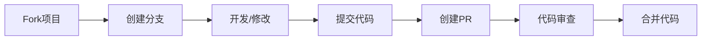

# 贡献指南

感谢您对设计模式学习项目的关注！我们欢迎所有形式的贡献，无论是代码、文档、测试还是建议。

## 🤝 如何贡献

### 参与方式

1. **🐛 报告问题** - 发现bug或有改进建议
2. **✨ 提交代码** - 修复bug或添加新功能
3. **📚 完善文档** - 改进文档和注释
4. **🧪 增强测试** - 提高测试覆盖率
5. **💬 参与讨论** - 在Issues和Discussions中交流

### 贡献流程



## 🚀 快速开始

### 环境准备

1. **Fork 项目**
   ```bash
   # 在GitHub上fork项目到你的账户
   # 然后克隆你的fork
   git clone https://github.com/YOUR_USERNAME/pattern-study.git
   cd pattern-study
   ```

2. **配置上游仓库**
   ```bash
   git remote add upstream https://github.com/ylzyd12345/pattern-study.git
   ```

3. **创建开发分支**
   ```bash
   git checkout -b feature/your-feature-name
   ```

### 开发环境设置

1. **安装JDK 11+**
   ```bash
   # Ubuntu/Debian
   sudo apt update
   sudo apt install openjdk-11-jdk
   
   # macOS (使用Homebrew)
   brew install openjdk@11
   
   # Windows
   # 下载并安装Oracle JDK 11或OpenJDK 11
   ```

2. **安装Maven 3.0+**
   ```bash
   # Ubuntu/Debian
   sudo apt install maven
   
   # macOS
   brew install maven
   
   # Windows
   # 下载并配置Maven
   ```

3. **验证环境**
   ```bash
   java -version
   mvn -version
   ```

## 📝 代码贡献

### 代码规范

#### 命名规范
- **类名**: 使用大驼峰命名法 (PascalCase)
  ```java
  public class SingletonPattern {}
  ```

- **方法名**: 使用小驼峰命名法 (camelCase)
  ```java
  public void getInstance() {}
  ```

- **常量名**: 使用全大写加下划线
  ```java
  public static final String DEFAULT_NAME = "default";
  ```

- **变量名**: 使用小驼峰命名法
  ```java
  private String instanceName;
  ```

#### 代码风格
- 使用4个空格缩进，不使用Tab
- 每行代码不超过120字符
- 大括号换行风格
- 适当的空行分隔代码块

#### 注释规范
- **类注释**: 必须包含Javadoc注释
  ```java
  /**
   * 单例模式实现类
   * 
   * @author Kevin
   * @version 1.0
   * @since 2024-01-01
   */
  public class Singleton {}
  ```

- **方法注释**: 公共方法必须包含Javadoc
  ```java
  /**
   * 获取单例实例
   * 
   * @return 单例实例
   * @throws IllegalStateException 如果初始化失败
   */
  public static Singleton getInstance() {}
  ```

- **行内注释**: 解释复杂逻辑
  ```java
  // 双重检查锁定确保线程安全
  if (instance == null) {
      synchronized (Singleton.class) {
          if (instance == null) {
              instance = new Singleton();
          }
      }
  }
  ```

### 提交规范

#### 提交信息格式
```
<type>(<scope>): <subject>

<body>

<footer>
```

#### Type类型
- `feat`: 新功能
- `fix`: 修复bug
- `docs`: 文档更新
- `style`: 代码格式调整（不影响功能）
- `refactor`: 重构
- `test`: 测试相关
- `chore`: 构建工具或辅助工具的变动
- `perf`: 性能优化
- `ci`: CI/CD相关

#### 示例
```bash
# 新功能
git commit -m "feat(behavioral): 添加观察者模式实现"

# 修复bug
git commit -m "fix(singleton): 修复懒汉式线程安全问题"

# 文档更新
git commit -m "docs(readme): 更新安装说明"

# 测试
git commit -m "test(strategy): 增加策略模式测试用例"
```

### 测试要求

#### 测试覆盖率
- 新代码必须有对应的单元测试
- 测试覆盖率不低于80%
- 核心逻辑测试覆盖率不低于90%

#### 测试命名规范
```java
// 测试类命名
public class SingletonTest {}

// 测试方法命名
@Test
void shouldReturnSameInstance() {}

@Test
void shouldThrowExceptionWhenNullInput() {}
```

#### 测试结构
```java
@Test
void shouldReturnSameInstance() {
    // Given - 准备测试数据
    String expected = "test";
    
    // When - 执行测试方法
    String actual = methodUnderTest(expected);
    
    // Then - 验证结果
    assertEquals(expected, actual);
}
```

## 📚 文档贡献

### 文档类型

#### API文档 (Javadoc)
- 所有公共类和方法必须有Javadoc注释
- 参数说明完整
- 返回值说明清晰
- 异常说明准确

#### 模式文档
每个设计模式文档应包含：
- 模式概述
- UML类图
- 代码实现
- 应用场景
- 优缺点分析
- 实际案例
- 相关模式对比

#### README文档
- 项目介绍清晰
- 安装步骤详细
- 使用示例完整
- 贡献指南明确

### 文档风格

#### Markdown规范
- 使用标准的Markdown语法
- 标题层级清晰
- 代码块标注语言
- 表格格式规范
- 图片alt文本完整

#### 中文文档
- 使用简体中文
- 专业术语准确
- 语言简洁明了
- 示例贴近实际

## 🐛 问题报告

### Bug报告模板

使用以下模板报告bug：

```markdown
**Bug描述**
简要描述bug现象

**重现步骤**
1. 执行命令 '...'
2. 点击 '....'
3. 滚动到 '....'
4. 看到错误

**期望行为**
描述你期望发生的行为

**实际行为**
描述实际发生的行为

**环境信息**
- OS: [例如 iOS]
- 浏览器: [例如 chrome, safari]
- 版本: [例如 22]

**附加信息**
添加任何其他有助于解决问题的信息
```

### 功能请求模板

```markdown
**功能描述**
简要描述你希望添加的功能

**问题背景**
描述这个功能要解决的问题

**解决方案**
描述你希望的解决方案

**替代方案**
描述你考虑过的其他解决方案

**附加信息**
添加任何其他相关信息或截图
```

## 🔍 代码审查

### 审查标准

#### 代码质量
- [ ] 代码符合项目规范
- [ ] 逻辑清晰，易于理解
- [ ] 没有明显的性能问题
- [ ] 错误处理完善

#### 测试质量
- [ ] 测试覆盖率达标
- [ ] 测试用例设计合理
- [ ] 测试数据有效
- [ ] 边界条件测试充分

#### 文档质量
- [ ] API文档完整
- [ ] 注释清晰准确
- [ ] README更新及时
- [ ] 示例代码可运行

### 审查流程

1. **自动检查**
   - 代码风格检查
   - 编译检查
   - 测试执行
   - 代码质量分析

2. **人工审查**
   - 逻辑审查
   - 设计审查
   - 安全审查
   - 性能审查

3. **反馈处理**
   - 及时响应审查意见
   - 修改相关问题
   - 更新测试和文档
   - 重新提交审查

## 🏆 贡献者激励

### 贡献认可
- **贡献者列表**: 在CONTRIBUTORS.md中列出所有贡献者
- **发布说明**: 在版本发布时感谢贡献者
- **社区认可**: 在社区中突出优秀贡献

### 贡献等级
- **🥉 Bronze**: 1-3次有效贡献
- **🥈 Silver**: 4-10次有效贡献
- **🥇 Gold**: 11-20次有效贡献
- **💎 Diamond**: 20+次有效贡献

### 特殊贡献
- **🌟 Star贡献者**: 长期活跃贡献者
- **🚀 创新贡献者**: 提出创新想法或实现
- **🛡️ 守护者**: 修复关键安全问题
- **📚 导师**: 帮助新贡献者入门

## 📞 联系我们

### 沟通渠道
- **GitHub Issues**: 报告bug和功能请求
- **GitHub Discussions**: 一般讨论和问答
- **Email**: 项目维护者邮箱
- **Wiki**: 项目文档和知识库

### 社区准则
- 尊重所有参与者
- 保持专业和友善
- 避免争议性话题
- 专注于技术讨论

### 响应时间
- **Bug报告**: 3个工作日内响应
- **功能请求**: 5个工作日内响应
- **PR审查**: 7个工作日内完成
- **一般问题**: 5个工作日内响应

## 🎯 贡献目标

### 短期目标
- [ ] 完善所有设计模式的测试用例
- [ ] 提高代码覆盖率到90%+
- [ ] 完善文档和示例
- [ ] 优化CI/CD流程

### 中期目标
- [ ] 添加更多实际应用案例
- [ ] 支持多语言实现
- [ ] 开发交互式学习工具
- [ ] 建立社区贡献体系

### 长期目标
- [ ] 成为设计模式学习的标杆项目
- [ ] 建立完整的知识体系
- [ ] 开发配套的学习平台
- [ ] 形成活跃的开发者社区

---

感谢您的贡献！每一个贡献都让这个项目变得更好。如果您有任何问题，请随时联系我们。