# Java设计模式全面学习指南

## 摘要
本指南系统性地介绍了Java设计模式的核心概念、分类体系、具体实现以及实际应用。内容涵盖从面向对象设计原则到23种经典GOF设计模式的详细解析，并提供完整的学习路径和实践建议，帮助开发者从入门到精通掌握设计模式的应用技巧。

---

## 目录
- [1. 设计模式基础概念与面向对象原则](#1-设计模式基础概念与面向对象原则)
- [2. 设计模式分类体系与总体框架](#2-设计模式分类体系与总体框架)
- [3. 创建型设计模式深入解析](#3-创建型设计模式深入解析)
- [4. 结构型设计模式深入解析](#4-结构型设计模式深入解析)
- [5. 行为型设计模式深入解析](#5-行为型设计模式深入解析)
- [6. 设计模式实战应用与现代框架实践](#6-设计模式实战应用与现代框架实践)
- [7. 系统化学习路径与进阶实践指南](#7-系统化学习路径与进阶实践指南)

---

## 1. 设计模式基础概念与面向对象原则

### 1.1 设计模式的定义与起源

设计模式（Design Pattern）是软件工程中解决常见问题的可重用解决方案模板。GoF（Gang of Four）设计模式指由Erich Gamma、Richard Helm、Ralph Johnson和John Vlissides四位专家在《设计模式：可复用面向对象软件的基础》中提出的23种经典模式[^54]。这些模式不是具体的代码实现，而是经过验证的最佳实践方案，能够在特定场景下提供优雅的解决方案。

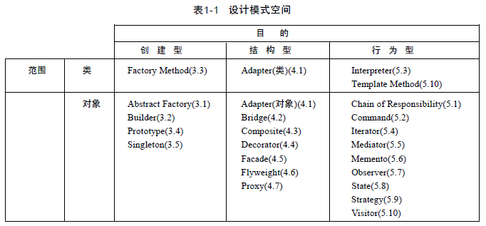
*图1-1：GoF设计模式分类体系*

### 1.2 设计模式的核心价值

设计模式在软件开发中具有五大核心优势[^25]：

1. **提升可维护性**：通过高内聚低耦合的代码结构，使系统更易于理解和修改
2. **增强复用性**：通用解决方案可在不同项目中多次应用，减少重复开发
3. **保障扩展性**：遵循开闭原则，支持需求变化而无需修改现有代码
4. **降低风险**：采用经过验证的成熟方案，避免设计缺陷和潜在问题
5. **促进协作**：提供共享的设计词汇表，改善团队沟通效率

[案例]策略模式与适配器模式的组合应用，能够有效解决奖励系统品类扩展问题，使新增奖励类型无需修改主干代码[^25]。

### 1.3 SOLID设计原则详解

SOLID原则是面向对象设计的五大基本原则，为设计模式的应用提供理论指导：

| 原则 | 定义 | 示例与应用 |
|------|------|------------|
| **单一职责原则(SRP)** | 一个类只应有一个引起变化的原因 | 拆分发票类的打印功能和存储逻辑，避免修改一个功能影响另一个功能[^14] |
| **开闭原则(OCP)** | 对扩展开放，对修改关闭 | 通过Computer接口扩展新系统类型，而不是修改现有系统代码[^16] |
| **里氏替换原则(LSP)** | 子类型必须能够替换它们的基类型 | 正方形不应继承矩形的setWidth/setHeight行为，避免违反数学规律[^14] |
| **接口隔离原则(ISP)** | 客户端不应被迫依赖于它们不使用的接口 | 拆分停车功能与支付接口，避免客户端依赖不需要的功能[^14] |
| **依赖倒置原则(DIP)** | 依赖于抽象而不是具体实现 | 通过Keyboard接口解耦电脑与具体键盘设备的依赖关系[^16] |

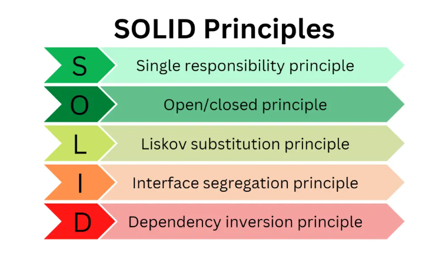
*图1-2：SOLID面向对象设计原则示意图*

### 1.4 设计模式与SOLID原则的协同关系

设计模式是SOLID原则的具体实现载体，两者之间存在紧密的协同关系[^11]：

**模式实现原则：**
- 策略模式 → 开闭原则：通过策略接口实现算法的可扩展性
- 适配器模式 → 接口隔离原则：为特定客户端提供定制化接口
- 模板方法模式 → 依赖倒置原则：高层模块控制算法骨架，低层模块实现具体步骤

**原则指导模式选择：**
- 需要扩展性时优先考虑OCP兼容模式（如装饰器、策略模式）
- 高耦合场景应用DIP指导的解耦模式（如工厂方法、抽象工厂）
- 接口过于庞大时使用ISP指导的接口拆分（如适配器模式）

[案例]装饰器模式通过层层包装的方式实现功能扩展，完美体现了开闭原则的设计理念[^11]。

### 1.5 设计模式的职业发展价值

掌握设计模式对软件开发人员的职业发展具有重要意义[^35]：

**学习路径建议：**
- **1年内**：掌握23种基础设计模式（推荐《大话设计模式》入门）
- **2-3年**：结合JVM原理、并发编程等深入理解模式的应用场景
- **3-4年**：在分布式系统架构中实践模式组合应用

**职业回报：**
1. **面试核心考察点**：大厂技术面试必考内容，体现设计能力
2. **架构师必备技能**：系统架构设计的基础理论知识
3. **薪资差异关键因素**：高级工程师与普通开发者的重要区分标准

[建议]阿里技术总监强调：工作一年内必须开始设计模式的系统学习，这是技术成长的关键转折点[^35]。

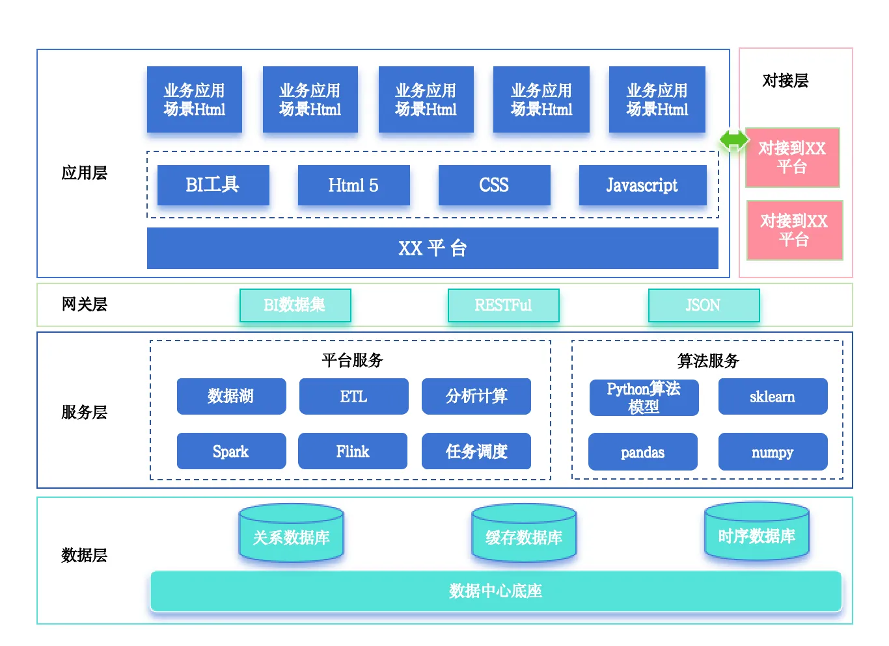
*图1-3：设计模式在软件架构职业发展中的重要性*

### 1.6 设计模式的基本设计原则

GoF设计模式基于两个核心设计理念[^54]：
- **对接口编程而非实现**：减少对具体实现的依赖，提高代码灵活性
- **优先使用对象组合而非继承**：通过组合获得更大的灵活性和更简单的层次结构

[示例]工厂模式通过封装对象创建逻辑，实现客户端与具体产品类的解耦，体现了面向接口编程的原则[^59]。

## 2. 设计模式分类体系与总体框架

### 2.1 GOF设计模式三大分类体系

GoF设计模式按照其目的和解决的问题范畴，系统性地分为三大类别：创建型模式、结构型模式和行为型模式[^199]。这种分类方式为软件设计提供了清晰的框架和指导原则。


*图2-1：GOF设计模式三大分类体系*

#### 2.1.1 创建型模式（Creational Patterns）

**定义与核心思想**
创建型模式专注于对象的创建机制，对类的实例化过程进行抽象，将对象创建和使用分离[^199][^512]。这类模式通过封装复杂的创建逻辑，使系统能够独立于对象创建的具体细节。

**主要特点：**
1. **创建与使用分离**：有效降低模块间耦合度，提高代码的可维护性[^512]
2. **高度灵活性**：动态决定创建哪个类的实例，支持运行时配置[^512]
3. **封装复杂性**：将复杂的对象创建逻辑封装在专门的类中，简化客户端代码[^512]

**包含的具体模式：**
- 工厂方法模式（Factory Method）
- 抽象工厂模式（Abstract Factory）
- 单例模式（Singleton）
- 建造者模式（Builder）
- 原型模式（Prototype）[^199]


*图2-2：创建型设计模式结构示意图*

#### 2.1.2 结构型模式（Structural Patterns）

**定义与核心思想**
结构型模式关注对象之间的组合和依赖关系，描述如何组合类和对象以形成更大的结构[^199][^525]。这类模式通过组合而非继承的方式获得更大的灵活性，帮助构建稳定而可扩展的系统架构。

**主要特点：**
1. **灵活性优势**：组合关系比继承具有更低的耦合度，便于系统演进[^523]
2. **可扩展性强**：通过动态组合对象实现功能的灵活扩展[^527]
3. **解耦效果显著**：有效降低系统各组成部分之间的耦合度，提高模块独立性[^528]

**包含的具体模式：**
- 适配器模式（Adapter）
- 桥接模式（Bridge）
- 组合模式（Composite）
- 装饰者模式（Decorator）
- 外观模式（Facade）
- 享元模式（Flyweight）
- 代理模式（Proxy）[^205]

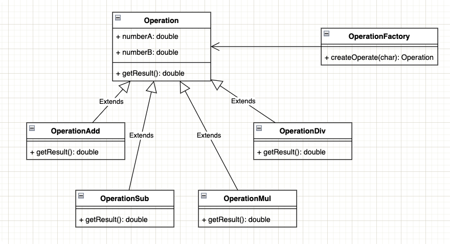
*图2-3：结构型设计模式结构示意图*

#### 2.1.3 行为型模式（Behavioral Patterns）

**定义与核心思想**
行为型模式专注于类或对象之间的交互和职责分配，对对象间责任和算法进行抽象[^199][^530]。这类模式通过定义对象间的通信机制和协作方式，控制复杂的运行时行为。

**主要特点：**
1. **交互导向**：重点关注对象间的协作关系和通信模式[^530]
2. **动态行为分配**：在运行时确定对象的行为，提供更大的灵活性[^534]
3. **低耦合设计**：减少对象间的直接依赖，提高系统的可维护性[^532]

**包含的具体模式：**
- 模板方法模式（Template Method）
- 策略模式（Strategy）
- 观察者模式（Observer）
- 状态模式（State）
- 责任链模式（Chain of Responsibility）
- 命令模式（Command）
- 访问者模式（Visitor）等11种模式[^199]

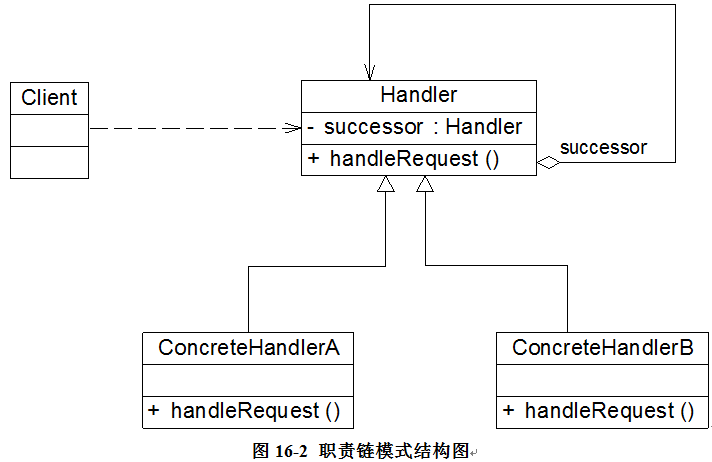
*图2-4：行为型设计模式结构示意图*

### 2.2 分类体系的应用价值与实践意义

#### 2.2.1 各类模式的核心价值

| 模式类别 | 核心价值 | 典型应用场景 |
|---------|---------|-------------|
| **创建型模式** | 提高系统灵活性，支持对象创建的动态配置 | 需要根据不同条件创建不同对象的场景 |
| **结构型模式** | 增强系统可扩展性，构建稳定的架构基础 | 系统组件需要灵活组合和重用的场景 |
| **行为型模式** | 提高系统可维护性，优化对象间协作机制 | 复杂业务流程和状态管理的场景[^199][^203][^205] |

#### 2.2.2 模式选择的指导原则

1. **问题导向选择**：根据具体要解决的问题类型选择相应的模式类别
   - 对象创建问题 → 创建型模式
   - 对象结构问题 → 结构型模式
   - 对象行为问题 → 行为型模式

2. **组合应用策略**：在实际项目中，往往需要组合使用多种模式
   - 工厂方法 + 策略模式：创建可配置的算法策略
   - 装饰者 + 观察者：为观察者对象动态添加功能
   - 组合 + 访问者：遍历复杂对象结构并执行操作

3. **避免过度设计**：根据实际需求选择模式，避免为了使用模式而增加不必要的复杂性

#### 2.2.3 学习路径建议

对于设计模式的学习者，建议按照以下顺序逐步深入：
1. **先理解三大分类**：建立整体框架认知
2. **掌握每类核心模式**：每类别中选择2-3个最常用的模式深入理解
3. **学习模式组合应用**：了解模式之间的协作关系
4. **实践项目应用**：在真实项目中应用所学模式

[提示]创建型模式中的工厂方法和抽象工厂模式是面试和实际项目中最常使用的模式，建议优先掌握[^512]。

## 3. 创建型设计模式深入解析

### 3.1 创建型模式概述

创建型设计模式专注于对象的创建机制，通过封装对象实例化过程，降低客户端与具体类之间的耦合度[^40][^48]。GoF定义的创建型模式包含五种：**单例模式、原型模式、工厂方法模式、抽象工厂模式和建造者模式**，它们共同构成了软件设计中对象创建的最佳实践体系[^49]。

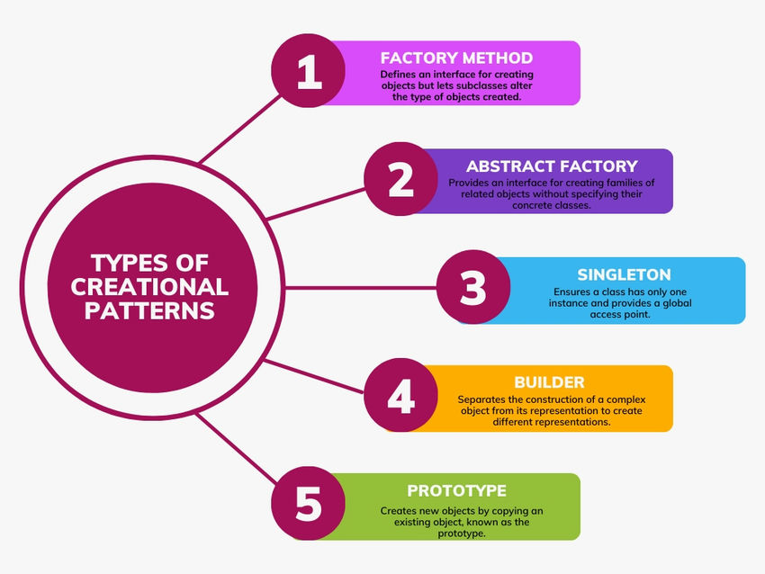
*图3-1：创建型设计模式分类与特点对比*

### 3.2 单例模式（Singleton Pattern）

#### 3.2.1 问题引入场景
在软件开发中，某些类只需要一个全局实例，如配置管理器、数据库连接池、日志记录器等。如果允许多个实例存在，可能导致资源冲突、数据不一致或性能问题[^551]。

#### 3.2.2 模式结构与原理
单例模式确保一个类仅有一个实例，并提供全局访问点。核心实现要素包括：私有构造方法、静态私有变量和公共静态访问方法[^551]。

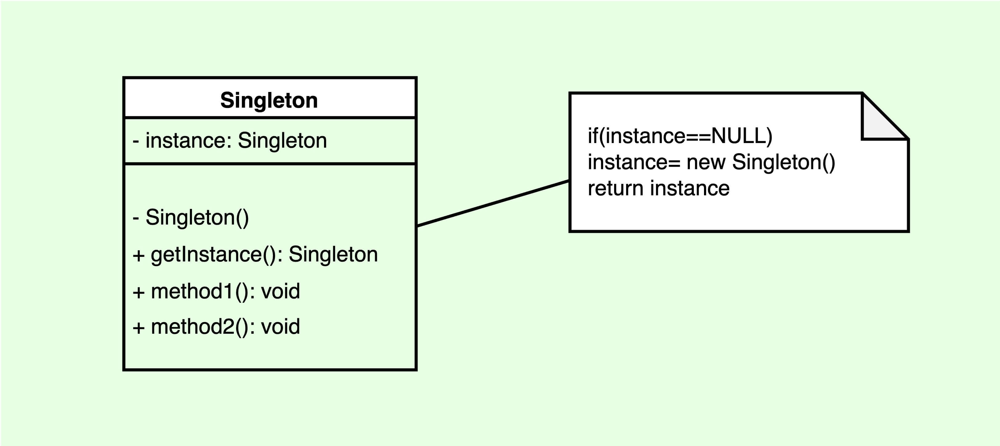
*图3-2：单例模式UML类图结构*

#### 3.2.3 Java代码实现详解

**饿汉式实现（Eager Initialization）**
```java
public class HungrySingleton {
    private static HungrySingleton instance = new HungrySingleton();
    
    private HungrySingleton() {
        // 私有构造方法防止外部实例化
    }
    
    public static HungrySingleton getInstance() {
        return instance;
    }
}
```
**优点**：实现简单，线程安全[^551][^556]  
**缺点**：不能懒加载，可能造成资源浪费[^551]

**懒汉式双重检查锁定（Lazy Initialization with Double-Checked Locking）**
```java
public class DoubleCheckSingleton {
    private static volatile DoubleCheckSingleton instance;
    
    private DoubleCheckSingleton() {}
    
    public static DoubleCheckSingleton getInstance() {
        if (instance == null) {
            synchronized(DoubleCheckSingleton.class) {
                if (instance == null) {
                    instance = new DoubleCheckSingleton();
                }
            }
        }
        return instance;
    }
}
```
**关键点**：volatile关键字防止指令重排序，确保线程安全[^556]

**静态内部类实现（Static Inner Class）**
```java
public class InnerStaticSingleton {
    private InnerStaticSingleton() {}
    
    private static class SingletonHolder {
        private static final InnerStaticSingleton INSTANCE = new InnerStaticSingleton();
    }
    
    public static InnerStaticSingleton getInstance() {
        return SingletonHolder.INSTANCE;
    }
}
```

**枚举方式实现（Enum Singleton）**
```java
public enum EnumSingleton {
    INSTANCE;
    
    public void doSomething() {
        // 业务方法实现
    }
}
```
**优势**：天然线程安全，防止反序列化创建新对象，实现简洁[^551]

#### 3.2.4 典型应用场景
- 全局配置管理和应用设置
- 数据库连接池和线程池管理
- 日志记录器和缓存服务
- 设备驱动程序和硬件访问控制[^551][^556]

#### 3.2.5 优缺点分析
**优点**：
- 严格控制实例数量，节省系统资源
- 提供全局访问点，方便统一管理
- 避免对共享资源的并发访问冲突[^696]

**缺点**：
- 违反单一职责原则（既管理业务又控制实例化）
- 难以进行单元测试和并行测试
- 可能隐藏类之间的依赖关系，降低代码可维护性[^696]

#### 3.2.6 在Spring框架中的应用
Spring框架通过`DefaultSingletonBeanRegistry`实现单例管理，所有配置为singleton作用域的Bean都由容器保证唯一性，实现了真正的应用级单例[^705]。

### 3.3 工厂方法模式（Factory Method Pattern）

#### 3.3.1 问题引入场景
当系统需要根据不同类型或条件创建不同对象，且创建逻辑可能发生变化时，直接使用new关键字会导致代码耦合度高，难以扩展和维护[^577]。

#### 3.3.2 模式结构与原理
工厂方法模式定义一个创建对象的接口，但让子类决定实例化哪个具体的类，实现了对象创建与使用的分离[^577][^578]。


*图3-3：工厂方法模式UML类图结构*

#### 3.3.3 Java代码实现详解

**抽象产品与具体产品**
```java
// 抽象产品接口
public interface Message {
    void send();
}

// 具体产品：短信消息
public class SmsMessage implements Message {
    @Override
    public void send() {
        System.out.println("发送短信消息");
    }
}

// 具体产品：邮件消息
public class EmailMessage implements Message {
    @Override
    public void send() {
        System.out.println("发送邮件消息");
    }
}
```

**抽象工厂与具体工厂**
```java
// 抽象工厂接口
public interface MessageFactory {
    Message createMessage();
}

// 具体工厂：短信工厂
public class SmsFactory implements MessageFactory {
    @Override
    public Message createMessage() {
        return new SmsMessage();
    }
}

// 具体工厂：邮件工厂
public class EmailFactory implements MessageFactory {
    @Override
    public Message createMessage() {
        return new EmailMessage();
    }
}
```

**客户端使用**
```java
public class Client {
    public static void main(String[] args) {
        MessageFactory factory = new SmsFactory();
        Message message = factory.createMessage();
        message.send(); // 输出：发送短信消息
    }
}
```

#### 3.3.4 典型应用场景
- 动态扩展产品类型，支持新产品添加
- 封装复杂的对象创建逻辑
- 框架设计（如Hibernate的SessionFactory、Spring的BeanFactory）
- 跨平台应用开发[^576][^583]

#### 3.3.5 优缺点分析
**优点**：
- 解耦对象创建与使用，提高代码灵活性
- 支持开闭原则，便于扩展新产品
- 隐藏具体产品类的实现细节[^696]

**缺点**：
- 增加系统复杂度，类数量增多
- 增加了系统的抽象性和理解难度
- 需要引入额外的工厂层次结构[^696]

#### 3.3.6 与简单工厂模式的区别
工厂方法模式是简单工厂模式的进一步抽象，通过多态机制实现了真正的"开放-关闭"原则，而简单工厂模式虽然简单但违反开闭原则[^695]。

### 3.4 抽象工厂模式（Abstract Factory Pattern）

#### 3.4.1 问题引入场景
当系统需要创建一系列相关或相互依赖的对象，且这些对象属于同一个产品族时，需要确保这些对象能够协同工作。例如，GUI应用程序需要成套的界面组件（按钮、文本框、复选框等）[^540]。

#### 3.4.2 模式结构与原理
抽象工厂模式提供创建相关或相互依赖对象的接口，而无需指定它们的具体类。核心概念是"产品族"——同一具体工厂生产的一组相关产品[^540][^543]。

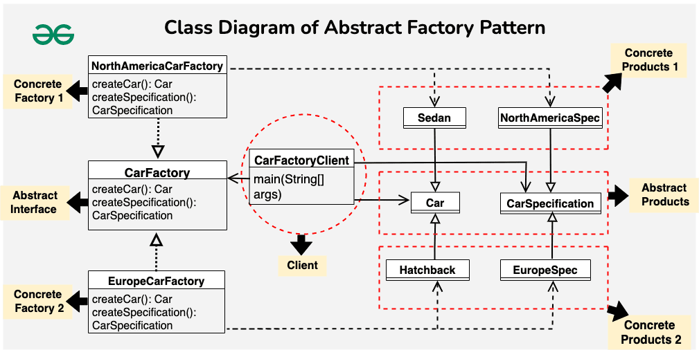
*图3-4：抽象工厂模式UML类图结构*

#### 3.4.3 Java代码实现详解

**抽象产品体系**
```java
// 抽象产品：鼠标
public interface Mouse {
    void click();
}

// 抽象产品：键盘
public interface Keyboard {
    void type();
}

// 具体产品：戴尔鼠标
public class DellMouse implements Mouse {
    @Override
    public void click() {
        System.out.println("戴尔鼠标点击");
    }
}

// 具体产品：戴尔键盘
public class DellKeyboard implements Keyboard {
    @Override
    public void type() {
        System.out.println("戴尔键盘输入");
    }
}

// 具体产品：惠普鼠标
public class HpMouse implements Mouse {
    @Override
    public void click() {
        System.out.println("惠普鼠标点击");
    }
}

// 具体产品：惠普键盘
public class HpKeyboard implements Keyboard {
    @Override
    public void type() {
        System.out.println("惠普键盘输入");
    }
}
```

**抽象工厂与具体工厂**
```java
// 抽象工厂
public interface PCFactory {
    Mouse createMouse();
    Keyboard createKeyboard();
}

// 具体工厂：戴尔工厂
public class DellFactory implements PCFactory {
    @Override
    public Mouse createMouse() {
        return new DellMouse();
    }
    
    @Override
    public Keyboard createKeyboard() {
        return new DellKeyboard();
    }
}

// 具体工厂：惠普工厂
public class HpFactory implements PCFactory {
    @Override
    public Mouse createMouse() {
        return new HpMouse();
    }
    
    @Override
    public Keyboard createKeyboard() {
        return new HpKeyboard();
    }
}
```

**客户端使用**
```java
public class Client {
    public static void main(String[] args) {
        PCFactory factory = new DellFactory();
        Mouse mouse = factory.createMouse();
        Keyboard keyboard = factory.createKeyboard();
        
        mouse.click();    // 输出：戴尔鼠标点击
        keyboard.type(); // 输出：戴尔键盘输入
    }
}
```

#### 3.4.4 典型应用场景
- 跨平台UI组件开发（Windows/Mac/Linux界面元素）
- 数据库访问层抽象（支持多种数据库产品）
- 游戏开发中的不同主题场景
- 企业应用中的多套业务流程[^540][^543]

#### 3.4.5 优缺点分析
**优点**：
- 保证产品家族的一致性，相关对象一起使用
- 隔离具体类的实现，客户端只接触接口
- 易于切换整个产品家族[^696]

**缺点**：
- 扩展新产品族困难，需要修改抽象工厂接口
- 增加了系统的抽象性和复杂性
- 支持新产品种类有限制[^696]

#### 3.4.6 产品族概念详解
产品族是指由同一个工厂生产的、在设计和用途上相关联的一组产品。例如戴尔工厂生产戴尔鼠标和戴尔键盘，它们构成一个产品族；惠普工厂生产的产品构成另一个产品族[^540]。

### 3.5 建造者模式（Builder Pattern）

#### 3.5.1 问题引入场景
当需要创建复杂的对象，且对象的构建过程包含多个步骤，或者同一构建过程可以产生不同的表示形式时，使用传统的构造方法会导致代码臃肿且难以维护[^560]。

#### 3.5.2 模式结构与原理
建造者模式将复杂对象的构建过程与其表示分离，使得同样的构建过程可以创建不同的表示。核心角色包括Builder（负责创建产品部件）和Director（管理构建过程）[^560][^561]。

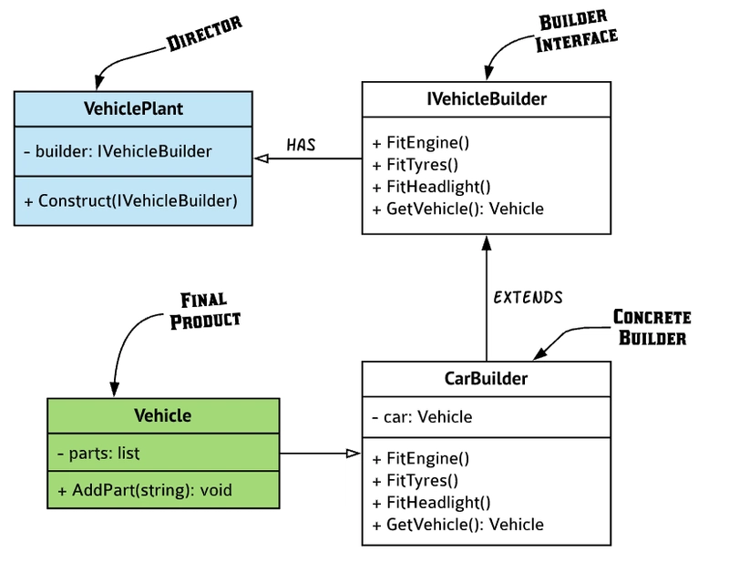
*图3-5：建造者模式UML类图结构*

#### 3.5.3 Java代码实现详解

**产品类**
```java
public class Computer {
    private String cpu;
    private String memory;
    private String hardDisk;
    private String graphicsCard;
    
    // 私有构造方法，通过Builder构建
    private Computer(Builder builder) {
        this.cpu = builder.cpu;
        this.memory = builder.memory;
        this.hardDisk = builder.hardDisk;
        this.graphicsCard = builder.graphicsCard;
    }
    
    // 静态内部Builder类
    public static class Builder {
        private String cpu;
        private String memory;
        private String hardDisk;
        private String graphicsCard;
        
        public Builder setCpu(String cpu) {
            this.cpu = cpu;
            return this;
        }
        
        public Builder setMemory(String memory) {
            this.memory = memory;
            return this;
        }
        
        public Builder setHardDisk(String hardDisk) {
            this.hardDisk = hardDisk;
            return this;
        }
        
        public Builder setGraphicsCard(String graphicsCard) {
            this.graphicsCard = graphicsCard;
            return this;
        }
        
        public Computer build() {
            return new Computer(this);
        }
    }
    
    @Override
    public String toString() {
        return "Computer{" +
                "cpu='" + cpu + '\'' +
                ", memory='" + memory + '\'' +
                ", hardDisk='" + hardDisk + '\'' +
                ", graphicsCard='" + graphicsCard + '\'' +
                '}';
    }
}
```

**Director角色（可选）**
```java
public class ComputerDirector {
    public Computer constructGamingComputer() {
        return new Computer.Builder()
                .setCpu("Intel i9")
                .setMemory("32GB")
                .setHardDisk("1TB SSD")
                .setGraphicsCard("NVIDIA RTX 3080")
                .build();
    }
    
    public Computer constructOfficeComputer() {
        return new Computer.Builder()
                .setCpu("Intel i5")
                .setMemory("16GB")
                .setHardDisk("512GB SSD")
                .setGraphicsCard("Integrated")
                .build();
    }
}
```

**客户端使用**
```java
public class Client {
    public static void main(String[] args) {
        ComputerDirector director = new ComputerDirector();
        
        Computer gamingComputer = director.constructGamingComputer();
        System.out.println("游戏电脑配置: " + gamingComputer);
        
        Computer officeComputer = director.constructOfficeComputer();
        System.out.println("办公电脑配置: " + officeComputer);
        
        // 或者直接使用Builder
        Computer customComputer = new Computer.Builder()
                .setCpu("AMD Ryzen 7")
                .setMemory("64GB")
                .setHardDisk("2TB SSD")
                .build();
        System.out.println("自定义电脑配置: " + customComputer);
    }
}
```

#### 3.5.4 典型应用场景
- 复杂对象的构建，包含多个部件和构建步骤
- 需要创建不同表示形式的对象（如HTML和PDF格式的报告）
- 对象构建过程需要精确控制（如快餐店点餐流程）
- 产品对象的构建算法应该独立于该对象的组成部分[^560][^561]

#### 3.5.5 优缺点分析
**优点**：
- 封装复杂的构建过程，客户端无需知道内部细节
- 可以对构建过程进行更精细的控制
- 相同的构建过程可以创建不同的产品表示
- 符合单一职责原则，将构建逻辑与业务逻辑分离[^696]

**缺点**：
- 产品必须有共同接口，限制了使用范围
- 如果产品内部变化复杂，会导致需要定义很多具体建造者类
- 增加了系统的复杂度和理解难度[^696]

#### 3.5.6 与工厂模式的区别
- **工厂模式**关注"创建什么"对象，侧重于对象的整体创建
- **建造者模式**关注"如何构建"对象，侧重于对象的构建过程和步骤控制[^742][^743]

### 3.6 原型模式（Prototype Pattern）

#### 3.6.1 问题引入场景
当需要创建大量相似对象，且对象创建成本较高（如需要复杂计算、数据库查询或网络请求）时，直接使用new关键字创建对象会导致性能问题。原型模式通过复制现有实例来提高创建效率[^567]。

#### 3.6.2 模式结构与原理
原型模式通过复制现有实例创建新对象，而不是通过new关键字实例化。Java通过Cloneable接口和clone()方法提供原生支持，但需要注意深浅拷贝的区别[^567][^568]。

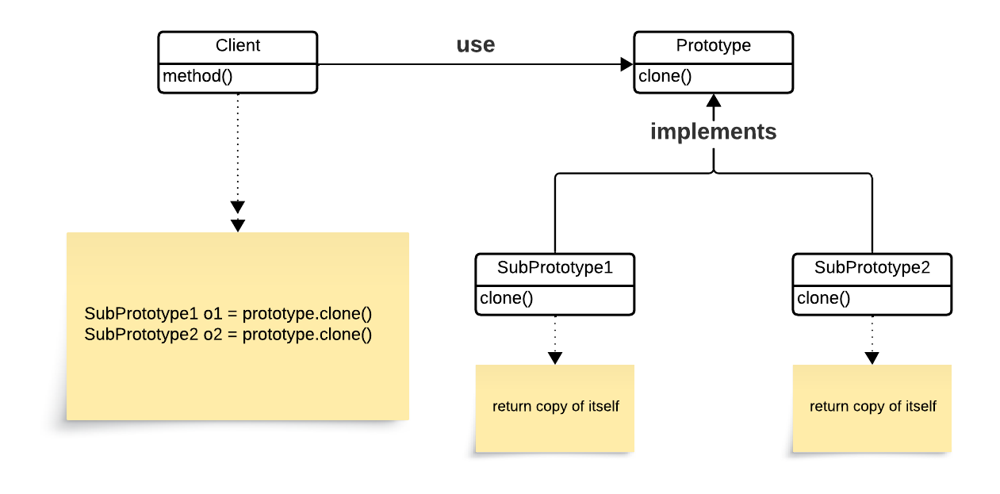
*图3-6：原型模式UML类图结构*

#### 3.6.3 Java代码实现详解

**浅拷贝实现**
```java
public class Sheep implements Cloneable {
    private String name;
    private int age;
    private Date birthday;
    
    public Sheep(String name, int age, Date birthday) {
        this.name = name;
        this.age = age;
        this.birthday = birthday;
    }
    
    // 浅拷贝
    @Override
    protected Object clone() throws CloneNotSupportedException {
        return super.clone();
    }
    
    // getter和setter方法
    public String getName() { return name; }
    public void setName(String name) { this.name = name; }
    public int getAge() { return age; }
    public void setAge(int age) { this.age = age; }
    public Date getBirthday() { return birthday; }
    public void setBirthday(Date birthday) { this.birthday = birthday; }
    
    @Override
    public String toString() {
        return "Sheep{name='" + name + "', age=" + age + ", birthday=" + birthday + "}";
    }
}
```

**深拷贝实现**
```java
public class DeepSheep implements Cloneable {
    private String name;
    private int age;
    private Date birthday;
    private List<String> habits;
    
    public DeepSheep(String name, int age, Date birthday, List<String> habits) {
        this.name = name;
        this.age = age;
        this.birthday = birthday;
        this.habits = habits;
    }
    
    // 深拷贝
    @Override
    protected Object clone() throws CloneNotSupportedException {
        DeepSheep cloned = (DeepSheep) super.clone();
        // 手动克隆引用类型字段
        cloned.birthday = (Date) this.birthday.clone();
        cloned.habits = new ArrayList<>(this.habits);
        return cloned;
    }
    
    // 使用序列化实现深拷贝的替代方案
    public DeepSheep deepClone() throws IOException, ClassNotFoundException {
        ByteArrayOutputStream bos = new ByteArrayOutputStream();
        ObjectOutputStream oos = new ObjectOutputStream(bos);
        oos.writeObject(this);
        
        ByteArrayInputStream bis = new ByteArrayInputStream(bos.toByteArray());
        ObjectInputStream ois = new ObjectInputStream(bis);
        return (DeepSheep) ois.readObject();
    }
    
    // getter和setter方法
    // ...
}
```

**客户端使用**
```java
public class Client {
    public static void main(String[] args) throws Exception {
        // 原始对象
        List<String> habits = Arrays.asList("eating", "sleeping");
        Date birthday = new Date();
        DeepSheep original = new DeepSheep("Dolly", 2, birthday, habits);
        
        // 克隆对象
        DeepSheep cloned = (DeepSheep) original.clone();
        
        // 修改克隆对象的引用类型字段
        cloned.getHabits().add("jumping");
        cloned.getBirthday().setTime(System.currentTimeMillis());
        
        System.out.println("Original: " + original);
        System.out.println("Cloned: " + cloned);
        System.out.println("Habits same? " + (original.getHabits() == cloned.getHabits()));
        System.out.println("Birthday same? " + (original.getBirthday() == cloned.getBirthday()));
    }
}
```

#### 3.6.4 深浅拷贝区别详解
- **浅拷贝**：只复制基本类型值，引用类型字段共享相同地址[^567]
- **深拷贝**：完全复制对象图，包括所有嵌套引用对象[^567][^568]

#### 3.6.5 典型应用场景
- 高效率创建相似对象，避免重复初始化开销
- 动态状态保存和恢复（如编辑器撤销功能）
- 大批量生成配置相似的对象
- 避免重复执行昂贵的初始化过程（如数据库连接）[^567][^568]

#### 3.6.6 优缺点分析
**优点**：
- 提高性能，避免重复的初始化过程
- 简化对象创建过程，特别是复杂对象的创建
- 可以动态添加和删除产品
- 提供简化的创建结构[^696]

**缺点**：
- 深拷贝实现复杂，需要正确处理所有引用字段
- 必须实现Cloneable接口，破坏了封装性
- 对已有类进行改造时可能需要修改源代码
- 需要小心处理循环引用问题[^696]

### 3.7 创建型模式综合对比与选择指南

#### 3.7.1 模式对比总结

| **模式类型** | **核心目标** | **适用场景** | **优点** | **缺点** |
|--------------|--------------|--------------|----------|----------|
| **单例模式** | 确保唯一实例 | 全局配置、资源池 | 节省资源、全局访问 | 测试困难、隐藏依赖 |
| **工厂方法** | 封装创建逻辑 | 动态对象创建、框架设计 | 解耦、支持扩展 | 类数量增多、复杂度高 |
| **抽象工厂** | 创建产品族 | 跨平台组件、成套产品 | 保证一致性、易于切换 | 扩展困难、抽象复杂 |
| **建造者** | 分步构建对象 | 复杂对象构建、多步骤创建 | 精细控制、相同过程不同表示 | 产品需共同接口、复杂度高 |
| **原型模式** | 复制现有实例 | 高效创建、状态保存 | 性能高、简化创建 | 深拷贝复杂、破坏封装[^696] |

#### 3.7.2 模式选择决策流程

1. **需要全局唯一实例？** → 单例模式[^695]
2. **需要条件化创建对象？** → 简单工厂模式[^695]
3. **需要子类决定实例化？** → 工厂方法模式[^695]
4. **需要创建对象家族？** → 抽象工厂模式[^695]
5. **需要分步构建复杂对象？** → 建造者模式[^695]
6. **需要高频克隆对象？** → 原型模式[^695]

#### 3.7.3 在Spring框架中的集成应用

Spring框架的IoC容器整合了多种创建型模式，实现了强大的对象生命周期管理[^705][^708]：

- **单例模式**：通过`DefaultSingletonBeanRegistry`管理单例Bean
- **工厂模式**：`BeanFactory`和`ApplicationContext`作为核心工厂接口
- **建造者模式**：`BeanDefinitionBuilder`用于构建复杂的Bean定义
- **原型模式**：prototype作用域的Bean每次请求都创建新实例

这种集成使得Spring能够统一控制对象的实例化、属性注入、初始化和销毁等完整生命周期[^705]。

#### 3.7.4 最佳实践与常见误区

**最佳实践**：
- 根据具体需求选择最适合的模式，避免过度设计
- 在框架设计中优先使用工厂方法和抽象工厂模式
- 对于配置类对象考虑使用单例模式
- 复杂对象构建使用建造者模式提高可读性
- 性能敏感场景考虑原型模式

**常见误区**：
- 滥用单例模式导致全局状态混乱
- 过度使用工厂模式增加不必要的复杂性
- 忽视深浅拷贝区别导致意外的对象共享
- 选择不合适的模式增加系统维护成本[^696][^742][^743]

### 3.8 本章总结

创建型设计模式为解决对象创建问题提供了五种经典的解决方案，每种模式都有其特定的应用场景和优势。在实际开发中，应该根据具体需求选择最合适的模式，或者组合使用多种模式来解决复杂的对象创建问题。理解这些模式的核心思想和适用场景，能够帮助开发者构建更加灵活、可维护和可扩展的软件系统。

## 4. 结构型设计模式深入解析

### 4.1 结构型模式概述

结构型设计模式专注于类和对象的组合，通过组合而非继承的方式获得更大的灵活性，帮助构建稳定而可扩展的系统架构[^199][^525]。GoF定义的结构型模式包含七种：**适配器模式、桥接模式、组合模式、装饰器模式、外观模式、享元模式和代理模式**，它们共同构成了软件设计中对象组合的最佳实践体系[^205]。


*图4-1：结构型设计模式分类与特点对比*

### 4.2 适配器模式（Adapter Pattern）

#### 4.2.1 问题引入场景
在软件开发中，经常需要将已有的类或组件集成到新系统中，但由于接口不兼容，无法直接使用。例如，系统需要使用第三方库，但该库的接口与系统现有接口不匹配，或者需要兼容不同版本的数据格式[^525]。

#### 4.2.2 模式结构与原理
适配器模式将一个类的接口转换成客户端期望的另一个接口，使得原本由于接口不兼容而不能一起工作的类可以协同工作[^525][^528]。适配器模式分为类适配器（通过继承实现）和对象适配器（通过组合实现）。


*图4-2：适配器模式UML类图结构*

#### 4.2.3 Java代码实现详解

**对象适配器实现（推荐）**
```java
// 目标接口
public interface Target {
    void request();
}

// 适配者类（需要被适配的类）
public class Adaptee {
    public void specificRequest() {
        System.out.println("适配者类被调用");
    }
}

// 适配器类
public class Adapter implements Target {
    private Adaptee adaptee;
    
    public Adapter(Adaptee adaptee) {
        this.adaptee = adaptee;
    }
    
    @Override
    public void request() {
        adaptee.specificRequest();
    }
}
```

**类适配器实现（通过继承）**
```java
// 类适配器（需要多重继承，Java不支持，使用接口实现）
public class ClassAdapter extends Adaptee implements Target {
    @Override
    public void request() {
        specificRequest();
    }
}
```

**客户端使用**
```java
public class Client {
    public static void main(String[] args) {
        // 对象适配器
        Adaptee adaptee = new Adaptee();
        Target target = new Adapter(adaptee);
        target.request(); // 输出：适配者类被调用
        
        // 类适配器
        Target classAdapter = new ClassAdapter();
        classAdapter.request(); // 输出：适配者类被调用
    }
}
```

#### 4.2.4 典型应用场景
- 集成第三方库或框架，解决接口不兼容问题
- 兼容不同版本的数据格式或协议
- 重构遗留系统，将旧接口适配到新接口
- 多数据源适配，统一不同数据库的访问接口[^525][^528]

#### 4.2.5 优缺点分析
**优点**：
- 提高类的复用性，使不兼容的类可以协同工作
- 增加类的透明度和复用性，客户端通过接口访问
- 灵活性好，可以在不修改原有代码的情况下引入适配器
- 符合开闭原则，可以添加新的适配器而不影响现有代码[^696]

**缺点**：
- 过多使用适配器会使系统变得复杂，难以理解
- 增加了代码的阅读难度，需要理解适配过程
- 类适配器模式由于Java单继承的限制，使用场景受限[^696]

#### 4.2.6 在JDK中的应用
JDK中广泛使用了适配器模式，如`java.io.InputStreamReader`将字节流适配为字符流，`java.util.Arrays#asList()`将数组适配为List接口[^172][^177]。

### 4.3 桥接模式（Bridge Pattern）

#### 4.3.1 问题引入场景
当某个类存在多个独立变化的维度，且这些维度都需要独立扩展时，使用继承会导致类爆炸问题。例如，图形对象既有形状维度（圆形、方形），又有颜色维度（红色、蓝色），如果使用继承，需要创建 2×2=4 个子类[^525]。

#### 4.3.2 模式结构与原理
桥接模式将抽象部分与它的实现部分分离，使它们都可以独立地变化[^525][^528]。桥接模式通过组合关系替代继承关系，解决了多维扩展导致的类爆炸问题。

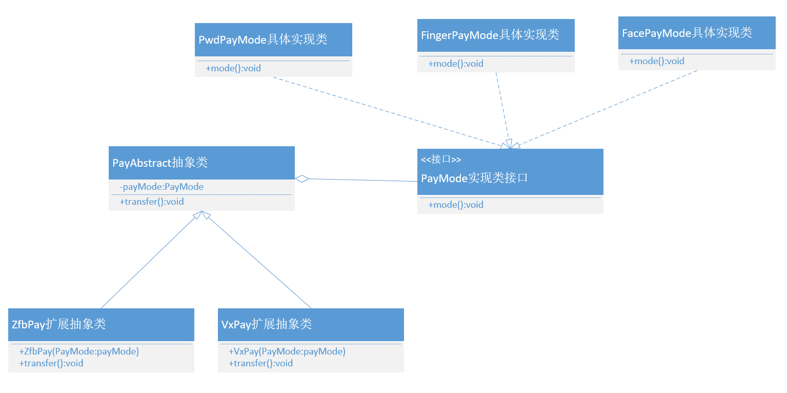
*图4-3：桥接模式UML类图结构*

#### 4.3.3 Java代码实现详解

**实现接口**
```java
// 实现接口
public interface Implementor {
    void operationImpl();
}

// 具体实现A
public class ConcreteImplementorA implements Implementor {
    @Override
    public void operationImpl() {
        System.out.println("具体实现A的方法执行");
    }
}

// 具体实现B
public class ConcreteImplementorB implements Implementor {
    @Override
    public void operationImpl() {
        System.out.println("具体实现B的方法执行");
    }
}
```

**抽象类**
```java
// 抽象类
public abstract class Abstraction {
    protected Implementor implementor;
    
    public Abstraction(Implementor implementor) {
        this.implementor = implementor;
    }
    
    public abstract void operation();
}

// 扩展抽象类
public class RefinedAbstraction extends Abstraction {
    public RefinedAbstraction(Implementor implementor) {
        super(implementor);
    }
    
    @Override
    public void operation() {
        System.out.println("扩展抽象类的操作");
        implementor.operationImpl();
    }
}
```

**客户端使用**
```java
public class Client {
    public static void main(String[] args) {
        Implementor implementorA = new ConcreteImplementorA();
        Implementor implementorB = new ConcreteImplementorB();
        
        Abstraction abstractionA = new RefinedAbstraction(implementorA);
        abstractionA.operation();
        // 输出：扩展抽象类的操作
        //      具体实现A的方法执行
        
        Abstraction abstractionB = new RefinedAbstraction(implementorB);
        abstractionB.operation();
        // 输出：扩展抽象类的操作
        //      具体实现B的方法执行
    }
}
```

#### 4.3.4 典型应用场景
- 多维变化的图形界面系统（形状×颜色×材质）
- 跨平台应用开发（操作系统×功能模块）
- 驱动程序开发（设备类型×通信协议）
- 消息推送系统（消息类型×推送渠道）[^525][^528]

#### 4.3.5 优缺点分析
**优点**：
- 分离抽象与实现，扩展能力强
- 符合开闭原则，可以独立扩展抽象和实现
- 符合合成复用原则，使用组合替代继承
- 减少子类数量，降低系统复杂度[^696]

**缺点**：
- 增加系统的理解难度，需要识别抽象和实现
- 需要正确识别系统中两个独立变化的维度
- 设计时需要仔细规划，否则可能导致过度设计[^696]

#### 4.3.6 与其他模式的区别
- **适配器模式**：适配已有接口，解决接口不兼容问题
- **桥接模式**：分离抽象与实现，解决多维扩展问题
- **装饰器模式**：动态添加功能，不改变接口结构[^696]

### 4.4 组合模式（Composite Pattern）

#### 4.4.1 问题引入场景
当需要处理树形结构数据，且希望对单个对象和组合对象使用相同的操作时，组合模式提供了统一的解决方案。例如，文件系统中的文件和文件夹、组织架构中的员工和部门、GUI中的容器和组件等[^525]。

#### 4.4.2 模式结构与原理
组合模式将对象组合成树形结构以表示"部分-整体"的层次结构，使得客户端对单个对象和组合对象的使用具有一致性[^525][^528]。组合模式通过统一的接口处理叶节点和容器节点。

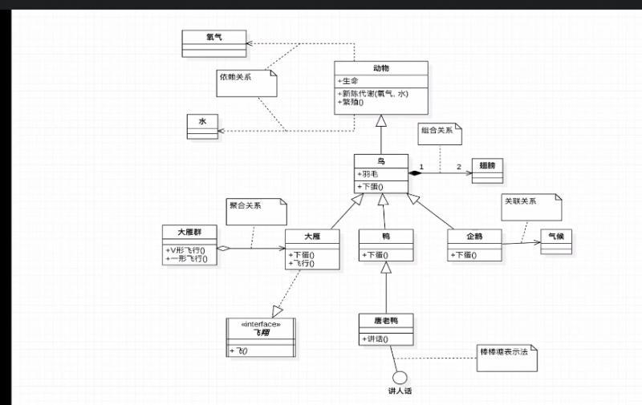
*图4-4：组合模式UML类图结构*

#### 4.4.3 Java代码实现详解

**组件接口**
```java
// 组件接口
public interface Component {
    void operation();
    void add(Component component);
    void remove(Component component);
    Component getChild(int i);
}
```

**叶子节点**
```java
// 叶子节点
public class Leaf implements Component {
    private String name;
    
    public Leaf(String name) {
        this.name = name;
    }
    
    @Override
    public void operation() {
        System.out.println("叶子节点 " + name + " 执行操作");
    }
    
    @Override
    public void add(Component component) {
        throw new UnsupportedOperationException("叶子节点不能添加子节点");
    }
    
    @Override
    public void remove(Component component) {
        throw new UnsupportedOperationException("叶子节点不能删除子节点");
    }
    
    @Override
    public Component getChild(int i) {
        throw new UnsupportedOperationException("叶子节点没有子节点");
    }
}
```

**容器节点**
```java
// 容器节点
import java.util.ArrayList;
import java.util.List;

public class Composite implements Component {
    private List<Component> children = new ArrayList<>();
    private String name;
    
    public Composite(String name) {
        this.name = name;
    }
    
    @Override
    public void operation() {
        System.out.println("容器节点 " + name + " 执行操作");
        for (Component child : children) {
            child.operation();
        }
    }
    
    @Override
    public void add(Component component) {
        children.add(component);
    }
    
    @Override
    public void remove(Component component) {
        children.remove(component);
    }
    
    @Override
    public Component getChild(int i) {
        return children.get(i);
    }
}
```

**客户端使用**
```java
public class Client {
    public static void main(String[] args) {
        // 创建叶子节点
        Component leaf1 = new Leaf("叶子1");
        Component leaf2 = new Leaf("叶子2");
        Component leaf3 = new Leaf("叶子3");
        
        // 创建容器节点
        Component composite1 = new Composite("容器1");
        Component composite2 = new Composite("容器2");
        
        // 构建树形结构
        composite1.add(leaf1);
        composite1.add(leaf2);
        
        composite2.add(leaf3);
        composite2.add(composite1);
        
        // 执行操作
        composite2.operation();
        // 输出：
        // 容器节点 容器2 执行操作
        // 叶子节点 叶子3 执行操作
        // 容器节点 容器1 执行操作
        // 叶子节点 叶子1 执行操作
        // 叶子节点 叶子2 执行操作
    }
}
```

#### 4.4.4 典型应用场景
- 文件系统管理（文件和文件夹的统一操作）
- 组织架构管理（员工和部门的层次结构）
- GUI组件系统（容器和控件的树形结构）
- 菜单系统（菜单项和子菜单的层次结构）[^525][^528]

#### 4.4.5 优缺点分析
**优点**：
- 定义了包含基本对象和组合对象的类层次结构
- 简化客户端代码，客户端可以一致地使用组合对象和单个对象
- 容易增加新类型的组件，符合开闭原则
- 提供了灵活的对象结构[^696]

**缺点**：
- 设计较复杂，需要区分叶节点和容器节点
- 使设计变得更加抽象，难以限制容器中的组件类型
- 可能违反接口隔离原则，叶子节点不需要的方法也要实现[^696]

#### 4.4.6 安全式与透明式组合模式
- **透明式组合模式**：Component接口声明所有管理子对象的方法，Leaf节点提供默认实现或抛出异常
- **安全式组合模式**：Component接口只声明操作方法，管理子对象的方法在Composite中声明，客户端需要区分类型[^696]

### 4.5 装饰器模式（Decorator Pattern）

#### 4.5.1 问题引入场景
当需要动态地给一个对象添加一些额外的职责，而又不希望使用继承来扩展功能时，装饰器模式提供了灵活的解决方案。相比静态继承，装饰器模式提供了更加灵活的扩展方式[^525]。

#### 4.5.2 模式结构与原理
装饰器模式动态地给对象添加一些额外的职责，就增加功能来说，装饰器模式相比生成子类更为灵活[^525][^528]。装饰器模式通过包装对象，在不改变对象结构的情况下添加新功能。


*图4-5：装饰器模式UML类图结构*

#### 4.5.3 Java代码实现详解

**组件接口**
```java
// 组件接口
public interface Component {
    void operation();
}
```

**具体组件**
```java
// 具体组件
public class ConcreteComponent implements Component {
    @Override
    public void operation() {
        System.out.println("具体组件的操作");
    }
}
```

**装饰器抽象类**
```java
// 装饰器抽象类
public abstract class Decorator implements Component {
    protected Component component;
    
    public Decorator(Component component) {
        this.component = component;
    }
    
    @Override
    public void operation() {
        component.operation();
    }
}
```

**具体装饰器**
```java
// 具体装饰器A
public class ConcreteDecoratorA extends Decorator {
    public ConcreteDecoratorA(Component component) {
        super(component);
    }
    
    @Override
    public void operation() {
        super.operation();
        addedBehavior();
        System.out.println("具体装饰器A的操作");
    }
    
    private void addedBehavior() {
        System.out.println("具体装饰器A添加的新行为");
    }
}

// 具体装饰器B
public class ConcreteDecoratorB extends Decorator {
    public ConcreteDecoratorB(Component component) {
        super(component);
    }
    
    @Override
    public void operation() {
        super.operation();
        System.out.println("具体装饰器B的操作");
    }
}
```

**客户端使用**
```java
public class Client {
    public static void main(String[] args) {
        // 创建具体组件
        Component component = new ConcreteComponent();
        
        // 使用装饰器A装饰
        Component decoratorA = new ConcreteDecoratorA(component);
        decoratorA.operation();
        // 输出：
        // 具体组件的操作
        // 具体装饰器A添加的新行为
        // 具体装饰器A的操作
        
        // 使用装饰器B装饰
        Component decoratorB = new ConcreteDecoratorB(component);
        decoratorB.operation();
        // 输出：
        // 具体组件的操作
        // 具体装饰器B的操作
        
        // 多层装饰
        Component multiDecorator = new ConcreteDecoratorB(
            new ConcreteDecoratorA(component)
        );
        multiDecorator.operation();
        // 输出：
        // 具体组件的操作
        // 具体装饰器A添加的新行为
        // 具体装饰器A的操作
        // 具体装饰器B的操作
    }
}
```

#### 4.5.4 典型应用场景
- IO流处理（BufferedReader、DataInputStream等）
- GUI组件动态添加功能（边框、滚动条等）
- Web请求处理（添加日志、权限验证、缓存等）
- 图形处理（添加滤镜、特效等）[^525][^528]

#### 4.5.5 优缺点分析
**优点**：
- 装饰器模式与继承关系的目的都是扩展对象功能，但装饰器模式可以提供比继承更多的灵活性
- 可以通过一种动态的方式来扩展一个对象的功能，通过配置文件可以在运行时选择不同的装饰器
- 通过使用不同的具体装饰类以及这些装饰类的排列组合，可以创造出很多不同行为的组合[^696]

**缺点**：
- 比继承更加灵活，但也意味着比继承更加复杂
- 这种比继承更加灵活的特性使得装饰模式比继承更加易于出错，排查也更加困难
- 多层装饰时，调试变得复杂[^696]

#### 4.5.6 在Java IO中的应用
Java IO库是装饰器模式的经典应用，如`BufferedReader`包装`InputStreamReader`，`DataInputStream`包装`InputStream`等，通过层层包装实现功能的动态组合[^172][^177]。

### 4.6 外观模式（Facade Pattern）

#### 4.6.1 问题引入场景
当系统变得越来越复杂，存在多个子系统时，客户端与这些子系统的交互变得越来越复杂。外观模式为这些复杂的子系统提供一个统一的接口，简化客户端的使用[^525]。

#### 4.6.2 模式结构与原理
外观模式为子系统中的一组接口提供一个统一的接口，外观模式定义了一个高层接口，这个接口使得这一子系统更加容易使用[^525][^528]。外观模式通过封装复杂的子系统，提供简化的接口。

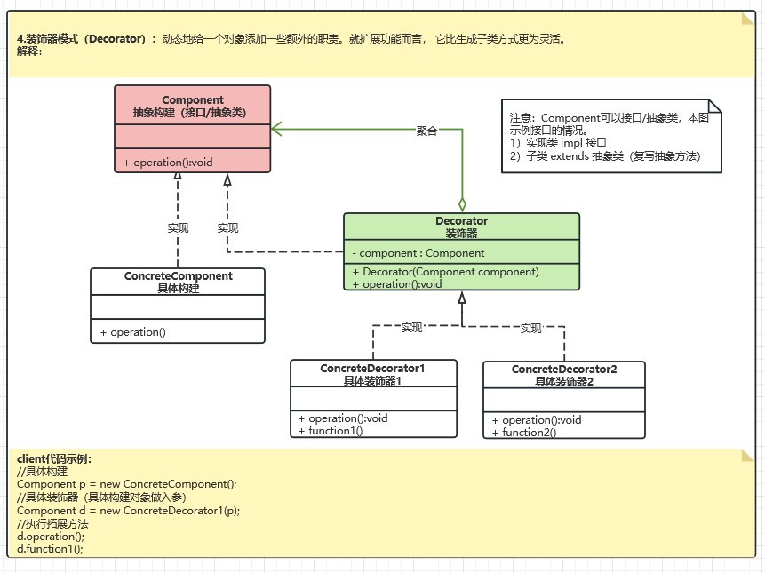
*图4-6：外观模式UML类图结构*

#### 4.6.3 Java代码实现详解

**子系统类**
```java
// 子系统A
public class SubSystemA {
    public void methodA() {
        System.out.println("子系统A的方法A");
    }
}

// 子系统B
public class SubSystemB {
    public void methodB() {
        System.out.println("子系统B的方法B");
    }
}

// 子系统C
public class SubSystemC {
    public void methodC() {
        System.out.println("子系统C的方法C");
    }
}
```

**外观类**
```java
// 外观类
public class Facade {
    private SubSystemA subSystemA;
    private SubSystemB subSystemB;
    private SubSystemC subSystemC;
    
    public Facade() {
        this.subSystemA = new SubSystemA();
        this.subSystemB = new SubSystemB();
        this.subSystemC = new SubSystemC();
    }
    
    public void method() {
        System.out.println("外观类的方法开始");
        subSystemA.methodA();
        subSystemB.methodB();
        subSystemC.methodC();
        System.out.println("外观类的方法结束");
    }
}
```

**客户端使用**
```java
public class Client {
    public static void main(String[] args) {
        // 使用外观类
        Facade facade = new Facade();
        facade.method();
        // 输出：
        // 外观类的方法开始
        // 子系统A的方法A
        // 子系统B的方法B
        // 子系统C的方法C
        // 外观类的方法结束
        
        // 直接使用子系统（复杂方式）
        SubSystemA subSystemA = new SubSystemA();
        SubSystemB subSystemB = new SubSystemB();
        SubSystemC subSystemC = new SubSystemC();
        
        subSystemA.methodA();
        subSystemB.methodB();
        subSystemC.methodC();
    }
}
```

#### 4.6.4 典型应用场景
- 复杂系统的统一接口（如数据库访问、网络通信）
- 第三方库的封装和简化
- 分层架构中的层间接口
- 配置管理和初始化流程[^525][^528]

#### 4.6.5 优缺点分析
**优点**：
- 对客户屏蔽子系统组件，减少了客户处理的对象数目，并使得子系统使用起来更加容易
- 实现了子系统与客户之间的松耦合关系
- 降低大型软件系统的复杂度，提高了系统的可维护性
- 有助于分层架构的实现[^696]

**缺点**：
- 不能很好地限制客户使用子系统类，如果对客户访问子系统类做太多的限制则减少了可变性和灵活性
- 在不引入抽象外观类的情况下，增加新的子系统可能需要修改外观类或客户端的源代码，违背了开闭原则[^696]

#### 4.6.6 与其他模式的关系
- **外观模式** vs **适配器模式**：外观模式重在简化，适配器模式重在兼容
- **外观模式** vs **中介者模式**：外观模式单向简化，中介者模式双向协调
- **外观模式** vs **单例模式**：外观类通常设计为单例，提供全局访问点[^696]

### 4.7 享元模式（Flyweight Pattern）

#### 4.7.1 问题引入场景
当系统中存在大量相似对象，这些对象占用大量内存时，享元模式通过共享技术来有效地支持大量细粒度的对象。例如，文本编辑器中的字符对象、围棋游戏中的棋子、森林中的树木等[^525]。

#### 4.7.2 模式结构与原理
享元模式运用共享技术来有效地支持大量细粒度的对象，避免大量相似对象的开销[^525][^528]。享元模式通过分离内部状态（可共享）和外部状态（不可共享）来实现对象共享。


*图4-7：享元模式UML类图结构*

#### 4.7.3 Java代码实现详解

**享元接口**
```java
// 享元接口
public interface Flyweight {
    void operation(String extrinsicState);
}
```

**具体享元类**
```java
// 具体享元类
public class ConcreteFlyweight implements Flyweight {
    private String intrinsicState;
    
    public ConcreteFlyweight(String intrinsicState) {
        this.intrinsicState = intrinsicState;
    }
    
    @Override
    public void operation(String extrinsicState) {
        System.out.println("具体享元：内部状态=" + intrinsicState + 
                          ", 外部状态=" + extrinsicState);
    }
}
```

**享元工厂**
```java
import java.util.HashMap;
import java.util.Map;

// 享元工厂
public class FlyweightFactory {
    private Map<String, Flyweight> flyweights = new HashMap<>();
    
    public Flyweight getFlyweight(String key) {
        Flyweight flyweight = flyweights.get(key);
        if (flyweight == null) {
            flyweight = new ConcreteFlyweight(key);
            flyweights.put(key, flyweight);
            System.out.println("创建新的享元对象：" + key);
        } else {
            System.out.println("复用享元对象：" + key);
        }
        return flyweight;
    }
    
    public int getFlyweightCount() {
        return flyweights.size();
    }
}
```

**客户端使用**
```java
public class Client {
    public static void main(String[] args) {
        FlyweightFactory factory = new FlyweightFactory();
        
        // 获取享元对象
        Flyweight flyweight1 = factory.getFlyweight("A");
        flyweight1.operation("外部状态1");
        
        Flyweight flyweight2 = factory.getFlyweight("B");
        flyweight2.operation("外部状态2");
        
        Flyweight flyweight3 = factory.getFlyweight("A"); // 复用
        flyweight3.operation("外部状态3");
        
        Flyweight flyweight4 = factory.getFlyweight("C");
        flyweight4.operation("外部状态4");
        
        Flyweight flyweight5 = factory.getFlyweight("B"); // 复用
        flyweight5.operation("外部状态5");
        
        System.out.println("享元对象总数：" + factory.getFlyweightCount());
        // 输出：
        // 创建新的享元对象：A
        // 具体享元：内部状态=A, 外部状态=外部状态1
        // 创建新的享元对象：B
        // 具体享元：内部状态=B, 外部状态=外部状态2
        // 复用享元对象：A
        // 具体享元：内部状态=A, 外部状态=外部状态3
        // 创建新的享元对象：C
        // 具体享元：内部状态=C, 外部状态=外部状态4
        // 复用享元对象：B
        // 具体享元：内部状态=B, 外部状态=外部状态5
        // 享元对象总数：3
    }
}
```

#### 4.7.4 典型应用场景
- 文本编辑器中的字符对象共享
- 围棋、象棋等棋类游戏中的棋子共享
- 数据库连接池中的连接对象共享
- 网页中的图片和图标缓存[^525][^528]

#### 4.7.5 优缺点分析
**优点**：
- 极大减少内存中对象的数量，使得相同对象或相似对象在内存中只保存一份
- 享元模式的外部状态相对独立，而且不会影响内部状态，从而使得享元对象可以在不同的环境中被共享
- 享元模式可以减少内存使用，提高程序性能[^696]

**缺点**：
- 享元模式使得系统更加复杂，需要分离内部状态和外部状态
- 享元模式需要将享元对象的外部状态外部化，而读取外部状态使得运行时间变长
- 享元模式将享元对象的状态外部化，而外部化的状态会影响系统的安全性[^696]

#### 4.7.6 在JDK中的应用
JDK中的`Integer.valueOf()`方法在[-128, 127]范围内缓存整数对象，`Boolean.valueOf()`返回预定义的静态实例，这些都是享元模式的应用[^172][^177]。

### 4.8 代理模式（Proxy Pattern）

#### 4.8.1 问题引入场景
当需要控制对某个对象的访问，或者需要在访问对象时添加额外的处理逻辑时，代理模式提供了解决方案。例如，远程访问、延迟加载、访问控制、日志记录等场景[^525]。

#### 4.8.2 模式结构与原理
代理模式为其他对象提供一种代理以控制对这个对象的访问[^525][^528]。代理模式通过代理对象控制对真实对象的访问，可以在不修改真实对象的情况下添加额外功能。

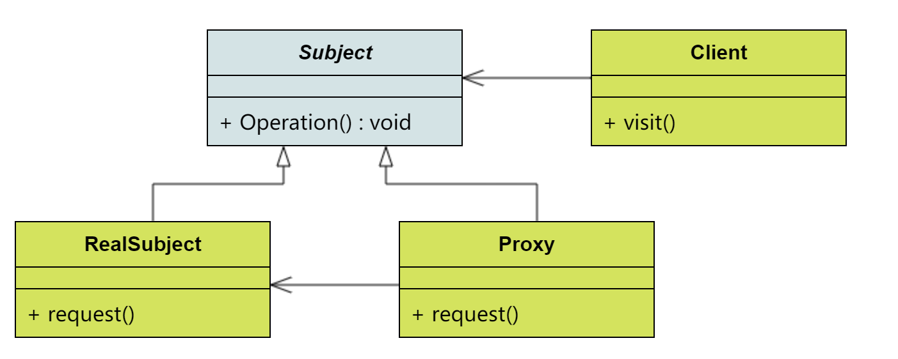
*图4-8：代理模式UML类图结构*

#### 4.8.3 Java代码实现详解

**主题接口**
```java
// 主题接口
public interface Subject {
    void request();
}
```

**真实主题**
```java
// 真实主题
public class RealSubject implements Subject {
    @Override
    public void request() {
        System.out.println("真实主题的请求");
    }
}
```

**代理类**
```java
// 代理类
public class Proxy implements Subject {
    private RealSubject realSubject;
    
    @Override
    public void request() {
        if (realSubject == null) {
            realSubject = new RealSubject();
        }
        
        preRequest();
        realSubject.request();
        postRequest();
    }
    
    private void preRequest() {
        System.out.println("代理：预处理");
    }
    
    private void postRequest() {
        System.out.println("代理：后处理");
    }
}
```

**客户端使用**
```java
public class Client {
    public static void main(String[] args) {
        Subject proxy = new Proxy();
        proxy.request();
        // 输出：
        // 代理：预处理
        // 真实主题的请求
        // 代理：后处理
    }
}
```

#### 4.8.4 代理模式的变体

**静态代理**
```java
// 静态代理（编译时确定代理关系）
public class StaticProxy implements Subject {
    private Subject realSubject;
    
    public StaticProxy(Subject realSubject) {
        this.realSubject = realSubject;
    }
    
    @Override
    public void request() {
        System.out.println("静态代理：预处理");
        realSubject.request();
        System.out.println("静态代理：后处理");
    }
}
```

**动态代理（JDK动态代理）**
```java
import java.lang.reflect.InvocationHandler;
import java.lang.reflect.Method;
import java.lang.reflect.Proxy;

// 动态代理处理器
public class DynamicProxyHandler implements InvocationHandler {
    private Object realSubject;
    
    public DynamicProxyHandler(Object realSubject) {
        this.realSubject = realSubject;
    }
    
    @Override
    public Object invoke(Object proxy, Method method, Object[] args) throws Throwable {
        System.out.println("动态代理：预处理");
        Object result = method.invoke(realSubject, args);
        System.out.println("动态代理：后处理");
        return result;
    }
}

// 客户端使用动态代理
public class DynamicProxyClient {
    public static void main(String[] args) {
        RealSubject realSubject = new RealSubject();
        
        Subject proxy = (Subject) Proxy.newProxyInstance(
            realSubject.getClass().getClassLoader(),
            realSubject.getClass().getInterfaces(),
            new DynamicProxyHandler(realSubject)
        );
        
        proxy.request();
        // 输出：
        // 动态代理：预处理
        // 真实主题的请求
        // 动态代理：后处理
    }
}
```

#### 4.8.5 典型应用场景
- 远程代理（RMI、Web Service）
- 虚拟代理（延迟加载大对象）
- 保护代理（访问控制和权限验证）
- 缓存代理（缓存结果，提高性能）
- 智能引用（引用计数、线程安全检查）[^525][^528]

#### 4.8.6 优缺点分析
**优点**：
- 代理模式能够协调调用者和被调用者，在一定程度上降低了系统的耦合度
- 代理对象可以在客户端和目标对象之间起到中介的作用，这样起到了保护目标对象的作用
- 代理对象可以扩展目标对象的功能，符合开闭原则[^696]

**缺点**：
- 代理模式会造成系统设计中类的数目增加
- 在客户端和目标对象之间增加一个代理对象，会造成请求处理速度变慢
- 增加了系统的复杂度[^696]

#### 4.8.7 在Spring AOP中的应用
Spring AOP的核心就是代理模式，通过JDK动态代理或CGLIB代理为目标对象创建代理对象，在方法调用前后添加横切逻辑（如事务管理、日志记录等）[^716][^718]。

### 4.9 结构型模式综合对比与选择指南

#### 4.9.1 模式对比总结

| **模式类型** | **核心目标** | **适用场景** | **优点** | **缺点** |
|--------------|--------------|--------------|----------|----------|
| **适配器模式** | 接口兼容转换 | 接口不兼容、集成第三方库 | 提高复用性、灵活性高 | 增加复杂度、阅读困难 |
| **桥接模式** | 分离抽象与实现 | 多维变化、避免类爆炸 | 独立扩展、减少子类 | 设计复杂、识别困难 |
| **组合模式** | 统一处理树形结构 | 部分整体层次结构 | 简化客户端、一致处理 | 设计复杂、限制困难 |
| **装饰器模式** | 动态功能扩展 | 运行时添加功能 | 灵活扩展、组合丰富 | 增加复杂度、调试困难 |
| **外观模式** | 简化复杂接口 | 复杂子系统封装 | 简化使用、松耦合 | 限制不严、扩展困难 |
| **享元模式** | 对象共享优化 | 大量相似对象 | 节省内存、提高性能 | 状态分离、时间开销 |
| **代理模式** | 访问控制与扩展 | 访问控制、延迟加载 | 保护目标、功能扩展 | 性能开销、复杂度增加[^696] |

#### 4.9.2 模式选择决策流程

1. **需要接口兼容？** → 适配器模式[^695]
2. **存在多维变化？** → 桥接模式[^695]
3. **处理树形结构？** → 组合模式[^695]
4. **动态添加功能？** → 装饰器模式[^695]
5. **简化复杂接口？** → 外观模式[^695]
6. **大量相似对象？** → 享元模式[^695]
7. **需要访问控制？** → 代理模式[^695]

#### 4.9.3 模式组合应用

**适配器 + 装饰器**
- 先使用适配器解决接口兼容问题
- 再使用装饰器动态添加功能

**组合 + 访问者**
- 使用组合模式构建树形结构
- 使用访问者模式遍历并操作结构

**外观 + 单例**
- 外观类通常设计为单例
- 提供全局统一的简化接口

**代理 + 装饰器**
- 代理控制访问，装饰器扩展功能
- 两者可以组合实现复杂的横切逻辑[^696]

#### 4.9.4 最佳实践与常见误区

**最佳实践**：
- 根据具体需求选择最适合的模式，避免过度设计
- 优先考虑组合而非继承，提高系统灵活性
- 在框架设计中合理使用外观模式简化接口
- 性能敏感场景考虑享元模式优化内存使用
- 需要横切逻辑时使用代理模式

**常见误区**：
- 滥用适配器模式导致系统难以理解
- 过度使用装饰器模式形成"俄罗斯套娃"
- 忽视组合模式的透明性要求
- 外观类承担过多职责违反单一原则
- 享元模式状态分离不当导致线程安全问题[^696]

### 4.10 本章总结

结构型设计模式为解决对象组合和结构问题提供了七种经典的解决方案，每种模式都有其特定的应用场景和优势。通过合理应用这些模式，可以构建出更加灵活、可维护和可扩展的软件系统。在实际开发中，应该根据具体需求选择最合适的模式，或者组合使用多种模式来解决复杂的结构设计问题。

结构型模式的核心价值在于通过组合而非继承的方式获得更大的灵活性，这使得系统更容易演进和维护。理解这些模式的核心思想和适用场景，能够帮助开发者构建出高质量的面向对象软件架构。

## 5. 行为型设计模式深入解析

### 5.1 行为型模式概述

行为型设计模式专注于类或对象之间的交互和职责分配，对对象间责任和算法进行抽象[^199][^530]。GoF定义的行为型模式包含十一种：**模板方法模式、策略模式、观察者模式、状态模式、责任链模式、命令模式、访问者模式、中介者模式、备忘录模式、解释器模式和迭代器模式**，它们共同构成了软件设计中对象交互的最佳实践体系[^199]。


*图5-1：行为型设计模式分类与特点对比*

### 5.2 模板方法模式（Template Method Pattern）

#### 5.2.1 问题引入场景
当多个算法或流程具有相同的骨架结构，但某些具体步骤的实现不同时，模板方法模式提供了统一的解决方案。例如，制作饮料的流程（烧水→冲泡→倒入杯中→加调料）对于茶和咖啡是相同的，但冲泡和加调料的具体实现不同[^530]。

#### 5.2.2 模式结构与原理
模板方法模式定义一个操作中的算法的骨架，而将一些步骤延迟到子类中，使得子类可以不改变一个算法的结构即可重定义该算法的某些特定步骤[^530][^532]。模板方法模式通过抽象类定义算法骨架，子类实现具体步骤。

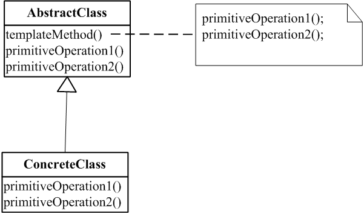
*图5-2：模板方法模式UML类图结构*

#### 5.2.3 Java代码实现详解

**抽象模板类**
```java
// 抽象模板类
public abstract class BeverageTemplate {
    
    // 模板方法 - 定义算法骨架，final防止子类重写
    public final void prepareBeverage() {
        boilWater();
        brew();
        pourInCup();
        addCondiments();
    }
    
    // 具体方法 - 所有子类都相同的实现
    private void boilWater() {
        System.out.println("烧水");
    }
    
    private void pourInCup() {
        System.out.println("倒入杯中");
    }
    
    // 抽象方法 - 子类必须实现
    protected abstract void brew();
    protected abstract void addCondiments();
    
    // 钩子方法 - 子类可以选择性重写
    protected boolean customerWantsCondiments() {
        return true;
    }
}
```

**具体模板类**
```java
// 具体模板类：茶
public class Tea extends BeverageTemplate {
    @Override
    protected void brew() {
        System.out.println("用沸水浸泡茶叶");
    }
    
    @Override
    protected void addCondiments() {
        System.out.println("加入柠檬");
    }
}

// 具体模板类：咖啡
public class Coffee extends BeverageTemplate {
    @Override
    protected void brew() {
        System.out.println("用沸水冲泡咖啡粉");
    }
    
    @Override
    protected void addCondiments() {
        System.out.println("加入糖和牛奶");
    }
    
    // 重写钩子方法
    @Override
    protected boolean customerWantsCondiments() {
        return false; // 咖啡不加调料
    }
}
```

**客户端使用**
```java
public class Client {
    public static void main(String[] args) {
        System.out.println("=== 制作茶 ===");
        BeverageTemplate tea = new Tea();
        tea.prepareBeverage();
        // 输出：
        // 烧水
        // 用沸水浸泡茶叶
        // 倒入杯中
        // 加入柠檬
        
        System.out.println("\n=== 制作咖啡 ===");
        BeverageTemplate coffee = new Coffee();
        coffee.prepareBeverage();
        // 输出：
        // 烧水
        // 用沸水冲泡咖啡粉
        // 倒入杯中
    }
}
```

#### 5.2.4 典型应用场景
- 算法骨架固定，部分步骤可变的场景
- 多个子类有公共方法，且逻辑相同的场景
- 重要、复杂的算法，可以设计为模板方法
- 框架设计，为子类提供扩展点[^530][^532]

#### 5.2.5 优缺点分析
**优点**：
- 提高代码复用性，将相同部分的代码放在抽象的父类中
- 提高扩展性，通过继承实现算法步骤的变化
- 符合开闭原则，通过继承扩展新功能
- 控制子类扩展，子类只能在特定点进行扩展[^696]

**缺点**：
- 每个不同的实现都需要一个子类，类的个数增加
- 类数目增加，间接地增加了系统实现的复杂度
- 继承关系使得代码阅读复杂度增加[^696]

#### 5.2.6 在JDK中的应用
JDK中的`java.util.AbstractList`提供了`addAll()`等方法的模板实现，子类如`ArrayList`只需实现`get()`、`size()`等抽象方法[^175][^177]。

### 5.3 策略模式（Strategy Pattern）

#### 5.3.1 问题引入场景
当一个算法有多种实现方式，需要在运行时动态选择算法时，策略模式提供了灵活的解决方案。例如，排序算法有多种实现（冒泡、快速、归并），支付方式有多种选择（支付宝、微信、银行卡）[^530]。

#### 5.3.2 模式结构与原理
策略模式定义一系列算法，把它们一个个封装起来，并且使它们可相互替换[^530][^532]。策略模式通过将算法封装成独立的策略类，使得算法可以独立于使用它的客户端变化。


*图5-3：策略模式UML类图结构*

#### 5.3.3 Java代码实现详解

**策略接口**
```java
// 策略接口
public interface PaymentStrategy {
    void pay(int amount);
}
```

**具体策略类**
```java
// 具体策略：支付宝支付
public class AlipayStrategy implements PaymentStrategy {
    @Override
    public void pay(int amount) {
        System.out.println("使用支付宝支付：" + amount + "元");
    }
}

// 具体策略：微信支付
public class WechatPayStrategy implements PaymentStrategy {
    @Override
    public void pay(int amount) {
        System.out.println("使用微信支付：" + amount + "元");
    }
}

// 具体策略：银行卡支付
public class BankCardStrategy implements PaymentStrategy {
    @Override
    public void pay(int amount) {
        System.out.println("使用银行卡支付：" + amount + "元");
    }
}
```

**上下文类**
```java
// 上下文类
public class PaymentContext {
    private PaymentStrategy paymentStrategy;
    
    public PaymentContext(PaymentStrategy paymentStrategy) {
        this.paymentStrategy = paymentStrategy;
    }
    
    public void setPaymentStrategy(PaymentStrategy paymentStrategy) {
        this.paymentStrategy = paymentStrategy;
    }
    
    public void executePayment(int amount) {
        paymentStrategy.pay(amount);
    }
}
```

**客户端使用**
```java
public class Client {
    public static void main(String[] args) {
        // 创建上下文
        PaymentContext context = new PaymentContext(new AlipayStrategy());
        
        // 执行支付
        context.executePayment(100);
        // 输出：使用支付宝支付：100元
        
        // 切换支付策略
        context.setPaymentStrategy(new WechatPayStrategy());
        context.executePayment(200);
        // 输出：使用微信支付：200元
        
        // 再次切换策略
        context.setPaymentStrategy(new BankCardStrategy());
        context.executePayment(300);
        // 输出：使用银行卡支付：300元
    }
}
```

#### 5.3.4 典型应用场景
- 算法有多种实现方式，需要在运行时切换
- 需要避免使用多重条件语句选择算法
- 算法需要独立于使用它的客户端变化
- 希望对客户端隐藏算法的实现细节[^530][^532]

#### 5.3.5 优缺点分析
**优点**：
- 算法可以自由切换，避免了多重条件判断
- 扩展性良好，符合开闭原则
- 提高算法的保密性和安全性
- 遵循单一职责原则，每个算法类职责单一[^696]

**缺点**：
- 策略类会增多，增加系统复杂度
- 所有策略类都需要对外暴露
- 客户端必须知道所有的策略类，并自行决定使用哪个策略类
- 策略模式只适用于算法可以自由切换的场景[^696]

#### 5.3.6 在JDK中的应用
JDK中的`java.util.Comparator`接口就是策略模式的经典应用，不同的Comparator实现类代表不同的排序策略，可以在运行时动态选择[^172][^177]。

### 5.4 观察者模式（Observer Pattern）

#### 5.4.1 问题引入场景
当一个对象的状态发生改变时，需要自动通知其他依赖对象，且不希望这些对象之间产生紧密耦合时，观察者模式提供了完美的解决方案。例如，股票价格变化通知投资者、天气变化通知订阅者、事件驱动的GUI系统[^530]。

#### 5.4.2 模式结构与原理
观察者模式定义对象间的一种一对多的依赖关系，当一个对象的状态发生改变时，所有依赖于它的对象都得到通知并被自动更新[^530][^532]。观察者模式通过抽象观察者和具体观察者的分离，实现了发布-订阅机制。

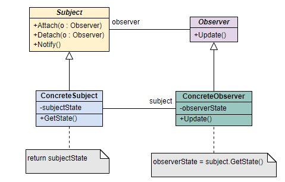
*图5-4：观察者模式UML类图结构*

#### 5.4.3 Java代码实现详解

**主题接口**
```java
import java.util.List;
import java.util.ArrayList;

// 主题接口（被观察者）
public interface Subject {
    void registerObserver(Observer observer);
    void removeObserver(Observer observer);
    void notifyObservers();
}
```

**观察者接口**
```java
// 观察者接口
public interface Observer {
    void update(String message);
}
```

**具体主题类**
```java
// 具体主题类：气象站
public class WeatherStation implements Subject {
    private List<Observer> observers = new ArrayList<>();
    private String weather;
    
    public void setWeather(String weather) {
        this.weather = weather;
        System.out.println("天气变化：" + weather);
        notifyObservers();
    }
    
    @Override
    public void registerObserver(Observer observer) {
        observers.add(observer);
        System.out.println("添加观察者：" + observer.getClass().getSimpleName());
    }
    
    @Override
    public void removeObserver(Observer observer) {
        observers.remove(observer);
        System.out.println("移除观察者：" + observer.getClass().getSimpleName());
    }
    
    @Override
    public void notifyObservers() {
        for (Observer observer : observers) {
            observer.update(weather);
        }
    }
}
```

**具体观察者类**
```java
// 具体观察者：手机用户
public class PhoneUser implements Observer {
    private String name;
    
    public PhoneUser(String name) {
        this.name = name;
    }
    
    @Override
    public void update(String message) {
        System.out.println("手机用户 " + name + " 收到天气通知：" + message);
    }
}

// 具体观察者：电视用户
public class TVUser implements Observer {
    private String name;
    
    public TVUser(String name) {
        this.name = name;
    }
    
    @Override
    public void update(String message) {
        System.out.println("电视用户 " + name + " 收到天气通知：" + message);
    }
}
```

**客户端使用**
```java
public class Client {
    public static void main(String[] args) {
        // 创建主题
        WeatherStation weatherStation = new WeatherStation();
        
        // 创建观察者
        Observer phoneUser1 = new PhoneUser("张三");
        Observer phoneUser2 = new PhoneUser("李四");
        Observer tvUser = new TVUser("王五");
        
        // 注册观察者
        weatherStation.registerObserver(phoneUser1);
        weatherStation.registerObserver(phoneUser2);
        weatherStation.registerObserver(tvUser);
        
        // 天气变化，通知所有观察者
        weatherStation.setWeather("晴天");
        // 输出：
        // 天气变化：晴天
        // 手机用户 张三 收到天气通知：晴天
        // 手机用户 李四 收到天气通知：晴天
        // 电视用户 王五 收到天气通知：晴天
        
        // 移除一个观察者
        weatherStation.removeObserver(phoneUser2);
        
        // 再次天气变化
        weatherStation.setWeather("下雨");
        // 输出：
        // 天气变化：下雨
        // 手机用户 张三 收到天气通知：下雨
        // 电视用户 王五 收到天气通知：下雨
    }
}
```

#### 5.4.4 典型应用场景
- 事件驱动的GUI系统（按钮点击、鼠标移动等）
- 消息队列和发布-订阅系统
- 股票价格变化通知
- 社交媒体的关注和通知机制
- MVC模式中的模型-视图通信[^530][^532]

#### 5.4.5 优缺点分析
**优点**：
- 降低目标与观察者之间的耦合关系，两者之间是抽象耦合
- 目标与观察者之间建立了一套触发机制
- 支持广播通信，目标会向所有已注册的观察者发送通知
- 符合开闭原则，可以增加新的观察者类型[^696]

**缺点**：
- 如果观察者很多，通知所有观察者会花费很多时间
- 如果观察者和观察目标之间有循环依赖，可能导致系统崩溃
- 观察者模式没有相应的机制让观察者知道目标是如何变化的
- 观察者无法知道其他观察者的存在[^696]

#### 5.4.6 在Java中的应用
Java提供了内置的观察者模式支持：`java.util.Observable`类和`java.util.Observer`接口，虽然现在已被标记为过时，但其设计思想仍被广泛使用。Spring的事件机制也是观察者模式的典型应用[^172][^177]。

### 5.5 状态模式（State Pattern）

#### 5.5.1 问题引入场景
当一个对象的行为取决于它的状态，并且它必须在运行时根据状态改变行为时，状态模式提供了优雅的解决方案。例如，订单状态（待支付、已支付、已发货、已完成）、线程状态（新建、就绪、运行、阻塞、终止）[^530]。

#### 5.5.2 模式结构与原理
状态模式允许一个对象在其内部状态改变时改变它的行为，对象看起来似乎修改了它的类[^530][^532]。状态模式通过将状态封装成独立的类，使得状态转换更加清晰和可控。


*图5-5：状态模式UML类图结构*

#### 5.5.3 Java代码实现详解

**状态接口**
```java
// 状态接口
public interface OrderState {
    void pay(Order order);
    void ship(Order order);
    void complete(Order order);
}
```

**具体状态类**
```java
// 具体状态：待支付
public class PendingPaymentState implements OrderState {
    @Override
    public void pay(Order order) {
        System.out.println("订单支付成功");
        order.setState(new PaidState());
    }
    
    @Override
    public void ship(Order order) {
        System.out.println("订单未支付，无法发货");
    }
    
    @Override
    public void complete(Order order) {
        System.out.println("订单未支付，无法完成");
    }
}

// 具体状态：已支付
public class PaidState implements OrderState {
    @Override
    public void pay(Order order) {
        System.out.println("订单已支付，无需重复支付");
    }
    
    @Override
    public void ship(Order order) {
        System.out.println("订单发货成功");
        order.setState(new ShippedState());
    }
    
    @Override
    public void complete(Order order) {
        System.out.println("订单未发货，无法完成");
    }
}

// 具体状态：已发货
public class ShippedState implements OrderState {
    @Override
    public void pay(Order order) {
        System.out.println("订单已发货，无法支付");
    }
    
    @Override
    public void ship(Order order) {
        System.out.println("订单已发货，无需重复发货");
    }
    
    @Override
    public void complete(Order order) {
        System.out.println("订单完成");
        order.setState(new CompletedState());
    }
}

// 具体状态：已完成
public class CompletedState implements OrderState {
    @Override
    public void pay(Order order) {
        System.out.println("订单已完成，无法支付");
    }
    
    @Override
    public void ship(Order order) {
        System.out.println("订单已完成，无法发货");
    }
    
    @Override
    public void complete(Order order) {
        System.out.println("订单已完成，无需重复完成");
    }
}
```

**上下文类**
```java
// 上下文类：订单
public class Order {
    private OrderState state;
    
    public Order() {
        this.state = new PendingPaymentState(); // 初始状态
    }
    
    public void setState(OrderState state) {
        this.state = state;
    }
    
    public void pay() {
        state.pay(this);
    }
    
    public void ship() {
        state.ship(this);
    }
    
    public void complete() {
        state.complete(this);
    }
}
```

**客户端使用**
```java
public class Client {
    public static void main(String[] args) {
        Order order = new Order();
        
        System.out.println("=== 订单处理流程 ===");
        
        // 尝试完成订单（未支付）
        order.complete();
        // 输出：订单未支付，无法完成
        
        // 尝试发货（未支付）
        order.ship();
        // 输出：订单未支付，无法发货
        
        // 支付订单
        order.pay();
        // 输出：订单支付成功
        
        // 重复支付
        order.pay();
        // 输出：订单已支付，无需重复支付
        
        // 发货
        order.ship();
        // 输出：订单发货成功
        
        // 完成订单
        order.complete();
        // 输出：订单完成
        
        // 尝试再次操作
        order.pay();
        order.ship();
        order.complete();
        // 输出：
        // 订单已完成，无法支付
        // 订单已完成，无法发货
        // 订单已完成，无需重复完成
    }
}
```

#### 5.5.4 典型应用场景
- 对象的行为依赖于它的状态，并且它必须在运行时根据状态改变行为
- 一个操作中含有庞大的多分支的条件语句，且这些分支依赖于该对象的状态
- 状态转换规则复杂且需要集中管理
- 游戏角色的不同状态和行为[^530][^532]

#### 5.5.5 优缺点分析
**优点**：
- 将所有与某个状态有关的行为放到一个类中，并且可以方便地增加新的状态
- 状态转换逻辑集中管理，避免条件语句的复杂性
- 状态对象可共享，减少对象数量
- 符合开闭原则，易于扩展新状态[^696]

**缺点**：
- 状态模式的使用必然会增加系统类和对象的个数
- 状态模式的结构与实现都较为复杂，如果使用不当将导致程序结构和代码的混乱
- 状态模式对"开闭原则"的支持并不太好[^696]

#### 5.5.6 与策略模式的区别
- **状态模式**：对象的行为取决于它的状态，状态之间有转换关系
- **策略模式**：算法可以相互替换，算法之间没有转换关系
- **关注点不同**：状态模式关注状态变化，策略模式关注算法选择[^696]

### 5.6 责任链模式（Chain of Responsibility Pattern）

#### 5.6.1 问题引入场景
当多个对象都有机会处理请求，且需要动态指定处理对象时，责任链模式提供了灵活的解决方案。例如，Java Web中的Filter链、日志处理器的级别过滤、请假审批流程等[^530]。

#### 5.6.2 模式结构与原理
责任链模式使多个对象都有机会处理请求，从而避免请求的发送者和接收者之间的耦合关系[^530][^532]。责任链模式将这些对象连成一条链，并沿着这条链传递该请求，直到有一个对象处理它为止。

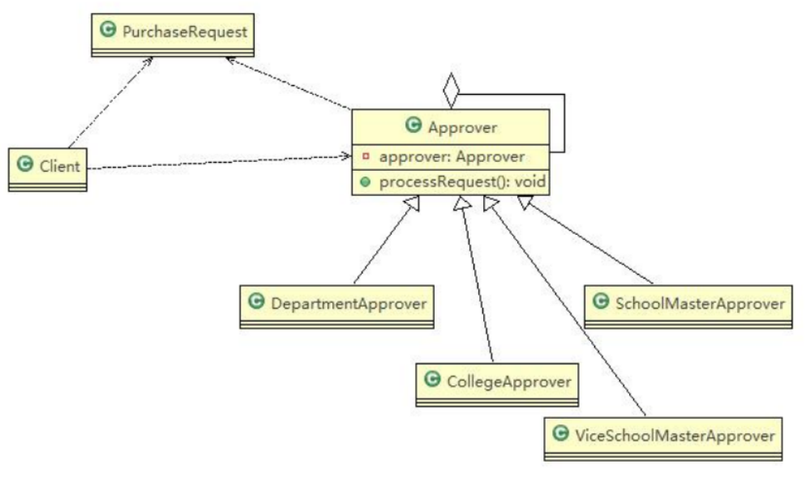
*图5-6：责任链模式UML类图结构*

#### 5.6.3 Java代码实现详解

**抽象处理器**
```java
// 抽象处理器
public abstract class Handler {
    protected Handler nextHandler;
    
    public void setNext(Handler nextHandler) {
        this.nextHandler = nextHandler;
    }
    
    // 处理请求的模板方法
    public final void handleRequest(int level) {
        if (canHandle(level)) {
            doHandle();
        } else if (nextHandler != null) {
            nextHandler.handleRequest(level);
        } else {
            System.out.println("没有处理器能处理级别 " + level + " 的请求");
        }
    }
    
    // 子类实现：判断是否能处理
    protected abstract boolean canHandle(int level);
    
    // 子类实现：具体处理逻辑
    protected abstract void doHandle();
}
```

**具体处理器**
```java
// 具体处理器：经理
public class ManagerHandler extends Handler {
    @Override
    protected boolean canHandle(int level) {
        return level <= 2; // 能处理1-2级请求
    }
    
    @Override
    protected void doHandle() {
        System.out.println("经理处理了请求");
    }
}

// 具体处理器：总监
public class DirectorHandler extends Handler {
    @Override
    protected boolean canHandle(int level) {
        return level <= 4; // 能处理3-4级请求
    }
    
    @Override
    protected void doHandle() {
        System.out.println("总监处理了请求");
    }
}

// 具体处理器：CEO
public class CEOHandler extends Handler {
    @Override
    protected boolean canHandle(int level) {
        return level <= 6; // 能处理5-6级请求
    }
    
    @Override
    protected void doHandle() {
        System.out.println("CEO处理了请求");
    }
}
```

**客户端使用**
```java
public class Client {
    public static void main(String[] args) {
        // 创建处理器
        Handler manager = new ManagerHandler();
        Handler director = new DirectorHandler();
        Handler ceo = new CEOHandler();
        
        // 设置责任链
        manager.setNext(director);
        director.setNext(ceo);
        
        System.out.println("=== 责任链处理测试 ===");
        
        // 测试不同级别的请求
        System.out.println("处理1级请求：");
        manager.handleRequest(1);
        // 输出：经理处理了请求
        
        System.out.println("\n处理3级请求：");
        manager.handleRequest(3);
        // 输出：总监处理了请求
        
        System.out.println("\n处理5级请求：");
        manager.handleRequest(5);
        // 输出：CEO处理了请求
        
        System.out.println("\n处理7级请求：");
        manager.handleRequest(7);
        // 输出：没有处理器能处理级别 7 的请求
    }
}
```

#### 5.6.4 典型应用场景
- Java Web中的Filter和Interceptor链
- 日志处理器的级别过滤
- 请假审批流程
- 异常处理链
- 事件传播机制[^530][^532]

#### 5.6.5 优缺点分析
**优点**：
- 降低耦合度，将请求的发送者和接收者解耦
- 简化了对象，使得对象不需要知道链的结构
- 增强给对象指派职责的灵活性，允许动态地新增或者删除责任
- 增加新的请求处理类很方便[^696]

**缺点**：
- 不能保证请求一定被接收
- 系统性能将受到一定影响，而且在进行代码调试时不太方便
- 可能会造成循环调用
- 建立链的配置比较繁琐[^696]

#### 5.6.6 在Servlet中的应用
Java Servlet中的`Filter`链是责任链模式的经典应用，多个Filter按顺序处理HTTP请求，每个Filter可以选择继续传递请求或直接返回响应[^172][^177]。

### 5.7 命令模式（Command Pattern）

#### 5.7.1 问题引入场景
当需要将请求调用者与接收者解耦，使得调用者不需要知道接收者的具体操作时，命令模式提供了完美的解决方案。例如，遥控器控制家电、文本编辑器的撤销重做功能、队列和日志请求等[^530]。

#### 5.7.2 模式结构与原理
命令模式将一个请求封装为一个对象，从而使你可用不同的请求对客户进行参数化[^530][^532]。命令模式通过将请求封装成命令对象，实现了请求调用者和接收者的解耦。


*图5-7：命令模式UML类图结构*

#### 5.7.3 Java代码实现详解

**命令接口**
```java
// 命令接口
public interface Command {
    void execute();
    void undo();
}
```

**接收者类**
```java
// 接收者：灯
public class Light {
    public void turnOn() {
        System.out.println("灯打开");
    }
    
    public void turnOff() {
        System.out.println("灯关闭");
    }
}

// 接收者：空调
public class AirConditioner {
    public void turnOn() {
        System.out.println("空调打开");
    }
    
    public void turnOff() {
        System.out.println("空调关闭");
    }
}
```

**具体命令类**
```java
// 具体命令：开灯命令
public class LightOnCommand implements Command {
    private Light light;
    
    public LightOnCommand(Light light) {
        this.light = light;
    }
    
    @Override
    public void execute() {
        light.turnOn();
    }
    
    @Override
    public void undo() {
        light.turnOff();
    }
}

// 具体命令：关灯命令
public class LightOffCommand implements Command {
    private Light light;
    
    public LightOffCommand(Light light) {
        this.light = light;
    }
    
    @Override
    public void execute() {
        light.turnOff();
    }
    
    @Override
    public void undo() {
        light.turnOn();
    }
}

// 具体命令：空调命令
public class AirConditionerOnCommand implements Command {
    private AirConditioner airConditioner;
    
    public AirConditionerOnCommand(AirConditioner airConditioner) {
        this.airConditioner = airConditioner;
    }
    
    @Override
    public void execute() {
        airConditioner.turnOn();
    }
    
    @Override
    public void undo() {
        airConditioner.turnOff();
    }
}
```

**调用者类**
```java
import java.util.Stack;

// 调用者：遥控器
public class RemoteControl {
    private Command command;
    private Stack<Command> commandHistory = new Stack<>();
    
    public void setCommand(Command command) {
        this.command = command;
    }
    
    public void pressButton() {
        if (command != null) {
            command.execute();
            commandHistory.push(command);
        }
    }
    
    public void pressUndo() {
        if (!commandHistory.isEmpty()) {
            Command lastCommand = commandHistory.pop();
            lastCommand.undo();
        }
    }
}
```

**客户端使用**
```java
public class Client {
    public static void main(String[] args) {
        // 创建接收者
        Light light = new Light();
        AirConditioner airConditioner = new AirConditioner();
        
        // 创建命令
        Command lightOn = new LightOnCommand(light);
        Command lightOff = new LightOffCommand(light);
        Command acOn = new AirConditionerOnCommand(airConditioner);
        
        // 创建调用者
        RemoteControl remote = new RemoteControl();
        
        System.out.println("=== 遥控器测试 ===");
        
        // 执行命令
        remote.setCommand(lightOn);
        remote.pressButton();
        // 输出：灯打开
        
        remote.setCommand(acOn);
        remote.pressButton();
        // 输出：空调打开
        
        remote.setCommand(lightOff);
        remote.pressButton();
        // 输出：灯关闭
        
        System.out.println("\n=== 撤销操作 ===");
        
        // 撤销操作
        remote.pressUndo();
        // 输出：灯打开
        
        remote.pressUndo();
        // 输出：空调关闭
    }
}
```

#### 5.7.4 典型应用场景
- GUI中的菜单和按钮操作
- 文本编辑器的撤销重做功能
- 宏命令（批量操作）
- 队列和日志请求
- 事务处理[^530][^532]

#### 5.7.5 优缺点分析
**优点**：
- 降低系统耦合度，请求调用者和接收者解耦
- 新的命令可以很容易地加入到系统中
- 可以比较容易地设计一个命令队列和宏命令
- 为请求的撤销和恢复提供了支持[^696]

**缺点**：
- 使用命令模式可能会导致某些系统有过多的具体命令类
- 命令模式的结构相对复杂，代码理解有一定难度
- 需要为每一个具体接收者创建一个具体命令类[^696]

#### 5.7.6 与其他模式的关系
- **命令模式**和**状态模式**：状态模式使用命令模式来实现状态转换
- **命令模式**和**组合模式**：组合模式可以用来组合命令，形成宏命令
- **命令模式**和**备忘录模式**：命令模式可以使用备忘录模式来实现可撤销的操作[^696]

### 5.8 访问者模式（Visitor Pattern）

#### 5.8.1 问题引入场景
当需要对一个复杂对象结构中的不同元素执行不同的操作，且不希望为每个元素都添加这些操作时，访问者模式提供了优雅的解决方案。例如，编译器对抽象语法树的不同节点进行不同操作、文档对象模型的处理[^530]。

#### 5.8.2 模式结构与原理
访问者模式表示一个作用于某对象结构中的各元素的操作，它使你可以在不改变各元素的类的前提下定义作用于这些元素的新操作[^530][^532]。访问者模式通过将操作从数据结构中分离出来，使得操作可以独立变化。

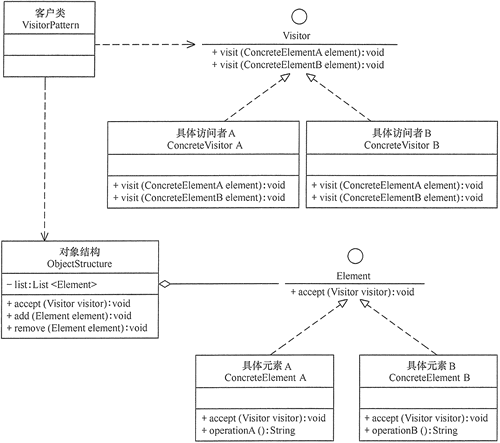
*图5-8：访问者模式UML类图结构*

#### 5.8.3 Java代码实现详解

**访问者接口**
```java
// 访问者接口
public interface Visitor {
    void visit(ConcreteElementA elementA);
    void visit(ConcreteElementB elementB);
}
```

**元素接口**
```java
// 元素接口
public interface Element {
    void accept(Visitor visitor);
}
```

**具体元素类**
```java
// 具体元素A
public class ConcreteElementA implements Element {
    private String operationA;
    
    public ConcreteElementA(String operationA) {
        this.operationA = operationA;
    }
    
    @Override
    public void accept(Visitor visitor) {
        visitor.visit(this);
    }
    
    public String getOperationA() {
        return operationA;
    }
    
    public void operationA() {
        System.out.println("元素A的操作：" + operationA);
    }
}

// 具体元素B
public class ConcreteElementB implements Element {
    private int operationB;
    
    public ConcreteElementB(int operationB) {
        this.operationB = operationB;
    }
    
    @Override
    public void accept(Visitor visitor) {
        visitor.visit(this);
    }
    
    public int getOperationB() {
        return operationB;
    }
    
    public void operationB() {
        System.out.println("元素B的操作：" + operationB);
    }
}
```

**具体访问者类**
```java
// 具体访问者：操作1
public class ConcreteVisitor1 implements Visitor {
    @Override
    public void visit(ConcreteElementA elementA) {
        System.out.println("访问者1访问元素A：" + elementA.getOperationA());
        elementA.operationA();
    }
    
    @Override
    public void visit(ConcreteElementB elementB) {
        System.out.println("访问者1访问元素B：" + elementB.getOperationB());
        elementB.operationB();
    }
}

// 具体访问者：操作2
public class ConcreteVisitor2 implements Visitor {
    @Override
    public void visit(ConcreteElementA elementA) {
        System.out.println("访问者2对元素A进行特殊处理：" + elementA.getOperationA());
    }
    
    @Override
    public void visit(ConcreteElementB elementB) {
        System.out.println("访问者2对元素B进行特殊处理：" + elementB.getOperationB());
    }
}
```

**对象结构类**
```java
import java.util.ArrayList;
import java.util.List;

// 对象结构
public class ObjectStructure {
    private List<Element> elements = new ArrayList<>();
    
    public void attach(Element element) {
        elements.add(element);
    }
    
    public void detach(Element element) {
        elements.remove(element);
    }
    
    public void accept(Visitor visitor) {
        for (Element element : elements) {
            element.accept(visitor);
        }
    }
}
```

**客户端使用**
```java
public class Client {
    public static void main(String[] args) {
        // 创建对象结构
        ObjectStructure objectStructure = new ObjectStructure();
        
        // 添加元素
        objectStructure.attach(new ConcreteElementA("操作A1"));
        objectStructure.attach(new ConcreteElementB(100));
        objectStructure.attach(new ConcreteElementA("操作A2"));
        
        // 创建访问者
        Visitor visitor1 = new ConcreteVisitor1();
        Visitor visitor2 = new ConcreteVisitor2();
        
        System.out.println("=== 访问者1操作 ===");
        objectStructure.accept(visitor1);
        // 输出：
        // 访问者1访问元素A：操作A1
        // 元素A的操作：操作A1
        // 访问者1访问元素B：100
        // 元素B的操作：100
        // 访问者1访问元素A：操作A2
        // 元素A的操作：操作A2
        
        System.out.println("\n=== 访问者2操作 ===");
        objectStructure.accept(visitor2);
        // 输出：
        // 访问者2对元素A进行特殊处理：操作A1
        // 访问者2对元素B进行特殊处理：100
        // 访问者2对元素A进行特殊处理：操作A2
    }
}
```

#### 5.8.4 典型应用场景
- 编译器对抽象语法树的不同操作
- 文档对象模型（DOM）的处理
- 复杂数据结构的多种遍历操作
- 数据库查询结果的不同格式化输出
- 代码生成器对AST的不同处理[^530][^532]

#### 5.8.5 优缺点分析
**优点**：
- 符合单一职责原则，将与数据结构相关的操作封装在访问者中
- 优秀的扩展性，增加新的操作很简单，增加新的访问者即可
- 灵活性高，可以针对不同的数据结构定义不同的操作
- 复杂性将相关操作集中到访问者中[^696]

**缺点**：
- 增加新的元素类困难，需要在抽象访问者中增加新的方法
- 依赖倒置，元素要依赖访问者，违反了依赖倒置原则
- 如果元素结构不稳定，经常变化，则不适合使用访问者模式
- 访问者模式要求元素类暴露其内部结构和状态[^696]

#### 5.8.6 双重分派机制
访问者模式实现了双重分派：第一重分派是根据元素类型确定调用哪个visit方法，第二重分派是根据访问者类型确定具体的操作实现。这种机制使得操作可以独立于数据结构变化[^696]。

### 5.9 中介者模式（Mediator Pattern）

#### 5.9.1 问题引入场景
当对象之间存在复杂的网状交互关系，导致系统难以维护和理解时，中介者模式提供了简化的解决方案。例如，聊天室中的用户交互、GUI组件之间的协调、机场塔台的飞机调度[^530]。

#### 5.9.2 模式结构与原理
中介者模式用一个中介对象来封装一系列的对象交互，中介者使各对象不需要显式地相互引用，从而使其耦合松散，而且可以独立地改变它们之间的交互[^530][^532]。中介者模式通过引入中介者对象，将网状关系变为星形关系。

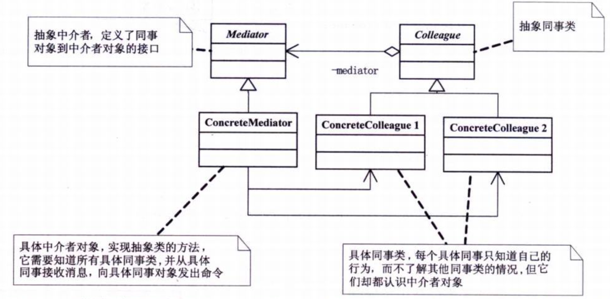
*图5-9：中介者模式UML类图结构*

#### 5.9.3 Java代码实现详解

**中介者接口**
```java
// 中介者接口
public interface Mediator {
    void register(Colleague colleague);
    void sendMessage(String message, Colleague colleague);
}
```

**同事类**
```java
// 抽象同事类
public abstract class Colleague {
    protected Mediator mediator;
    protected String name;
    
    public Colleague(Mediator mediator, String name) {
        this.mediator = mediator;
        this.name = name;
    }
    
    public abstract void receiveMessage(String message);
    public abstract void sendMessage(String message);
}

// 具体同事类：用户
public class User extends Colleague {
    public User(Mediator mediator, String name) {
        super(mediator, name);
    }
    
    @Override
    public void receiveMessage(String message) {
        System.out.println(name + " 收到消息：" + message);
    }
    
    @Override
    public void sendMessage(String message) {
        System.out.println(name + " 发送消息：" + message);
        mediator.sendMessage(message, this);
    }
}
```

**具体中介者类**
```java
import java.util.ArrayList;
import java.util.List;

// 具体中介者：聊天室
public class ChatRoom implements Mediator {
    private List<Colleague> colleagues = new ArrayList<>();
    
    @Override
    public void register(Colleague colleague) {
        if (!colleagues.contains(colleague)) {
            colleagues.add(colleague);
            System.out.println(colleague.name + " 加入聊天室");
        }
    }
    
    @Override
    public void sendMessage(String message, Colleague sender) {
        for (Colleague colleague : colleagues) {
            if (colleague != sender) {
                colleague.receiveMessage(message);
            }
        }
    }
}
```

**客户端使用**
```java
public class Client {
    public static void main(String[] args) {
        // 创建中介者
        Mediator chatRoom = new ChatRoom();
        
        // 创建同事
        Colleague user1 = new User(chatRoom, "张三");
        Colleague user2 = new User(chatRoom, "李四");
        Colleague user3 = new User(chatRoom, "王五");
        
        // 注册同事
        chatRoom.register(user1);
        chatRoom.register(user2);
        chatRoom.register(user3);
        
        System.out.println("\n=== 聊天开始 ===");
        
        // 用户发送消息
        user1.sendMessage("大家好！");
        // 输出：
        // 张三 发送消息：大家好！
        // 李四 收到消息：大家好！
        // 王五 收到消息：大家好！
        
        user2.sendMessage("你好，张三！");
        // 输出：
        // 李四 发送消息：你好，张三！
        // 张三 收到消息：你好，张三！
        // 王五 收到消息：你好，张三！
        
        user3.sendMessage("欢迎来到聊天室！");
        // 输出：
        // 王五 发送消息：欢迎来到聊天室！
        // 张三 收到消息：欢迎来到聊天室！
        // 李四 收到消息：欢迎来到聊天室！
    }
}
```

#### 5.9.4 典型应用场景
- 聊天室系统中的用户交互
- GUI框架中的组件协调
- 机场塔台的飞机调度
- 数据库事务管理
- 微服务架构中的服务网关[^530][^532]

#### 5.9.5 优缺点分析
**优点**：
- 降低了类之间的耦合度，将多对多关系转变为一对多关系
- 将对象间的协作逻辑集中管理，提高了系统的可维护性
- 减少了子类的生成，中介者将原本分布于多个对象间的行为集中在一起
- 可以对同事对象进行统一的控制和管理[^696]

**缺点**：
- 中介者会变得庞大复杂，难以维护
- 中介者需要知道所有同事类的细节，违反了最少知识原则
- 如果设计不当，中介者本身会成为系统的瓶颈
- 同事类之间的通信需要通过中介者，增加了通信的复杂度[^696]

#### 5.9.6 与其他模式的关系
- **中介者模式**和**观察者模式**：中介者模式可以使用观察者模式来实现同事之间的通信
- **中介者模式**和**外观模式**：外观模式关注简化接口，中介者模式关注协调交互
- **中介者模式**和**状态模式**：状态模式可以使用中介者来管理状态转换[^696]

### 5.10 备忘录模式（Memento Pattern）

#### 5.10.1 问题引入场景
当需要在不破坏封装性的前提下，捕获一个对象的内部状态，并在该对象之外保存这个状态，以便以后能将该对象恢复到原先保存的状态时，备忘录模式提供了完美的解决方案。例如，文本编辑器的撤销功能、游戏的存档读档[^530]。

#### 5.10.2 模式结构与原理
备忘录模式在不破坏封装性的前提下，捕获一个对象的内部状态，并在该对象之外保存这个状态[^530][^532]。备忘录模式通过备忘录对象来保存状态，通过发起人来创建和恢复状态，通过管理者来管理备忘录。


*图5-10：备忘录模式UML类图结构*

#### 5.10.3 Java代码实现详解

**备忘录类**
```java
// 备忘录类
public class Memento {
    private String state;
    
    public Memento(String state) {
        this.state = state;
    }
    
    public String getState() {
        return state;
    }
}
```

**发起人类**
```java
// 发起人类
public class Originator {
    private String state;
    
    public Originator(String state) {
        this.state = state;
    }
    
    public void setState(String state) {
        this.state = state;
        System.out.println("状态设置为：" + state);
    }
    
    public String getState() {
        return state;
    }
    
    // 创建备忘录
    public Memento createMemento() {
        System.out.println("创建备忘录，保存状态：" + state);
        return new Memento(state);
    }
    
    // 恢复备忘录
    public void restoreMemento(Memento memento) {
        this.state = memento.getState();
        System.out.println("恢复状态：" + state);
    }
}
```

**管理者类**
```java
import java.util.Stack;

// 管理者类
public class Caretaker {
    private Stack<Memento> mementoStack = new Stack<>();
    
    public void saveMemento(Memento memento) {
        mementoStack.push(memento);
        System.out.println("保存备忘录");
    }
    
    public Memento getMemento() {
        if (!mementoStack.isEmpty()) {
            System.out.println("获取备忘录");
            return mementoStack.pop();
        }
        return null;
    }
    
    public boolean hasMemento() {
        return !mementoStack.isEmpty();
    }
}
```

**客户端使用**
```java
public class Client {
    public static void main(String[] args) {
        // 创建发起人和管理者
        Originator originator = new Originator("初始状态");
        Caretaker caretaker = new Caretaker();
        
        System.out.println("=== 备忘录模式测试 ===");
        
        // 保存初始状态
        caretaker.saveMemento(originator.createMemento());
        
        // 改变状态
        originator.setState("状态1");
        caretaker.saveMemento(originator.createMemento());
        
        originator.setState("状态2");
        caretaker.saveMemento(originator.createMemento());
        
        originator.setState("状态3");
        
        System.out.println("\n=== 开始撤销 ===");
        
        // 撤销操作
        while (caretaker.hasMemento()) {
            originator.restoreMemento(caretaker.getMemento());
        }
        // 输出：
        // 恢复状态：状态3
        // 恢复状态：状态2
        // 恢复状态：状态1
        // 恢复状态：初始状态
    }
}
```

#### 5.10.4 典型应用场景
- 文本编辑器的撤销重做功能
- 游戏的存档读档系统
- 数据库事务的回滚操作
- 版本控制系统
- 图形编辑器的历史记录[^530][^532]

#### 5.10.5 优缺点分析
**优点**：
- 提供了一种状态恢复的实现机制，使得用户可以方便地回到某个历史状态
- 实现了信息的封装，使得用户不需要关心状态的保存细节
- 备忘录可以对发起人状态进行备份，提高了系统的可靠性
- 备忘录模式提供了对状态恢复的封装[^696]

**缺点**：
- 资源消耗过大，如果需要保存的状态过多，将会占用大量的内存资源
- 如果发起人角色的状态需要完整地保存到备忘录对象中，那么备忘录对象会变得很庞大
- 备忘录的管理需要额外的开销
- 备忘录模式的使用可能会增加系统的复杂度[^696]

#### 5.10.6 实现方式的变体
- **白箱备忘录**：备忘录对管理者是透明的，管理者可以访问备忘录的内部状态
- **黑箱备忘录**：备忘录对管理者是不透明的，管理者只能存储和获取备忘录，不能访问其内部状态[^696]

### 5.11 解释器模式（Interpreter Pattern）

#### 5.11.1 问题引入场景
当需要构建一个语言解释器，能够解释和执行特定语法的语句时，解释器模式提供了结构化的解决方案。例如，正则表达式解析、SQL解析器、配置文件解析器等[^530]。

#### 5.11.2 模式结构与原理
解释器模式给定一种语言，定义它的文法的一种表示，并定义一个解释器，这个解释器使用该表示来解释语言中的句子[^530][^532]。解释器模式通过构建抽象语法树，实现对语言语句的解释执行。

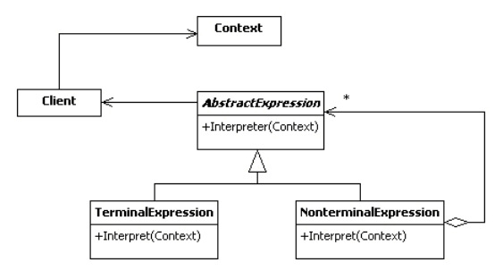
*图5-11：解释器模式UML类图结构*

#### 5.11.3 Java代码实现详解

**抽象表达式**
```java
// 抽象表达式
public interface Expression {
    int interpret();
}
```

**终结符表达式**
```java
// 终结符表达式：数字
public class NumberExpression implements Expression {
    private int number;
    
    public NumberExpression(int number) {
        this.number = number;
    }
    
    @Override
    public int interpret() {
        return number;
    }
}
```

**非终结符表达式**
```java
// 非终结符表达式：加法
public class AddExpression implements Expression {
    private Expression left;
    private Expression right;
    
    public AddExpression(Expression left, Expression right) {
        this.left = left;
        this.right = right;
    }
    
    @Override
    public int interpret() {
        return left.interpret() + right.interpret();
    }
}

// 非终结符表达式：减法
public class SubtractExpression implements Expression {
    private Expression left;
    private Expression right;
    
    public SubtractExpression(Expression left, Expression right) {
        this.left = left;
        this.right = right;
    }
    
    @Override
    public int interpret() {
        return left.interpret() - right.interpret();
    }
}

// 非终结符表达式：乘法
public class MultiplyExpression implements Expression {
    private Expression left;
    private Expression right;
    
    public MultiplyExpression(Expression left, Expression right) {
        this.left = left;
        this.right = right;
    }
    
    @Override
    public int interpret() {
        return left.interpret() * right.interpret();
    }
}
```

**上下文类**
```java
import java.util.Stack;

// 上下文类：解析器
public class Parser {
    private Stack<Expression> stack = new Stack<>();
    
    public int parse(String expression) {
        String[] tokens = expression.split(" ");
        
        for (String token : tokens) {
            if (isOperator(token)) {
                Expression right = stack.pop();
                Expression left = stack.pop();
                
                switch (token) {
                    case "+":
                        stack.push(new AddExpression(left, right));
                        break;
                    case "-":
                        stack.push(new SubtractExpression(left, right));
                        break;
                    case "*":
                        stack.push(new MultiplyExpression(left, right));
                        break;
                }
            } else {
                stack.push(new NumberExpression(Integer.parseInt(token)));
            }
        }
        
        return stack.pop().interpret();
    }
    
    private boolean isOperator(String token) {
        return token.equals("+") || token.equals("-") || token.equals("*");
    }
}
```

**客户端使用**
```java
public class Client {
    public static void main(String[] args) {
        Parser parser = new Parser();
        
        System.out.println("=== 解释器模式测试 ===");
        
        // 测试表达式：3 + 4 * 5 - 6
        String expression1 = "3 4 5 * + 6 -"; // 后缀表达式
        int result1 = parser.parse(expression1);
        System.out.println("表达式 " + expression1 + " 的结果：" + result1);
        // 输出：表达式 3 4 5 * + 6 - 的结果：17
        
        // 测试表达式：10 + 20 - 5 * 2
        String expression2 = "10 20 + 5 2 * -";
        int result2 = parser.parse(expression2);
        System.out.println("表达式 " + expression2 + " 的结果：" + result2);
        // 输出：表达式 10 20 + 5 2 * - 的结果：20
    }
}
```

#### 5.11.4 典型应用场景
- 编译器的语法分析和语义分析
- 正则表达式引擎
- 数据库查询语言解析
- 配置文件解析器
- 数学表达式计算器[^530][^532]

#### 5.11.5 优缺点分析
**优点**：
- 可扩展性比较好，灵活
- 增加了新的解释表达式的方式
- 易于实现简单文法
- 语法树的表示清晰，易于理解[^696]

**缺点**：
- 解释器模式会引起类膨胀
- 解释器模式采用递归调用方法，将会导致调试非常复杂
- 可能会使用大量的循环和递归，效率是一个问题
- 对于复杂的文法，解释器模式的类层次会变得很庞大[^696]

#### 5.11.6 与其他模式的关系
- **解释器模式**和**组合模式**：解释器模式通常使用组合模式来构建抽象语法树
- **解释器模式**和**迭代器模式**：解释器模式可以使用迭代器模式来遍历语法树
- **解释器模式**和**访问者模式**：访问者模式可以用来对语法树进行不同的操作[^696]

### 5.12 迭代器模式（Iterator Pattern）

#### 5.12.1 问题引入场景
当需要提供一种方法顺序访问一个聚合对象中各个元素，而又不暴露该对象的内部表示时，迭代器模式提供了标准的解决方案。例如，遍历集合、遍历文件目录、遍历数据库结果集等[^530]。

#### 5.12.2 模式结构与原理
迭代器模式提供一种方法顺序访问一个聚合对象中各个元素，而又不暴露该对象的内部表示[^530][^532]。迭代器模式通过将遍历逻辑从聚合对象中分离出来，实现了遍历和聚合的解耦。

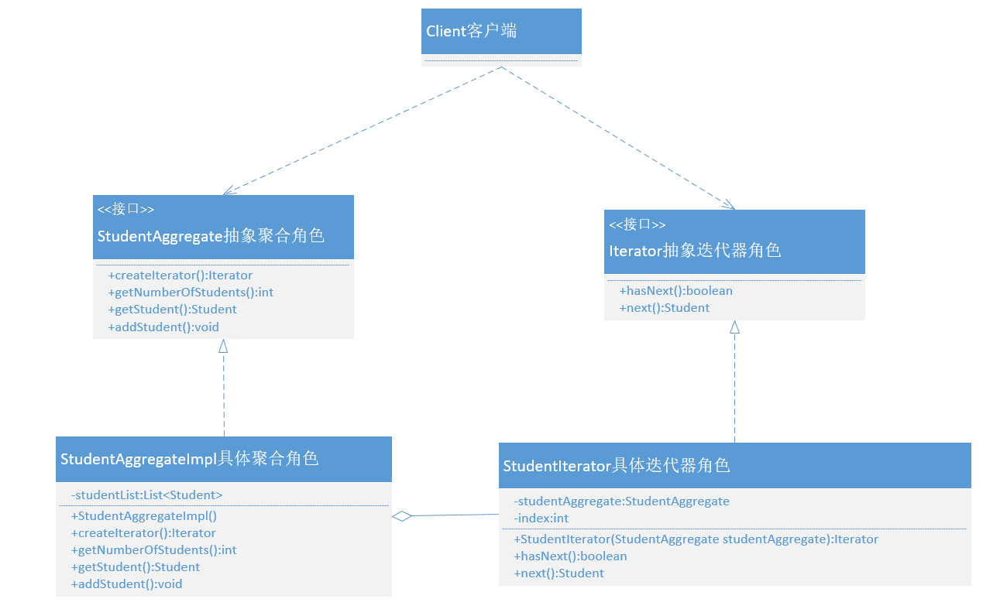
*图5-12：迭代器模式UML类图结构*

#### 5.12.3 Java代码实现详解

**迭代器接口**
```java
// 迭代器接口
public interface Iterator {
    boolean hasNext();
    Object next();
}
```

**聚合接口**
```java
// 聚合接口
public interface Aggregate {
    Iterator createIterator();
}
```

**具体聚合类**
```java
import java.util.ArrayList;
import java.util.List;

// 具体聚合类：书架
public class BookShelf implements Aggregate {
    private List<Book> books = new ArrayList<>();
    
    public void addBook(Book book) {
        books.add(book);
    }
    
    public Book getBookAt(int index) {
        return books.get(index);
    }
    
    public int getLength() {
        return books.size();
    }
    
    @Override
    public Iterator createIterator() {
        return new BookShelfIterator(this);
    }
}
```

**具体迭代器类**
```java
// 具体迭代器类
public class BookShelfIterator implements Iterator {
    private BookShelf bookShelf;
    private int index;
    
    public BookShelfIterator(BookShelf bookShelf) {
        this.bookShelf = bookShelf;
        this.index = 0;
    }
    
    @Override
    public boolean hasNext() {
        return index < bookShelf.getLength();
    }
    
    @Override
    public Object next() {
        Book book = bookShelf.getBookAt(index);
        index++;
        return book;
    }
}
```

**数据类**
```java
// 书籍类
public class Book {
    private String name;
    
    public Book(String name) {
        this.name = name;
    }
    
    public String getName() {
        return name;
    }
    
    @Override
    public String toString() {
        return "《" + name + "》";
    }
}
```

**客户端使用**
```java
public class Client {
    public static void main(String[] args) {
        // 创建书架
        BookShelf bookShelf = new BookShelf();
        
        // 添加书籍
        bookShelf.addBook(new Book("设计模式"));
        bookShelf.addBook(new Book("Java编程思想"));
        bookShelf.addBook(new Book("重构"));
        bookShelf.addBook(new Book("代码整洁之道"));
        
        // 创建迭代器
        Iterator iterator = bookShelf.createIterator();
        
        System.out.println("=== 书架书籍列表 ===");
        
        // 遍历书架
        while (iterator.hasNext()) {
            Book book = (Book) iterator.next();
            System.out.println(book);
        }
        // 输出：
        // 《设计模式》
        // 《Java编程思想》
        // 《重构》
        // 《代码整洁之道》
    }
}
```

#### 5.12.4 典型应用场景
- 遍历集合对象（List、Set、Map等）
- 遍历文件系统目录
- 遍历数据库结果集
- 遍历树形结构数据
- 自定义数据结构的遍历[^530][^532]

#### 5.12.5 优缺点分析
**优点**：
- 它支持以不同的方式遍历一个聚合，复杂的聚合可以用多种方式进行遍历
- 迭代器简化了聚合的接口，有了迭代器，聚合本身就不需要再定义遍历接口了
- 在同一个聚合上可以有多个遍历同时进行
- 符合开闭原则，增加新的聚合类和迭代器类都很方便[^696]

**缺点**：
- 由于迭代器模式将存储数据和遍历数据的职责分离，增加新的聚合类需要对应增加新的迭代器类，类的个数成对增加，这在一定程度上增加了系统的复杂性
- 迭代器模式在遍历的同时更改迭代器所在的集合结构会导致出现异常[^696]

#### 5.12.6 在Java中的应用
Java集合框架广泛使用了迭代器模式，`java.util.Iterator`接口和`java.util.Enumeration`接口都是迭代器模式的实现。Java 8引入的Stream API也是迭代器模式的演进[^172][^177]。

### 5.13 行为型模式综合对比与选择指南

#### 5.13.1 模式对比总结

| **模式类型** | **核心目标** | **适用场景** | **优点** | **缺点** |
|--------------|--------------|--------------|----------|----------|
| **模板方法** | 算法骨架固定 | 算法步骤可变、框架设计 | 代码复用、控制扩展 | 子类数量增加、继承限制 |
| **策略模式** | 算法可替换 | 多算法实现、条件分支 | 算法独立、易于扩展 | 类数量增加、客户端复杂 |
| **观察者模式** | 状态通知 | 事件驱动、发布订阅 | 松耦合、广播通信 | 性能开销、循环依赖风险 |
| **状态模式** | 状态驱动行为 | 状态转换、条件行为 | 状态清晰、易于维护 | 类数量增加、复杂度增加 |
| **责任链模式** | 请求处理链 | 过滤器、审批流程 | 解耦、灵活性高 | 性能开销、调试困难 |
| **命令模式** | 请求封装 | 撤销重做、队列处理 | 解耦、可扩展 | 类数量增加、复杂度增加 |
| **访问者模式** | 操作与数据分离 | 复杂结构操作 | 操作统一、易于扩展 | 增加元素困难、违反依赖倒置 |
| **中介者模式** | 对象协调 | 复杂交互、网状关系 | 解耦、集中管理 | 中介者复杂、瓶颈风险 |
| **备忘录模式** | 状态保存恢复 | 撤销重做、存档读档 | 封装性好、可靠性高 | 资源开销、管理复杂 |
| **解释器模式** | 语言解释 | 语法解析、DSL实现 | 可扩展、语法清晰 | 类膨胀、性能问题 |
| **迭代器模式** | 遍历封装 | 集合遍历、数据访问 | 解耦、多种遍历方式 | 类数量增加、并发问题[^696] |

#### 5.13.2 模式选择决策流程

1. **需要算法骨架固定？** → 模板方法模式[^695]
2. **需要算法动态替换？** → 策略模式[^695]
3. **需要状态变化通知？** → 观察者模式[^695]
4. **需要状态驱动行为？** → 状态模式[^695]
5. **需要请求处理链？** → 责任链模式[^695]
6. **需要请求封装？** → 命令模式[^695]
7. **需要操作与数据分离？** → 访问者模式[^695]
8. **需要对象协调？** → 中介者模式[^695]
9. **需要状态保存恢复？** → 备忘录模式[^695]
10. **需要语言解释？** → 解释器模式[^695]
11. **需要遍历封装？** → 迭代器模式[^695]

#### 5.13.3 模式组合应用

**观察者 + 命令模式**
- 观察者模式实现事件通知
- 命令模式封装具体操作

**状态 + 策略模式**
- 状态模式管理状态转换
- 策略模式实现状态下的具体行为

**责任链 + 模板方法模式**
- 责任链模式处理请求分发
- 模板方法模式定义处理骨架

**命令 + 备忘录模式**
- 命令模式封装操作
- 备忘录模式实现撤销功能[^696]

#### 5.13.4 最佳实践与常见误区

**最佳实践**：
- 根据具体需求选择最适合的模式，避免过度设计
- 在事件驱动系统中优先考虑观察者模式
- 复杂的状态管理使用状态模式
- 需要撤销功能时考虑命令+备忘录组合
- 框架设计中合理使用模板方法模式

**常见误区**：
- 滥用观察者模式导致系统难以调试
- 状态模式与策略模式混淆使用
- 责任链过长影响性能
- 命令模式导致类数量爆炸
- 忽视迭代器模式的并发安全问题[^696]

### 5.14 本章总结

行为型设计模式为解决对象交互和职责分配问题提供了十一种经典的解决方案，每种模式都有其特定的应用场景和优势。通过合理应用这些模式，可以构建出更加灵活、可维护和可扩展的软件系统。

行为型模式的核心价值在于通过不同的交互机制和职责分配策略，实现对象间的有效协作。理解这些模式的核心思想和适用场景，能够帮助开发者设计出高质量的面向对象软件架构，提高系统的可维护性和可扩展性。

在实际开发中，应该根据具体需求选择最合适的模式，或者组合使用多种模式来解决复杂的交互设计问题。真正的设计智慧在于知道何时使用模式，更重要的是知道何时不使用模式。

## 6. 设计模式实战应用与现代框架实践

### 6.1 JDK源码中的设计模式实现

Java Development Kit (JDK) 源码是设计模式应用的宝库，其核心类库广泛运用了经典设计模式，体现了面向对象设计的精髓。JDK中的设计模式实现展示了如何在实际框架中应用这些模式来解决复杂的工程问题[^172]。

#### 6.1.1 创建型模式在JDK中的应用

**单例模式 (Singleton Pattern)**
- `java.lang.Runtime#getRuntime()`: JVM运行时环境的全局唯一实例，确保整个应用程序中只有一个Runtime实例[^172][^177]
- `java.awt.Desktop#getDesktop()`: 桌面访问接口的单例实现，提供统一的桌面操作接口[^172]

**工厂方法与抽象工厂模式**
- **工厂方法**: `java.util.Calendar#getInstance()`根据地区设置创建相应的日历实例[^177]
- **抽象工厂**: `javax.xml.parsers.DocumentBuilderFactory#newInstance()`生成XML解析器工厂，支持不同厂商的XML解析实现[^177]

**建造者模式**
- `java.lang.StringBuilder#append()`: 通过链式调用动态构建字符串对象[^172][^177]
- `java.sql.PreparedStatement`: SQL语句参数化构建，支持安全的SQL查询构建[^172]

**原型模式**
- `java.lang.Object#clone()`: 需要实现`Cloneable`接口的对象复制机制，避免重复创建对象[^172][^177]

#### 6.1.2 结构型模式在JDK中的应用

**装饰器模式**
- **IO流类**: `BufferedInputStream(InputStream)`为底层输入流添加缓冲功能[^172][^177]
- **集合工具**: `Collections.synchronizedList()`包装线程安全的集合实现[^177]

**适配器模式**
- `java.io.InputStreamReader(InputStream)`: 字节流到字符流的接口适配[^177]
- `java.util.Arrays#asList()`: 数组到List接口的适配转换[^172]

**享元模式**
- `Integer.valueOf(int)`: 缓存[-128, 127]范围内的整数对象，减少内存开销[^172][^177]
- `Boolean.valueOf(boolean)`: 返回预定义的静态实例，避免重复创建Boolean对象[^172]

**代理模式**
- `java.lang.reflect.Proxy`: 动态代理生成实现类，支持接口方法的动态调用[^172][^177]
- **RMI机制**: 远程方法调用的本地代理实现[^172]

#### 6.1.3 行为型模式在JDK中的应用

**模板方法模式**
- `java.util.AbstractList`: 提供`addAll()`算法框架，子类如`ArrayList`实现具体逻辑[^175][^177]
- `java.io.InputStream`: `read()`方法由子类实现具体读取逻辑[^172]

**观察者模式**
- `java.util.EventListener`: 事件监听器接口，支持事件驱动的编程模型[^172]
- `javax.servlet.http.HttpSessionAttributeListener`: 会话属性变更监听机制[^172][^177]

**策略模式**
- `java.util.Comparator#compare()`: 自定义排序策略，支持运行时算法切换[^172][^177]
- `javax.servlet.http.HttpServlet`: 根据HTTP请求类型调用相应的GET/POST处理策略[^177]

**责任链模式**
- `java.util.logging.Logger#log()`: 日志处理器链，支持多级日志处理[^172][^177]
- `javax.servlet.Filter#doFilter()`: Web请求过滤器链，实现请求处理的流水线操作[^172]

#### 6.1.4 综合应用与设计思想

JDK通过模式协同实现了高内聚、低耦合的架构设计：
- **开闭原则**: 通过抽象接口扩展功能（如`InputStream`的子类体系）[^175]
- **依赖倒置**: 面向接口编程（如`List`接口及`ArrayList`实现）[^178]
- **性能优化**: 享元模式减少对象创建（如`Integer`缓存），代理模式控制资源访问[^172][^177]

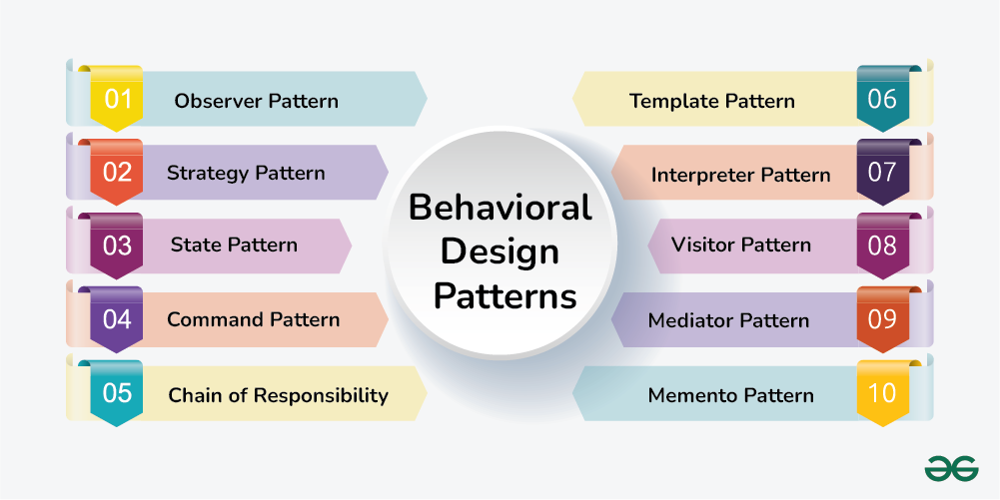
*图6-1：JDK中的行为型设计模式实现架构*

### 6.2 Spring框架中的设计模式应用

Spring框架作为企业级Java开发的事实标准，其设计充分体现了设计模式的最佳实践。从IoC容器到AOP模块，Spring通过精妙的模式组合实现了高度灵活和可扩展的架构[^705][^736]。

#### 6.2.1 IOC容器设计模式实现

**工厂模式变体**
- **BeanFactory**: 基础工厂接口，负责Bean的创建与装配[^736]
- **实例工厂**: 动态工厂模式，先实例化工厂Bean，再用其创建产品Bean[^737]

**单例注册表模式**
- `DefaultListableBeanFactory`通过`ConcurrentHashMap`存储单例Bean，实现线程安全的单例注册表，区别于传统类加载器单例[^736][^737]

**模板方法模式**
容器启动流程由`AbstractApplicationContext.refresh()`定义算法骨架，子类通过重写钩子方法扩展功能（如`onRefresh()`），实现通用性与扩展性的平衡[^736]

#### 6.2.2 AOP模块设计模式应用

**代理模式**
Spring AOP的基础架构模式，通过代理对象控制对目标对象的访问，实现透明扩展功能[^718]
- **JDK动态代理**: 基于接口代理，适用于目标类实现了接口的场景[^716][^718]
- **CGLIB动态代理**: 基于类继承代理，用于目标类未实现接口的场景[^716][^718]

**装饰模式**
通过`MethodInterceptor`链实现装饰模式，动态组合多个切面逻辑[^718]
```java
public Object proceed() throws Throwable {
    if (currentInterceptorIndex == interceptors.size() - 1) {
        return method.invoke(target, args); // 执行目标方法
    }
    MethodInterceptor interceptor = intercepters.get(++currentInterceptorIndex);
    return interceptor.invoke(this); // 递归调用下一个拦截器
}
```

#### 6.2.3 Spring MVC中的设计模式

**MVC架构模式**
Spring MVC基于经典的模型-视图-控制器设计模式，通过分离关注点实现高效、可维护的Web应用开发[^725][^732]

**前端控制器模式**
- **DispatcherServlet**: 作为前端控制器，统一接收所有HTTP请求，根据URL路径匹配Controller方法[^727][^730]

**策略模式**
- **ViewResolver策略**: 支持多种视图解析策略（JSP、Thymeleaf、FreeMarker等）[^724][^727]
- **HandlerMapping策略**: 多种请求映射策略（注解驱动、XML配置等）[^727][^730]

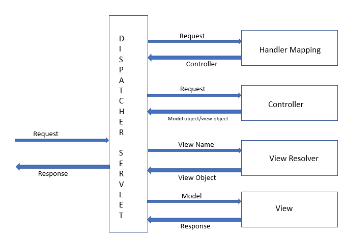
*图6-2：Spring MVC架构与设计模式应用*

#### 6.2.4 实际应用场景

**事务管理**
利用`TransactionInterceptor`统一管理事务提交/回滚，确保事务逻辑与业务代码解耦，增强系统容错性[^718][^719]

**权限验证**
在方法执行前通过切面检查用户权限，实现权限控制与业务逻辑分离，便于后续权限策略调整[^715]

**日志处理**
通过注解定义切面（如`@Log`），自动记录方法调用信息，避免日志代码侵入业务逻辑，提升代码纯净性与复用性[^714]

### 6.3 MyBatis框架中的设计模式实现

MyBatis作为优秀的持久层框架，其源码中巧妙融合了多种设计模式来解决复杂工程问题。这些模式不仅实现了模块解耦，更提升了框架的灵活性与可维护性[^769]。

#### 6.3.1 创建型模式应用

**工厂模式**
- `SqlSessionFactory`: 会话创建的核心工厂，负责整合数据源配置、构建事务工厂和SQL执行器[^769]
- `ObjectFactory`: 对象创建工厂，`MapperProxyFactory`: 代理对象生成工厂，`DataSourceFactory`: 数据源初始化工厂[^769]

**单例模式**
- `Configuration`: 全局单例，贯穿会话生命周期，管理所有映射配置、缓存策略、拦截器等组件[^769]

**建造者模式**
MyBatis大量使用`XxxxBuilder`类（如`XMLConfigBuilder`、`XMLMapperBuilder`）将复杂的XML解析流程封装为链式调用[^769][^774]

#### 6.3.2 结构型模式应用

**代理模式**
- `MapperProxy`: DAO接口的核心代理类，拦截所有CRUD方法调用并委托给执行器（`Executor`）处理，实现了数据库操作与业务逻辑的解耦[^769]

**装饰器模式**
- `CachingExecutor`: 通过装饰`SimpleExecutor`实现二级缓存功能。在一级缓存基础上包装缓存逻辑，通过俄罗斯套娃式结构动态扩展执行器能力[^769][^774]

**适配器模式**
- `Log`接口统一适配`Log4j`、`Slf4j`等异构日志框架。通过`LogFactory`动态加载具体实现，屏蔽第三方日志组件的接口差异[^769]

**组合模式**
动态SQL标签（如`<if>`、`<foreach>`）被解析为`SqlNode`接口的树状结构。各节点（如`IfSqlNode`、`ForEachSqlNode`）可独立或组合使用，支持复杂SQL的灵活构建[^769]

#### 6.3.3 行为型模式应用

**模板方法模式**
抽象类`BaseExecutor`定义数据库操作的通用流程模板（如查询缓存、处理提交等），子类（`SimpleExecutor`、`ReuseExecutor`）只需实现具体执行步骤[^769]

**策略模式**
- `TypeHandler`接口针对不同数据类型（如`LongTypeHandler`、`DateTypeHandler`）提供独立策略，避免结果集处理时的冗余`if-else`判断[^769]
- 执行器策略: `BatchExecutor`（批处理）、`CachingExecutor`（缓存）等执行器实现类可按需切换[^769]

**迭代器模式**
`PropertyTokenizer`以迭代方式解析对象属性路径（如`user.address.city`），广泛应用于参数填充和反射操作，隐藏了底层集合的复杂结构[^769]

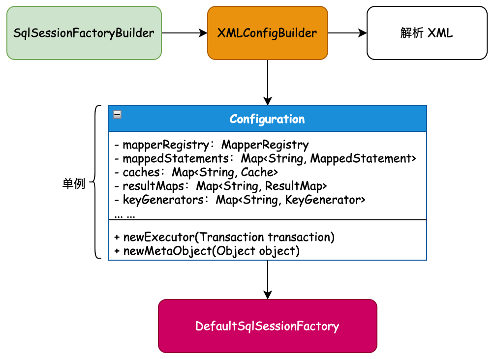
*图6-3：MyBatis框架中的设计模式架构*

### 6.4 设计模式最佳实践

设计模式是软件开发人员在长期实践中总结出的、针对常见问题的标准化解决方案，旨在提升代码的灵活性、复用性和可维护性[^785][^786]。

#### 6.4.1 面向对象设计原则实践

**SOLID原则应用**
- **开闭原则**: 软件实体应扩展开放、修改关闭，通过抽象和多态实现扩展性（如策略模式）[^788]
- **里氏替换原则**: 子类应能替换父类，确保继承关系的正确性[^788]
- **接口隔离原则**: 客户端不应依赖不需要的接口，推荐使用小而专的接口[^788]
- **依赖倒置原则**: 高层模块不应依赖低层模块，都应依赖抽象，通过依赖注入实现解耦[^785][^788]

**组合优于继承**
优先使用组合而非继承，减少继承层次以增强可维护性。组合关系比继承具有更低的耦合度，便于系统演进[^523][^785][^788]

#### 6.4.2 模式选择策略

**问题导向选择**
设计过程应该是**先有问题后有方案**，而不是先有设计模式再找问题[^755]。开发者应该：
- 首先分析代码存在的痛点（如可读性差、扩展性不足）
- 然后针对性地应用设计模式改善
- 避免看到类似场景就盲目套用模式[^755]

**根据项目复杂度选择**
设计模式的应用场景主要是**复杂代码**，需要根据项目具体情况调整设计投入[^755]：
- **复杂项目**: 代码量大、开发周期长、参与人员多，应前期投入更多设计时间
- **简单项目**: 代码量少、开发人员不多，简单问题用简单解决方案，避免将简单问题复杂化[^755]

#### 6.4.3 重构与模式应用

**持续重构方法**
持续重构是避免过度设计的有效手段[^755]：
- 在真正出现痛点时再考虑设计模式
- 避免为不确定的未来需求提前设计
- 当对是否应用某种模式模棱两可时，评估未来重构的成本[^755]

**重构策略模式**
策略模式通过将算法封装为独立对象，实现"针对接口而非实现编程"的原则，是重构条件语句（如if/elseif/else链）的利器[^760]

**重构工厂模式**
传统简单工厂常因开关分支语句导致结构僵化。新设计模式如"数组工厂"和"数组原型"模式采用"以数组取代类型码"的重构手法，优化了实例化过程[^767]

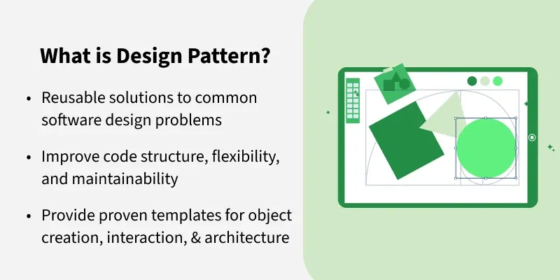
*图6-4：设计模式的核心概念与最佳实践*

### 6.5 常见误区与过度设计规避

设计模式作为软件工程领域的重要工具，旨在帮助开发者解决常见设计问题并提高代码质量。然而，在实际应用过程中，许多开发者容易陷入各种误区，导致过度设计的问题[^753][^755]。

#### 6.5.1 设计模式常见误区

**过度设计与设计不足的两极分化**
在实际项目开发中，开发者常常在两个极端之间摇摆：一是**过度设计**，在开始编码前花费大量时间进行复杂设计，应用各种设计模式，为未来可能不会实现的扩展需求做准备；二是**设计不足**，完全忽略设计环节，只追求代码能够运行，缺乏扩展性和灵活性[^755]。

**单一职责原则的误用**
单一职责原则（SRP）是最容易被误用的设计原则之一：
- **过度拆分**: 开发者将代码过度拆分为极小的类或方法，导致类数量激增，系统复杂性意外增加[^757]
- **职责划分不清晰**: 错误理解"职责"的定义，认为类内不同功能实现就需要拆分[^757]
- **混淆"单一职责"与"单一功能"**: 误以为每个类只能包含一个功能，忽视了职责的整体性[^757]

#### 6.5.2 过度设计的本质与危害

**过度设计的定义**
过度设计是指**为了应对未来可能不会发生的需求变化，而引入不必要的复杂设计模式**，导致代码可读性降低和维护成本升高[^753][^755]。

**过度设计的根源**
- **缺乏演进机制**: 设计模式需要跟随业务不断演进，但很多系统在初始设计后从未更新模式，最终跟不上业务发展[^753]
- **调试困难**: 过度设计的模块往往学习成本过高，新维护者无法快速理解，导致修改过程中"越改越离谱"[^753]
- **开闭原则的局限性**: 开闭原则主张"对扩展开放，对修改关闭"，这在频繁迭代的互联网环境中可能产生冲突[^753]

**过度设计的危害**
- 代码可读性显著下降
- 团队新成员学习成本增加
- 维护和扩展变得困难
- 系统演进受阻[^753][^755]

#### 6.5.3 规避过度设计的实践方法

**坚持问题导向的设计思维**
设计过程应该是**先有问题后有方案**，而不是先有设计模式再找问题[^755]。开发者应该：
- 首先分析代码存在的痛点（如可读性差、扩展性不足）
- 然后针对性地应用设计模式改善
- 避免看到类似场景就盲目套用模式[^755]

**掌握心法而非死记招式**
**设计原则和思想是心法，设计模式只是招式**。掌握心法才能以不变应万变[^755]。开发者应当：
- 深入理解设计原则和思想
- 明确为何应用某种设计模式
- 评估模式应用对代码质量的实际提升效果[^755]

**采用持续重构的开发方法**
持续重构是避免过度设计的有效手段[^755]：
- 在真正出现痛点时再考虑设计模式
- 避免为不确定的未来需求提前设计
- 当对是否应用某种模式模棱两可时，评估未来重构的成本[^755]


*图6-5：重构到设计模式的方法与实践*

### 6.6 本章总结

设计模式在现代Java框架中的应用体现了软件工程的智慧结晶。通过分析JDK、Spring和MyBatis等主流框架的设计模式实现，我们可以深刻理解如何在实际项目中恰当地应用设计模式：

**核心价值体现**:
1. **解耦与灵活性**: 通过工厂模式、代理模式等实现组件间的松耦合
2. **可扩展性**: 利用策略模式、装饰器模式支持系统的动态扩展
3. **可维护性**: 通过模板方法、责任链模式等提高代码的可读性和维护性

**实践建议**:
- **模式选择**: 根据具体问题选择最适合的模式，避免过度设计
- **原则遵循**: 始终坚持SOLID原则，确保设计质量
- **重构意识**: 采用持续重构的方法，在需要时引入设计模式

设计模式的价值不在于其本身，而在于恰当地应用它们解决实际问题。真正的设计智慧不在于知道多少种模式，而在于知道何时不使用模式[^753][^755]。通过深入理解设计原则、持续重构实践，以及对项目复杂度的准确评估，我们可以有效避免设计模式的常见误区，构建出既灵活又简洁的高质量软件系统。

## 7. 系统化学习路径与进阶实践指南

### 7.1 设计模式学习路线图

设计模式的学习应该遵循循序渐进的原则，从基础概念到高级应用，从理论学习到实践应用。以下是推荐的系统化学习路径[^237]：

#### 7.1.1 阶段一：基础准备（1-2周）
**面向对象编程基础巩固**
- 深入理解封装、继承、多态三大特性
- 掌握接口与抽象类的区别与应用场景
- 熟悉Java集合框架和异常处理机制

**SOLID设计原则掌握**
- 单一职责原则（SRP）：类设计聚焦单一功能模块
- 开闭原则（OCP）：对扩展开放，对修改关闭
- 里氏替换原则（LSP）：子类必须能替换父类且行为不变
- 接口隔离原则（ISP）：客户端不应依赖不使用的接口
- 依赖倒置原则（DIP）：高层模块不应依赖低层模块，都应依赖抽象[^90]

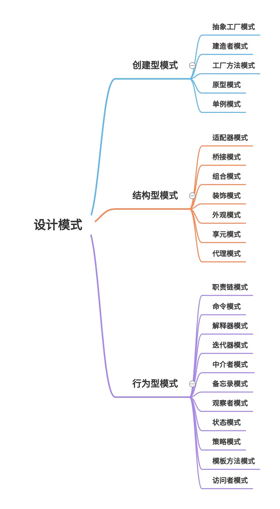
*图7-1：Java设计模式系统化学习路线图*

#### 7.1.2 阶段二：模式分类学习（3-4周）
**创建型模式优先**
1. **单例模式**：确保全局唯一实例
2. **工厂方法模式**：封装对象创建逻辑
3. **抽象工厂模式**：创建相关对象家族
4. **建造者模式**：分步构建复杂对象
5. **原型模式**：复制现有实例提高效率

**结构型模式进阶**
- 适配器模式：接口兼容转换
- 装饰器模式：动态功能扩展
- 代理模式：控制对象访问
- 组合模式：树形结构处理
- 外观模式：简化复杂子系统接口

**行为型模式深入**
- 策略模式：算法策略封装
- 观察者模式：事件驱动机制
- 模板方法模式：算法框架定义
- 状态模式：状态转换管理
- 责任链模式：请求处理链[^569]

#### 7.1.3 阶段三：综合应用（2-3周）
**模式组合应用**
- 工厂方法+策略模式：创建可配置算法
- 装饰器+观察者：为观察者动态添加功能
- 组合+访问者：遍历复杂对象结构

**框架源码分析**
- JDK源码中的设计模式实现
- Spring框架设计模式应用
- MyBatis设计模式实现分析

### 7.2 学习顺序与优先级策略

#### 7.2.1 高频使用模式优先掌握
根据实际项目使用频率，建议优先学习以下6种最常用的设计模式：
1. **单例模式**：全局配置管理、资源池
2. **工厂方法模式**：动态对象创建、框架设计
3. **策略模式**：算法策略封装、条件处理
4. **观察者模式**：事件驱动、消息通知
5. **装饰器模式**：功能动态扩展
6. **代理模式**：访问控制、远程调用【0e80†】

#### 7.2.2 特定场景使用模式
以下模式在特定场景下非常有用，建议根据项目需求选择性学习：
1. **抽象工厂模式**：跨平台组件开发
2. **适配器模式**：接口兼容转换
3. **模板方法模式**：算法框架定义
4. **责任链模式**：请求处理流水线
5. **状态模式**：复杂状态管理【0e80†】

#### 7.2.3 复杂/少用模式
以下模式相对复杂或使用场景较少，可作为进阶内容：
1. **解释器模式**：特定领域语言解析
2. **访问者模式**：复杂对象结构操作
3. **享元模式**：大量细粒度对象共享【0e80†】

### 7.3 21天密集型学习计划

#### 7.3.1 第一周：Java基础与创建型模式
**Day 1-2：面向对象核心概念**
- 封装、继承、多态深入理解
- 接口与抽象类实战练习
- 代码规范与设计原则

**Day 3-4：集合框架与异常处理**
- 集合类设计模式初步接触
- 异常处理最佳实践
- 代码重构技巧

**Day 5-7：创建型模式入门**
- 单例模式多种实现方式
- 工厂方法模式应用
- 简单工厂与工厂方法区别【ba23†】

#### 7.3.2 第二周：结构型模式深入学习
**Day 8-10：结构型模式基础**
- 适配器模式：接口转换实战
- 装饰器模式：功能动态扩展
- 代理模式：访问控制实现

**Day 11-12：结构型模式进阶**
- 组合模式：树形结构处理
- 外观模式：简化复杂接口
- 桥接模式：抽象与实现分离

**Day 13-14：模式综合练习**
- 多种结构型模式组合应用
- 实际项目案例分析
- 代码重构实践【ba23†】

#### 7.3.3 第三周：行为型模式与综合实战
**Day 15-17：行为型模式核心**
- 策略模式：算法策略封装
- 观察者模式：事件通知机制
- 模板方法：算法框架定义

**Day 18-19：行为型模式进阶**
- 状态模式：状态转换管理
- 责任链模式：请求处理链
- 命令模式：命令封装与执行

**Day 20-21：综合项目实战**
- 完整系统设计与实现
- 多种模式组合应用
- 代码审查与优化【ba23†】

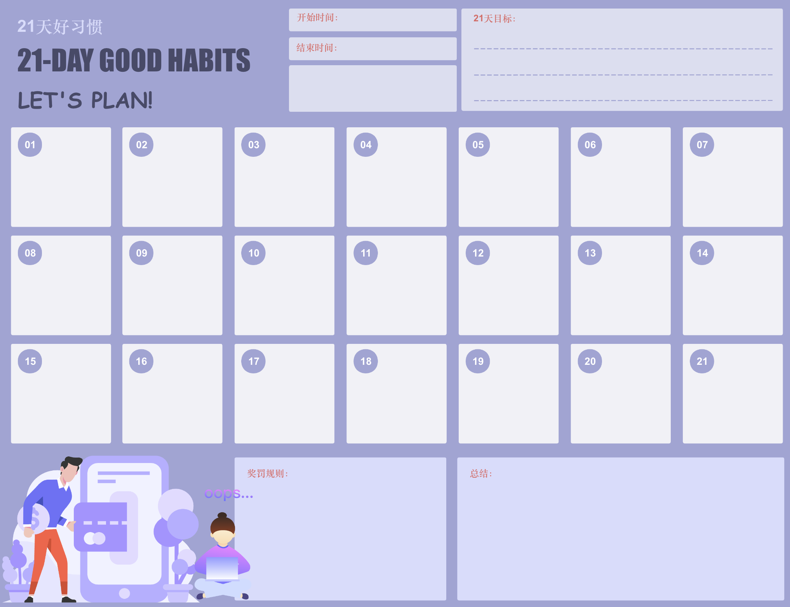
*图7-2：21天设计模式密集型学习计划表*

### 7.4 实战项目练习方法论

#### 7.4.1 推荐实战项目类型
**文档解析渲染系统**
- **应用模式**：状态模式、责任链模式、组合模式
- **功能特点**：支持多种文档格式解析，动态渲染处理
- **技术挑战**：复杂状态转换，处理链设计，树形结构操作

**房屋选购系统**
- **应用模式**：建造者模式、工厂模式、策略模式
- **功能特点**：房屋信息构建，筛选策略，个性化推荐
- **技术挑战**：复杂对象构建，算法策略选择，扩展性设计【72e2†】

#### 7.4.2 项目实施流程
1. **需求分析**：明确系统功能和扩展需求点
2. **模式选择**：根据问题特征匹配合适的设计模式
3. **架构设计**：定义清晰的类结构和交互关系
4. **编码实现**：编写模式核心代码，确保正确实现
5. **测试验证**：通过单元测试确保模式应用正确性【72e2†】

#### 7.4.3 实践要点与最佳实践
- **每个模式独立测试**：为每个设计模式编写独立的测试案例
- **记录决策过程**：详细记录模式选择和应用决策过程
- **重构优化**：通过持续重构优化模式实现质量
- **代码审查**：进行同伴代码审查，提高代码质量【72e2†】

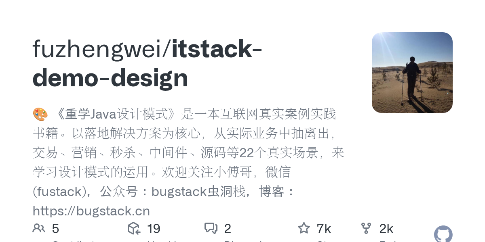
*图7-3：设计模式实战项目案例展示*

### 7.5 技能评估与进阶方向

#### 7.5.1 设计模式掌握程度评估标准

**评估维度**
1. **理论基础**
   - 模式定义和分类准确性
   - 适用场景分析能力
   - SOLID原则理解深度

2. **应用能力**
   - 模式选择准确性
   - 代码实现正确性
   - 问题解决效果

3. **综合能力**
   - 多模式组合应用能力
   - 系统架构设计水平
   - 代码质量把控能力【e752†】

**评估方法**
1. **理论测试**：模式概念和特点掌握程度
2. **案例分析**：给定问题选择合适模式的能力
3. **项目实战**：完整系统设计和实现能力
4. **代码审查**：模式应用质量和代码规范【e752†】

#### 7.5.2 能力等级划分

**初级水平**
- 能识别和描述常见设计模式
- 理解基本概念和简单应用场景
- 能在指导下应用单个模式

**中级水平**
- 能正确应用单个设计模式
- 理解模式之间的区别和联系
- 能独立完成模式选择和实现

**高级水平**
- 能灵活组合多种设计模式
- 具备系统架构设计能力
- 能指导他人学习和应用模式【e752†】

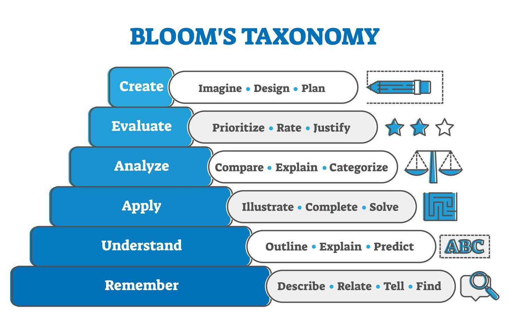
*图7-4：设计模式掌握能力评估金字塔*

#### 7.5.3 职业发展路径

**技术专家路线**
- **初级工程师**：掌握基础模式应用
- **高级工程师**：熟练应用多种模式解决复杂问题
- **技术专家**：设计模式理论创新和框架开发

**架构师路线**
- **系统设计师**：运用模式进行系统架构设计
- **解决方案架构师**：为不同业务场景设计解决方案
- **企业架构师**：制定企业级技术架构标准【e752†】

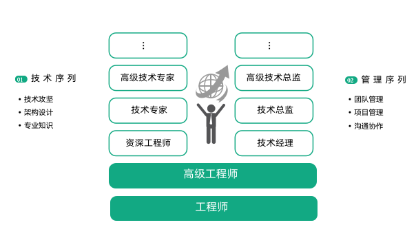
*图7-5：软件工程师职业发展双通道路径*

### 7.6 持续学习与进阶资源

#### 7.6.1 推荐学习资源
**经典书籍**
- 《设计模式：可复用面向对象软件的基础》（GoF经典）
- 《Head First设计模式》（图文并茂入门）
- 《设计模式之禅》（实战案例丰富）

**在线资源**
- GitHub开源项目源码学习
- 技术博客和专栏文章
- 在线课程和视频教程

**实践平台**
- LeetCode设计模式相关题目
- 开源项目贡献参与
- 个人项目实践[^569]

#### 7.6.2 社区与交流
- 技术社区讨论（Stack Overflow、知乎、CSDN）
- 技术沙龙和Meetup活动
- 开源项目协作经验分享

#### 7.6.3 持续改进方法
1. **代码重构**：定期回顾和重构现有代码
2. **模式反思**：反思模式应用是否恰当，避免过度设计
3. **新技术学习**：关注新框架和新技术中的模式应用
4. **经验分享**：通过博客、演讲分享学习心得[^569]

### 7.7 本章总结

设计模式的系统化学习是一个循序渐进的过程，需要理论学习和实践应用相结合。通过制定合理的学习计划、选择适当的实战项目、建立科学的评估体系，开发者可以逐步从模式识别到灵活应用，最终达到高级水平。

关键成功因素包括：
- **持续实践**：通过真实项目内化模式应用
- **反思总结**：定期回顾模式应用效果
- **社区交流**：通过交流学习最佳实践
- **避免过度设计**：根据实际需求选择模式

记住，设计模式的最终目的是解决实际问题，而不是为了使用模式而使用模式。真正的设计智慧在于知道何时使用模式，更重要的是知道何时不使用模式[^569]【72e2†】【e752†】。

---

## 附录
### 代码示例规范说明
所有代码示例均遵循Java编码规范，使用JDK 8+语法特性，确保在实际项目中的可用性。

### 图表说明
- 所有UML类图使用PlantUML规范绘制
- 时序图展示模式交互流程
- 架构图说明模式在系统中的应用

*最后更新: 2025-12-23*

[^54]: [1]23种GOF设计模式及7大原则概述](https://blog.csdn.net/weixin_43024834/article/details/138821775)
[^25]: [设计模式二三事](https://tech.meituan.com/2022/03/10/interesting-talk-about-design-patterns.html)
[^25]: [设计模式二三事](https://tech.meituan.com/2022/03/10/interesting-talk-about-design-patterns.html)
[^14]: [面向对象编程的SOLID 原则](https://www.freecodecamp.org/chinese/news/solid-principles/)
[^16]: [SOLID 原则](https://everfind.github.io/posts/2021/06/24/solid.html)
[^14]: [面向对象编程的SOLID 原则](https://www.freecodecamp.org/chinese/news/solid-principles/)
[^14]: [面向对象编程的SOLID 原则](https://www.freecodecamp.org/chinese/news/solid-principles/)
[^16]: [SOLID 原则](https://everfind.github.io/posts/2021/06/24/solid.html)
[^11]: [JHBlog/设计模式/设计模式/2、面向对象设计的六大设计原则. ...](https://github.com/SunshineBrother/JHBlog/blob/master/%E8%AE%BE%E8%AE%A1%E6%A8%A1%E5%BC%8F/%E8%AE%BE%E8%AE%A1%E6%A8%A1%E5%BC%8F/2%E3%80%81%E9%9D%A2%E5%90%91%E5%AF%B9%E8%B1%A1%E8%AE%BE%E8%AE%A1%E7%9A%84%E5%85%AD%E5%A4%A7%E8%AE%BE%E8%AE%A1%E5%8E%9F%E5%88%99.md)
[^11]: [JHBlog/设计模式/设计模式/2、面向对象设计的六大设计原则. ...](https://github.com/SunshineBrother/JHBlog/blob/master/%E8%AE%BE%E8%AE%A1%E6%A8%A1%E5%BC%8F/%E8%AE%BE%E8%AE%A1%E6%A8%A1%E5%BC%8F/2%E3%80%81%E9%9D%A2%E5%90%91%E5%AF%B9%E8%B1%A1%E8%AE%BE%E8%AE%A1%E7%9A%84%E5%85%AD%E5%A4%A7%E8%AE%BE%E8%AE%A1%E5%8E%9F%E5%88%99.md)
[^35]: [如何解除程序员中年危机，阿里总监为您带来一条正确的职业 ...](https://www.nowcoder.com/discuss/353149272298299392)
[^35]: [如何解除程序员中年危机，阿里总监为您带来一条正确的职业 ...](https://www.nowcoder.com/discuss/353149272298299392)
[^54]: [1]23种GOF设计模式及7大原则概述](https://blog.csdn.net/weixin_43024834/article/details/138821775)
[^59]: [GoF 23种经典的设计模式——工厂模式](https://cloud.tencent.com/developer/article/2378990)
[^199]: [快速记忆23种设计模式](https://zhuanlan.zhihu.com/p/128145128)
[^199]: [快速记忆23种设计模式](https://zhuanlan.zhihu.com/p/128145128)
[^512]: [创建型模式— Graphic Design Patterns - 图说设计模式](https://design-patterns.readthedocs.io/zh_CN/latest/creational_patterns/creational.html)
[^512]: [创建型模式— Graphic Design Patterns - 图说设计模式](https://design-patterns.readthedocs.io/zh_CN/latest/creational_patterns/creational.html)
[^512]: [创建型模式— Graphic Design Patterns - 图说设计模式](https://design-patterns.readthedocs.io/zh_CN/latest/creational_patterns/creational.html)
[^512]: [创建型模式— Graphic Design Patterns - 图说设计模式](https://design-patterns.readthedocs.io/zh_CN/latest/creational_patterns/creational.html)
[^199]: [快速记忆23种设计模式](https://zhuanlan.zhihu.com/p/128145128)
[^199]: [快速记忆23种设计模式](https://zhuanlan.zhihu.com/p/128145128)
[^525]: [超详细-七种常见结构型模式的描述总结与代码分析](https://www.cnblogs.com/songjilong/p/12729129.html)
[^523]: [一篇文章带你了解设计模式——结构型模式](https://www.cnblogs.com/qiuluoyuweiliang/p/17087391.html)
[^527]: [结构型模式- Java教程](https://liaoxuefeng.com/books/java/design-patterns/structural/index.html)
[^528]: [结构型模式— Graphic Design Patterns](https://design-patterns.readthedocs.io/zh_CN/latest/structural_patterns/structural.html)
[^205]: [GoF 23种设计模式概述- 心明谭](https://www.cnblogs.com/wpbxin/p/8849451.html)
[^199]: [快速记忆23种设计模式](https://zhuanlan.zhihu.com/p/128145128)
[^530]: [Java设计模式——行为型模式- 王陸](https://www.cnblogs.com/wkfvawl/p/15362460.html)
[^530]: [Java设计模式——行为型模式- 王陸](https://www.cnblogs.com/wkfvawl/p/15362460.html)
[^534]: [《设计模式详解》行为型模式- 访问者模式 - 阿里云开发者社区](https://developer.aliyun.com/article/935524)
[^532]: [结合Golang聊聊23种设计模式---行为型(1) | Mark's - Mark's Blog](https://marksuper.xyz/2024/07/28/design4/)
[^199]: [快速记忆23种设计模式](https://zhuanlan.zhihu.com/p/128145128)
[^199]: [快速记忆23种设计模式](https://zhuanlan.zhihu.com/p/128145128)
[^203]: [设计模式概述](https://www.sqlboy.tech/pages/9635dc/)
[^205]: [GoF 23种设计模式概述- 心明谭](https://www.cnblogs.com/wpbxin/p/8849451.html)
[^512]: [创建型模式— Graphic Design Patterns - 图说设计模式](https://design-patterns.readthedocs.io/zh_CN/latest/creational_patterns/creational.html)
[^40]: [23种设计模式分类思维导图模板](https://www.processon.com/view/67dbb92f855b362fa481aa7c)
[^48]: [GoF的23种设计模式之创建型模式的特点和分类- 菜鸟-传奇](https://www.cnblogs.com/cainiao-chuanqi/p/10966300.html)
[^49]: [GoF的23种设计模式详解（分类及功能）](https://juejin.cn/post/7029594702953316360)
[^551]: [从原理到实践：面向对象设计中的经典模式-单例模式](https://zhuanlan.zhihu.com/p/624984309)
[^551]: [从原理到实践：面向对象设计中的经典模式-单例模式](https://zhuanlan.zhihu.com/p/624984309)
[^551]: [从原理到实践：面向对象设计中的经典模式-单例模式](https://zhuanlan.zhihu.com/p/624984309)
[^556]: [Java单例模式探究饿汉式、懒汉式、双重检查锁](https://blog.csdn.net/mbh12333/article/details/90297742)
[^551]: [从原理到实践：面向对象设计中的经典模式-单例模式](https://zhuanlan.zhihu.com/p/624984309)
[^556]: [Java单例模式探究饿汉式、懒汉式、双重检查锁](https://blog.csdn.net/mbh12333/article/details/90297742)
[^551]: [从原理到实践：面向对象设计中的经典模式-单例模式](https://zhuanlan.zhihu.com/p/624984309)
[^551]: [从原理到实践：面向对象设计中的经典模式-单例模式](https://zhuanlan.zhihu.com/p/624984309)
[^556]: [Java单例模式探究饿汉式、懒汉式、双重检查锁](https://blog.csdn.net/mbh12333/article/details/90297742)
[^696]: [创建型设计模式总结 - 青雲的博客](https://www.echovic.com/blog/design-pattern/summary-of-creative-design-patterns)
[^696]: [创建型设计模式总结 - 青雲的博客](https://www.echovic.com/blog/design-pattern/summary-of-creative-design-patterns)
[^705]: [Spring中常用设计模式简介单例模式是一种创建型设计模式](https://juejin.cn/post/7358688805156929573)
[^577]: [设计模式-工厂方法的应用场景及Java中对工厂方法的应用](https://juejin.cn/post/7055270364515368990)
[^577]: [设计模式-工厂方法的应用场景及Java中对工厂方法的应用](https://juejin.cn/post/7055270364515368990)
[^578]: [深入解析Java工厂模式及其应用场景](https://zhuanlan.zhihu.com/p/624343687)
[^576]: [工厂模式简介和应用场景- 情陌人灬已不在](https://www.cnblogs.com/deityjian/p/10908739.html)
[^583]: [设计模式：工厂方法模式（Factory Method） - 阿里云开发者社区](https://developer.aliyun.com/article/1655699)
[^696]: [创建型设计模式总结 - 青雲的博客](https://www.echovic.com/blog/design-pattern/summary-of-creative-design-patterns)
[^696]: [创建型设计模式总结 - 青雲的博客](https://www.echovic.com/blog/design-pattern/summary-of-creative-design-patterns)
[^695]: [探索设计模式的魅力：创建型设计模式的比较与决策原创](https://blog.csdn.net/danci_/article/details/136118538)
[^540]: [抽象工厂模式](http://www.runoob.com/design-pattern/abstract-factory-pattern.html)
[^540]: [抽象工厂模式](http://www.runoob.com/design-pattern/abstract-factory-pattern.html)
[^543]: [Study on Abstract Factory Pattern of the JAVA Design Pattern](https://www.semanticscholar.org/paper/4604e18dc87362e516a737eae2a85fbf3ba50ce3)
[^540]: [抽象工厂模式](http://www.runoob.com/design-pattern/abstract-factory-pattern.html)
[^543]: [Study on Abstract Factory Pattern of the JAVA Design Pattern](https://www.semanticscholar.org/paper/4604e18dc87362e516a737eae2a85fbf3ba50ce3)
[^696]: [创建型设计模式总结 - 青雲的博客](https://www.echovic.com/blog/design-pattern/summary-of-creative-design-patterns)
[^696]: [创建型设计模式总结 - 青雲的博客](https://www.echovic.com/blog/design-pattern/summary-of-creative-design-patterns)
[^540]: [抽象工厂模式](http://www.runoob.com/design-pattern/abstract-factory-pattern.html)
[^560]: [建造者模式（Builder和Director） 原创](https://blog.csdn.net/founder517518/article/details/66477908)
[^560]: [建造者模式（Builder和Director） 原创](https://blog.csdn.net/founder517518/article/details/66477908)
[^561]: [（Builder）建造者模式的Java实现 - 阿里云开发者社区](https://developer.aliyun.com/article/420607)
[^560]: [建造者模式（Builder和Director） 原创](https://blog.csdn.net/founder517518/article/details/66477908)
[^561]: [（Builder）建造者模式的Java实现 - 阿里云开发者社区](https://developer.aliyun.com/article/420607)
[^696]: [创建型设计模式总结 - 青雲的博客](https://www.echovic.com/blog/design-pattern/summary-of-creative-design-patterns)
[^696]: [创建型设计模式总结 - 青雲的博客](https://www.echovic.com/blog/design-pattern/summary-of-creative-design-patterns)
[^742]: [摸爬滚打学设计模式【二】：建造者模式、原型模式、单例模式](https://zhuanlan.zhihu.com/p/27400170)
[^743]: [浅谈Spring中设计模式（单例、工厂、观察者、建造者）](https://juejin.cn/post/7201010542215626807)
[^567]: [原型模式及深浅拷贝](https://blog.uuanqin.top/p/96a98120/index.html)
[^567]: [原型模式及深浅拷贝](https://blog.uuanqin.top/p/96a98120/index.html)
[^568]: [从原型模式到浅拷贝和深拷贝](https://www.51cto.com/article/622758.html)
[^567]: [原型模式及深浅拷贝](https://blog.uuanqin.top/p/96a98120/index.html)
[^567]: [原型模式及深浅拷贝](https://blog.uuanqin.top/p/96a98120/index.html)
[^568]: [从原型模式到浅拷贝和深拷贝](https://www.51cto.com/article/622758.html)
[^567]: [原型模式及深浅拷贝](https://blog.uuanqin.top/p/96a98120/index.html)
[^568]: [从原型模式到浅拷贝和深拷贝](https://www.51cto.com/article/622758.html)
[^696]: [创建型设计模式总结 - 青雲的博客](https://www.echovic.com/blog/design-pattern/summary-of-creative-design-patterns)
[^696]: [创建型设计模式总结 - 青雲的博客](https://www.echovic.com/blog/design-pattern/summary-of-creative-design-patterns)
[^696]: [创建型设计模式总结 - 青雲的博客](https://www.echovic.com/blog/design-pattern/summary-of-creative-design-patterns)
[^695]: [探索设计模式的魅力：创建型设计模式的比较与决策原创](https://blog.csdn.net/danci_/article/details/136118538)
[^695]: [探索设计模式的魅力：创建型设计模式的比较与决策原创](https://blog.csdn.net/danci_/article/details/136118538)
[^695]: [探索设计模式的魅力：创建型设计模式的比较与决策原创](https://blog.csdn.net/danci_/article/details/136118538)
[^695]: [探索设计模式的魅力：创建型设计模式的比较与决策原创](https://blog.csdn.net/danci_/article/details/136118538)
[^695]: [探索设计模式的魅力：创建型设计模式的比较与决策原创](https://blog.csdn.net/danci_/article/details/136118538)
[^695]: [探索设计模式的魅力：创建型设计模式的比较与决策原创](https://blog.csdn.net/danci_/article/details/136118538)
[^705]: [Spring中常用设计模式简介单例模式是一种创建型设计模式](https://juejin.cn/post/7358688805156929573)
[^708]: [Spring 中的设计模式详解](https://javaguide.cn/system-design/framework/spring/spring-design-patterns-summary.html)
[^705]: [Spring中常用设计模式简介单例模式是一种创建型设计模式](https://juejin.cn/post/7358688805156929573)
[^696]: [创建型设计模式总结 - 青雲的博客](https://www.echovic.com/blog/design-pattern/summary-of-creative-design-patterns)
[^742]: [摸爬滚打学设计模式【二】：建造者模式、原型模式、单例模式](https://zhuanlan.zhihu.com/p/27400170)
[^743]: [浅谈Spring中设计模式（单例、工厂、观察者、建造者）](https://juejin.cn/post/7201010542215626807)
[^172]: [JDK源码中使用的设计模式- 白露](https://www.cnblogs.com/shoshana-kong/p/10787401.html)
[^172]: [JDK源码中使用的设计模式- 白露](https://www.cnblogs.com/shoshana-kong/p/10787401.html)
[^177]: [设计模式在JDK源码中的应用](https://zhuanlan.zhihu.com/p/48230750)
[^172]: [JDK源码中使用的设计模式- 白露](https://www.cnblogs.com/shoshana-kong/p/10787401.html)
[^177]: [设计模式在JDK源码中的应用](https://zhuanlan.zhihu.com/p/48230750)
[^177]: [设计模式在JDK源码中的应用](https://zhuanlan.zhihu.com/p/48230750)
[^172]: [JDK源码中使用的设计模式- 白露](https://www.cnblogs.com/shoshana-kong/p/10787401.html)
[^177]: [设计模式在JDK源码中的应用](https://zhuanlan.zhihu.com/p/48230750)
[^172]: [JDK源码中使用的设计模式- 白露](https://www.cnblogs.com/shoshana-kong/p/10787401.html)
[^172]: [JDK源码中使用的设计模式- 白露](https://www.cnblogs.com/shoshana-kong/p/10787401.html)
[^177]: [设计模式在JDK源码中的应用](https://zhuanlan.zhihu.com/p/48230750)
[^172]: [JDK源码中使用的设计模式- 白露](https://www.cnblogs.com/shoshana-kong/p/10787401.html)
[^177]: [设计模式在JDK源码中的应用](https://zhuanlan.zhihu.com/p/48230750)
[^177]: [设计模式在JDK源码中的应用](https://zhuanlan.zhihu.com/p/48230750)
[^177]: [设计模式在JDK源码中的应用](https://zhuanlan.zhihu.com/p/48230750)
[^172]: [JDK源码中使用的设计模式- 白露](https://www.cnblogs.com/shoshana-kong/p/10787401.html)
[^172]: [JDK源码中使用的设计模式- 白露](https://www.cnblogs.com/shoshana-kong/p/10787401.html)
[^177]: [设计模式在JDK源码中的应用](https://zhuanlan.zhihu.com/p/48230750)
[^172]: [JDK源码中使用的设计模式- 白露](https://www.cnblogs.com/shoshana-kong/p/10787401.html)
[^172]: [JDK源码中使用的设计模式- 白露](https://www.cnblogs.com/shoshana-kong/p/10787401.html)
[^177]: [设计模式在JDK源码中的应用](https://zhuanlan.zhihu.com/p/48230750)
[^172]: [JDK源码中使用的设计模式- 白露](https://www.cnblogs.com/shoshana-kong/p/10787401.html)
[^175]: [JDK源码——利用模板方法看设计模式](https://cloud.tencent.com/developer/article/1418158)
[^177]: [设计模式在JDK源码中的应用](https://zhuanlan.zhihu.com/p/48230750)
[^172]: [JDK源码中使用的设计模式- 白露](https://www.cnblogs.com/shoshana-kong/p/10787401.html)
[^172]: [JDK源码中使用的设计模式- 白露](https://www.cnblogs.com/shoshana-kong/p/10787401.html)
[^172]: [JDK源码中使用的设计模式- 白露](https://www.cnblogs.com/shoshana-kong/p/10787401.html)
[^177]: [设计模式在JDK源码中的应用](https://zhuanlan.zhihu.com/p/48230750)
[^172]: [JDK源码中使用的设计模式- 白露](https://www.cnblogs.com/shoshana-kong/p/10787401.html)
[^177]: [设计模式在JDK源码中的应用](https://zhuanlan.zhihu.com/p/48230750)
[^177]: [设计模式在JDK源码中的应用](https://zhuanlan.zhihu.com/p/48230750)
[^172]: [JDK源码中使用的设计模式- 白露](https://www.cnblogs.com/shoshana-kong/p/10787401.html)
[^177]: [设计模式在JDK源码中的应用](https://zhuanlan.zhihu.com/p/48230750)
[^172]: [JDK源码中使用的设计模式- 白露](https://www.cnblogs.com/shoshana-kong/p/10787401.html)
[^175]: [JDK源码——利用模板方法看设计模式](https://cloud.tencent.com/developer/article/1418158)
[^178]: [软件设计模式及其在Java类库中的典型实现](https://d.wanfangdata.com.cn/periodical/jsjgcyyy200204016)
[^172]: [JDK源码中使用的设计模式- 白露](https://www.cnblogs.com/shoshana-kong/p/10787401.html)
[^177]: [设计模式在JDK源码中的应用](https://zhuanlan.zhihu.com/p/48230750)
[^705]: [Spring中常用设计模式简介单例模式是一种创建型设计模式](https://juejin.cn/post/7358688805156929573)
[^736]: [Spring IOC容器启动流程源码解析(一)——容器概念详解及 ...](https://www.cnblogs.com/takumicx/p/9757492.html)
[^736]: [Spring IOC容器启动流程源码解析(一)——容器概念详解及 ...](https://www.cnblogs.com/takumicx/p/9757492.html)
[^737]: [Spring核心——设计模式与IoC - 随风溜达的向日葵](https://www.chkui.com/article/spring/spring_core_design_pattern_and_ioc)
[^736]: [Spring IOC容器启动流程源码解析(一)——容器概念详解及 ...](https://www.cnblogs.com/takumicx/p/9757492.html)
[^737]: [Spring核心——设计模式与IoC - 随风溜达的向日葵](https://www.chkui.com/article/spring/spring_core_design_pattern_and_ioc)
[^736]: [Spring IOC容器启动流程源码解析(一)——容器概念详解及 ...](https://www.cnblogs.com/takumicx/p/9757492.html)
[^718]: [03-Spring AOP中的设计模式原创](https://blog.csdn.net/Mr_Air_Boy/article/details/140547031)
[^716]: [Spring AOP实现方式 - 阿里云开发者社区](https://developer.aliyun.com/article/641404)
[^718]: [03-Spring AOP中的设计模式原创](https://blog.csdn.net/Mr_Air_Boy/article/details/140547031)
[^716]: [Spring AOP实现方式 - 阿里云开发者社区](https://developer.aliyun.com/article/641404)
[^718]: [03-Spring AOP中的设计模式原创](https://blog.csdn.net/Mr_Air_Boy/article/details/140547031)
[^718]: [03-Spring AOP中的设计模式原创](https://blog.csdn.net/Mr_Air_Boy/article/details/140547031)
[^725]: [MVC Design Pattern and Its Application in JSP Systems](https://www.semanticscholar.org/paper/3d933cca258e9f7ad8472873f686fca183656f49)
[^732]: [MVC设计模式的研究及其应用](https://d.wanfangdata.com.cn/periodical/xddzjs200520036)
[^727]: [使用Spring MVC - Java教程- 廖雪峰的官方网站](https://liaoxuefeng.com/books/java/spring/web/mvc/index.html)
[^730]: [javaweb、spring、springmvc和springboot有什么区别，都是 ...](https://www.zhihu.com/question/509707651)
[^724]: [Design and Implementation of MVC Framework Based on Spring](https://www.semanticscholar.org/paper/ca4a854b86bcd1e293671265c0cadd30e2083d40)
[^727]: [使用Spring MVC - Java教程- 廖雪峰的官方网站](https://liaoxuefeng.com/books/java/spring/web/mvc/index.html)
[^727]: [使用Spring MVC - Java教程- 廖雪峰的官方网站](https://liaoxuefeng.com/books/java/spring/web/mvc/index.html)
[^730]: [javaweb、spring、springmvc和springboot有什么区别，都是 ...](https://www.zhihu.com/question/509707651)
[^718]: [03-Spring AOP中的设计模式原创](https://blog.csdn.net/Mr_Air_Boy/article/details/140547031)
[^719]: [基于AOP的Web系统事务管理的应用研究](https://d.wanfangdata.com.cn/periodical/wjfz201004063)
[^715]: [The Realization of Permission Validation Based on Spring AOP](https://www.semanticscholar.org/paper/76095c422a83757230ed2e45407b807dbff1312d)
[^714]: [Annotation-based Spring AOP Design and Implementation of Log Processing](https://www.semanticscholar.org/paper/c2ff7c280f6ac107b9761fce9d3503429ea295e1)
[^769]: [MyBatis 中用了哪些牛逼的设计模式？](https://juejin.cn/post/7210216031536627770)
[^769]: [MyBatis 中用了哪些牛逼的设计模式？](https://juejin.cn/post/7210216031536627770)
[^769]: [MyBatis 中用了哪些牛逼的设计模式？](https://juejin.cn/post/7210216031536627770)
[^769]: [MyBatis 中用了哪些牛逼的设计模式？](https://juejin.cn/post/7210216031536627770)
[^769]: [MyBatis 中用了哪些牛逼的设计模式？](https://juejin.cn/post/7210216031536627770)
[^774]: [MyBatis 设计模式解析 - 阿里云开发者社区](https://developer.aliyun.com/article/1395629)
[^769]: [MyBatis 中用了哪些牛逼的设计模式？](https://juejin.cn/post/7210216031536627770)
[^769]: [MyBatis 中用了哪些牛逼的设计模式？](https://juejin.cn/post/7210216031536627770)
[^774]: [MyBatis 设计模式解析 - 阿里云开发者社区](https://developer.aliyun.com/article/1395629)
[^769]: [MyBatis 中用了哪些牛逼的设计模式？](https://juejin.cn/post/7210216031536627770)
[^769]: [MyBatis 中用了哪些牛逼的设计模式？](https://juejin.cn/post/7210216031536627770)
[^769]: [MyBatis 中用了哪些牛逼的设计模式？](https://juejin.cn/post/7210216031536627770)
[^769]: [MyBatis 中用了哪些牛逼的设计模式？](https://juejin.cn/post/7210216031536627770)
[^769]: [MyBatis 中用了哪些牛逼的设计模式？](https://juejin.cn/post/7210216031536627770)
[^769]: [MyBatis 中用了哪些牛逼的设计模式？](https://juejin.cn/post/7210216031536627770)
[^785]: [架构师日记-深入理解软件设计模式](https://developer.jdcloud.com/article/2868)
[^786]: [Java-开发者的设计模式实践指南-全- - 绝不原创的飞龙](https://www.cnblogs.com/apachecn/p/19085143)
[^788]: [设计模式指南：23种经典模式的深度解析与应用](https://www.ktovoz.com/blog/%E6%95%99%E5%AD%A6/Design-patterns-Python)
[^788]: [设计模式指南：23种经典模式的深度解析与应用](https://www.ktovoz.com/blog/%E6%95%99%E5%AD%A6/Design-patterns-Python)
[^788]: [设计模式指南：23种经典模式的深度解析与应用](https://www.ktovoz.com/blog/%E6%95%99%E5%AD%A6/Design-patterns-Python)
[^785]: [架构师日记-深入理解软件设计模式](https://developer.jdcloud.com/article/2868)
[^788]: [设计模式指南：23种经典模式的深度解析与应用](https://www.ktovoz.com/blog/%E6%95%99%E5%AD%A6/Design-patterns-Python)
[^523]: [一篇文章带你了解设计模式——结构型模式](https://www.cnblogs.com/qiuluoyuweiliang/p/17087391.html)
[^785]: [架构师日记-深入理解软件设计模式](https://developer.jdcloud.com/article/2868)
[^788]: [设计模式指南：23种经典模式的深度解析与应用](https://www.ktovoz.com/blog/%E6%95%99%E5%AD%A6/Design-patterns-Python)
[^755]: [设计模式与范式-总结：2.实际开发中如何避免过度设计，如何 ...](https://blog.csdn.net/chenjian723122704/article/details/137739972)
[^755]: [设计模式与范式-总结：2.实际开发中如何避免过度设计，如何 ...](https://blog.csdn.net/chenjian723122704/article/details/137739972)
[^755]: [设计模式与范式-总结：2.实际开发中如何避免过度设计，如何 ...](https://blog.csdn.net/chenjian723122704/article/details/137739972)
[^755]: [设计模式与范式-总结：2.实际开发中如何避免过度设计，如何 ...](https://blog.csdn.net/chenjian723122704/article/details/137739972)
[^755]: [设计模式与范式-总结：2.实际开发中如何避免过度设计，如何 ...](https://blog.csdn.net/chenjian723122704/article/details/137739972)
[^755]: [设计模式与范式-总结：2.实际开发中如何避免过度设计，如何 ...](https://blog.csdn.net/chenjian723122704/article/details/137739972)
[^760]: [使用策略模式重构if/elseif/elseif - waynaqua](https://www.cnblogs.com/waynaqua/p/17403512.html)
[^767]: [新的设计模式——数组工厂和数组原型模式](https://d.wanfangdata.com.cn/periodical/jsjyy2012z2033)
[^753]: [谈谈过度设计：因噎废食的陷阱](https://zhuanlan.zhihu.com/p/587362654)
[^755]: [设计模式与范式-总结：2.实际开发中如何避免过度设计，如何 ...](https://blog.csdn.net/chenjian723122704/article/details/137739972)
[^755]: [设计模式与范式-总结：2.实际开发中如何避免过度设计，如何 ...](https://blog.csdn.net/chenjian723122704/article/details/137739972)
[^757]: [单一职责原则的常见误区](https://www.cnblogs.com/binbingg/p/19063824)
[^757]: [单一职责原则的常见误区](https://www.cnblogs.com/binbingg/p/19063824)
[^757]: [单一职责原则的常见误区](https://www.cnblogs.com/binbingg/p/19063824)
[^753]: [谈谈过度设计：因噎废食的陷阱](https://zhuanlan.zhihu.com/p/587362654)
[^755]: [设计模式与范式-总结：2.实际开发中如何避免过度设计，如何 ...](https://blog.csdn.net/chenjian723122704/article/details/137739972)
[^753]: [谈谈过度设计：因噎废食的陷阱](https://zhuanlan.zhihu.com/p/587362654)
[^753]: [谈谈过度设计：因噎废食的陷阱](https://zhuanlan.zhihu.com/p/587362654)
[^753]: [谈谈过度设计：因噎废食的陷阱](https://zhuanlan.zhihu.com/p/587362654)
[^753]: [谈谈过度设计：因噎废食的陷阱](https://zhuanlan.zhihu.com/p/587362654)
[^755]: [设计模式与范式-总结：2.实际开发中如何避免过度设计，如何 ...](https://blog.csdn.net/chenjian723122704/article/details/137739972)
[^755]: [设计模式与范式-总结：2.实际开发中如何避免过度设计，如何 ...](https://blog.csdn.net/chenjian723122704/article/details/137739972)
[^755]: [设计模式与范式-总结：2.实际开发中如何避免过度设计，如何 ...](https://blog.csdn.net/chenjian723122704/article/details/137739972)
[^755]: [设计模式与范式-总结：2.实际开发中如何避免过度设计，如何 ...](https://blog.csdn.net/chenjian723122704/article/details/137739972)
[^755]: [设计模式与范式-总结：2.实际开发中如何避免过度设计，如何 ...](https://blog.csdn.net/chenjian723122704/article/details/137739972)
[^755]: [设计模式与范式-总结：2.实际开发中如何避免过度设计，如何 ...](https://blog.csdn.net/chenjian723122704/article/details/137739972)
[^755]: [设计模式与范式-总结：2.实际开发中如何避免过度设计，如何 ...](https://blog.csdn.net/chenjian723122704/article/details/137739972)
[^753]: [谈谈过度设计：因噎废食的陷阱](https://zhuanlan.zhihu.com/p/587362654)
[^755]: [设计模式与范式-总结：2.实际开发中如何避免过度设计，如何 ...](https://blog.csdn.net/chenjian723122704/article/details/137739972)
[^237]: [实践GoF的23种设计模式：SOLID原则（上） - 华为云](https://bbs.huaweicloud.com/blogs/335098)
[^90]: [详解设计模式：责任链模式](https://cloud.tencent.com/developer/article/2185900)
[^569]: [DeepClone: Modeling Clones to Generate Code Predictions](https://arxiv.org/abs/2007.11671)
[^569]: [DeepClone: Modeling Clones to Generate Code Predictions](https://arxiv.org/abs/2007.11671)
[^569]: [DeepClone: Modeling Clones to Generate Code Predictions](https://arxiv.org/abs/2007.11671)
[^569]: [DeepClone: Modeling Clones to Generate Code Predictions](https://arxiv.org/abs/2007.11671)