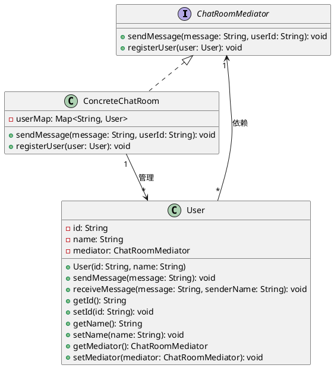
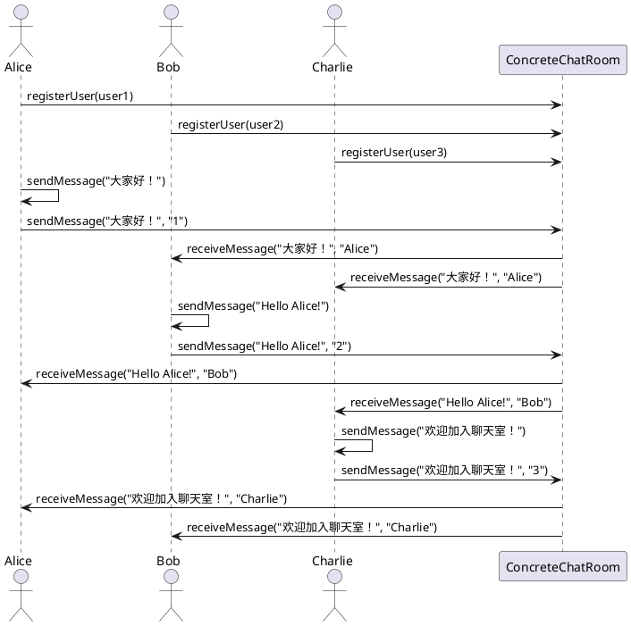

# 中介模式（Mediator Pattern）

## 1. 模式概述

中介模式是一种行为型设计模式，它通过引入一个中介者对象来封装一系列对象之间的交互，从而降低对象之间的耦合度。中介者使得对象之间不需要直接相互引用，而是通过中介者进行通信，这样可以减少系统中的依赖关系，提高系统的可维护性和扩展性。

### 1.1 核心意图
- 封装对象之间的交互，使其松耦合
- 集中管理对象之间的复杂关系
- 减少对象之间的直接依赖
- 使系统更容易维护和扩展

### 1.2 解决的问题
当系统中存在多个对象需要相互通信时，传统的直接交互方式会导致对象之间的关系变得非常复杂（通常称为"对象图的蜘蛛网"问题）。中介模式通过引入一个中介者对象，将对象之间的交互集中管理，从而简化对象之间的关系，提高系统的可维护性。

## 2. 模式结构

### 2.1 核心角色

| 角色 | 职责 | 实现类 |
|------|------|--------|
| 中介者接口（Mediator） | 定义中介者与同事对象之间交互的接口 | ChatRoomMediator接口 |
| 具体中介者（ConcreteMediator） | 实现中介者接口，协调各个同事对象之间的交互 | ConcreteChatRoom类 |
| 同事类（Colleague） | 定义同事对象的行为，通过中介者与其他同事对象交互 | User类 |

### 2.2 结构示意图

#### 2.2.1 UML类图



#### 2.2.2 UML序列图



## 3. 实现示例

### 3.1 聊天室中介者示例

#### 3.1.1 中介者接口（ChatRoomMediator）

```java
package com.kevin.demo.behavioral.中介;

/**
 * 聊天室中介者接口
 * <p>
 * 中介者模式中的中介者角色(Mediator)，定义了同事对象之间交互的接口
 * 
 * @author Kevin
 */
public interface ChatRoomMediator {
    /**
     * 发送消息
     * 
     * @param message 消息内容
     * @param userId 发送者ID
     */
    void sendMessage(String message, String userId);
    
    /**
     * 注册用户
     * 
     * @param user 用户对象
     */
    void registerUser(User user);
}
```

#### 3.1.2 具体中介者（ConcreteChatRoom）

```java
package com.kevin.demo.behavioral.中介;

import java.util.HashMap;
import java.util.Map;

/**
 * 具体聊天室中介者
 * <p>
 * 中介者模式中的具体中介者角色(ConcreteMediator)，实现了中介者接口，协调各个同事对象之间的交互
 * 
 * @author Kevin
 */
public class ConcreteChatRoom implements ChatRoomMediator {
    
    /**
     * 保存注册的用户
     */
    private Map<String, User> userMap;
    
    /**
     * 构造方法
     */
    public ConcreteChatRoom() {
        this.userMap = new HashMap<>();
    }
    
    /**
     * 发送消息
     * 
     * @param message 消息内容
     * @param userId 发送者ID
     */
    @Override
    public void sendMessage(String message, String userId) {
        User sender = userMap.get(userId);
        if (sender == null) {
            System.out.println("用户" + userId + "不存在！");
            return;
        }
        
        // 向所有用户发送消息（除了发送者自己）
        for (Map.Entry<String, User> entry : userMap.entrySet()) {
            if (!entry.getKey().equals(userId)) {
                User receiver = entry.getValue();
                receiver.receiveMessage(message, sender.getName());
            }
        }
    }
    
    /**
     * 注册用户
     * 
     * @param user 用户对象
     */
    @Override
    public void registerUser(User user) {
        if (user != null && !userMap.containsKey(user.getId())) {
            userMap.put(user.getId(), user);
            user.setMediator(this);
            System.out.println("用户" + user.getName() + "注册成功！");
        }
    }
}
```

#### 3.1.3 同事类（User）

```java
package com.kevin.demo.behavioral.中介;

/**
 * 用户类
 * <p>
 * 中介者模式中的同事角色(Colleague)，定义了同事对象的行为，通过中介者与其他同事对象交互
 * 
 * @author Kevin
 */
public class User {
    
    private String id;
    private String name;
    private ChatRoomMediator mediator;
    
    /**
     * 构造方法
     * 
     * @param id 用户ID
     * @param name 用户名
     */
    public User(String id, String name) {
        this.id = id;
        this.name = name;
    }
    
    /**
     * 发送消息
     * 
     * @param message 消息内容
     */
    public void sendMessage(String message) {
        System.out.println(name + "发送消息: " + message);
        mediator.sendMessage(message, id);
    }
    
    /**
     * 接收消息
     * 
     * @param message 消息内容
     * @param senderName 发送者名称
     */
    public void receiveMessage(String message, String senderName) {
        System.out.println(name + "收到来自" + senderName + "的消息: " + message);
    }
    
    // getter and setter methods
    public String getId() {
        return id;
    }
    
    public void setId(String id) {
        this.id = id;
    }
    
    public String getName() {
        return name;
    }
    
    public void setName(String name) {
        this.name = name;
    }
    
    public ChatRoomMediator getMediator() {
        return mediator;
    }
    
    public void setMediator(ChatRoomMediator mediator) {
        this.mediator = mediator;
    }
}
```

#### 3.1.4 客户端代码（App）

```java
package com.kevin.demo.behavioral.中介;

/**
 * 中介模式演示应用
 * <p>
 * 展示如何使用中介者模式实现聊天室功能
 * 
 * @author Kevin
 */
public class App {
    
    public static void main(String[] args) {
        // 创建聊天室中介者
        ChatRoomMediator chatRoom = new ConcreteChatRoom();
        
        // 创建用户
        User user1 = new User("1", "Alice");
        User user2 = new User("2", "Bob");
        User user3 = new User("3", "Charlie");
        
        // 注册用户到聊天室
        chatRoom.registerUser(user1);
        chatRoom.registerUser(user2);
        chatRoom.registerUser(user3);
        
        System.out.println("\n=== 开始聊天 ===");
        
        // 用户发送消息
        user1.sendMessage("大家好！");
        System.out.println();
        
        user2.sendMessage("Hello Alice!");
        System.out.println();
        
        user3.sendMessage("欢迎加入聊天室！");
    }
}
```

### 3.2 运行结果

```
用户Alice注册成功！
用户Bob注册成功！
用户Charlie注册成功！

=== 开始聊天 ===
Alice发送消息: 大家好！
Bob收到来自Alice的消息: 大家好！
Charlie收到来自Alice的消息: 大家好！

Bob发送消息: Hello Alice!
Alice收到来自Bob的消息: Hello Alice!
Charlie收到来自Bob的消息: Hello Alice!

Charlie发送消息: 欢迎加入聊天室！
Alice收到来自Charlie的消息: 欢迎加入聊天室！
Bob收到来自Charlie的消息: 欢迎加入聊天室！
```

## 4. 优缺点分析

### 4.1 优点

1. **减少耦合度**：中介者模式将对象之间的直接交互转化为通过中介者的间接交互，降低了对象之间的耦合度。
2. **集中管理交互**：所有对象之间的交互都集中在中介者中管理，使得系统的结构更加清晰，易于维护。
3. **提高可扩展性**：当需要添加新的同事对象或修改对象之间的交互规则时，只需要修改中介者即可，不需要修改各个同事对象。
4. **简化对象设计**：同事对象不需要知道其他同事对象的存在，只需要与中介者交互，简化了同事对象的设计。

### 4.2 缺点

1. **中介者复杂度增加**：随着同事对象数量的增加，中介者的复杂度可能会急剧增加，变得难以维护。
2. **潜在的性能问题**：所有的交互都通过中介者进行，可能会导致中介者成为性能瓶颈。
3. **可能导致系统结构不清晰**：如果中介者的设计不合理，可能会导致系统结构不清晰，降低系统的可维护性。

## 5. 使用场景

### 5.1 适用场景

1. **当系统中存在多个对象需要相互通信时**：中介者模式可以将对象之间的复杂关系集中管理，降低系统的复杂度。
2. **当对象之间的交互变得复杂难以维护时**：中介者模式可以简化对象之间的关系，提高系统的可维护性。
3. **当需要减少对象之间的耦合度时**：中介者模式可以降低对象之间的依赖关系，提高系统的灵活性。
4. **当需要集中管理对象之间的交互时**：中介者模式可以将对象之间的交互集中在一个地方管理，便于系统的扩展和维护。

### 5.2 实际应用案例

1. **聊天室系统**：聊天室作为中介者，用户之间通过聊天室进行通信，而不需要直接相互引用。
2. **GUI界面组件**：GUI框架中的事件处理机制通常使用中介者模式，组件之间通过事件总线（中介者）进行通信。
3. **网络通信协议**：网络通信中的路由器、交换机等设备可以看作是中介者，负责转发数据包。
4. **MVC框架**：MVC框架中的控制器（Controller）可以看作是中介者，协调模型（Model）和视图（View）之间的交互。

## 6. 与其他模式的关系

### 6.1 与观察者模式的关系
观察者模式和中介者模式都用于处理对象之间的通信，但它们的关注点不同。观察者模式关注的是对象之间的一对多依赖关系，当一个对象状态发生变化时，所有依赖它的对象都会得到通知。而中介者模式关注的是多个对象之间的交互，通过中介者来协调对象之间的通信。

### 6.2 与外观模式的关系
外观模式和中介者模式都用于简化系统的结构，但它们的目的不同。外观模式提供了一个统一的接口，用于访问子系统中的一组接口，而中介者模式是为了降低对象之间的耦合度，集中管理对象之间的交互。

### 6.3 与适配器模式的关系
适配器模式用于将一个类的接口转换为客户端期望的另一个接口，而中介者模式用于协调对象之间的交互。适配器模式关注的是接口的转换，而中介者模式关注的是对象之间的通信。

## 7. 总结

中介模式是一种非常重要的行为型设计模式，它通过引入一个中介者对象来封装对象之间的交互，从而降低对象之间的耦合度。中介者模式可以使系统的结构更加清晰，易于维护和扩展，但需要注意中介者的复杂度问题。

在实际应用中，中介模式常用于处理多个对象之间的复杂交互，如聊天室系统、GUI界面组件、网络通信协议等。通过合理地使用中介模式，可以提高系统的灵活性、可维护性和可扩展性。