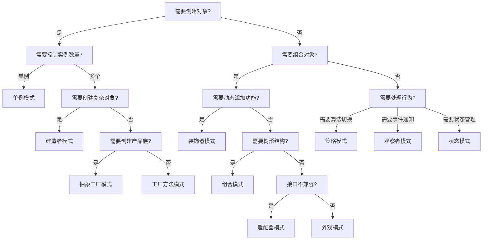

# 设计模式概述

## 什么是设计模式

设计模式是软件开发中常见问题的典型解决方案。它们是经过反复验证的、可重用的设计方案，能够帮助开发者编写更灵活、可维护和可理解的代码。

## 设计模式的分类

根据"设计模式：可复用面向对象软件的基础"一书，设计模式分为三大类：

### 1. 创建型模式 (Creational Patterns)

创建型模式关注对象的创建过程，提供了一种在创建对象的同时隐藏创建逻辑的方式。

| 模式 | 英文名 | 描述 | 适用场景 |
|------|--------|------|----------|
| 单例模式 | Singleton | 确保一个类只有一个实例 | 全局唯一对象，如配置管理器 |
| 工厂方法模式 | Factory Method | 定义创建对象的接口，让子类决定实例化 | 需要根据不同情况创建不同对象 |
| 抽象工厂模式 | Abstract Factory | 提供创建一系列相关对象的接口 | 产品族创建，如跨平台UI组件 |
| 建造者模式 | Builder | 分步骤构建复杂对象 | 复杂对象构建，如StringBuilder |
| 原型模式 | Prototype | 通过复制现有对象创建新对象 | 对象创建成本高的场景 |

### 2. 结构型模式 (Structural Patterns)

结构型模式关注类和对象的组合，通过组合它们来形成更大的结构。

| 模式 | 英文名 | 描述 | 适用场景 |
|------|--------|------|----------|
| 适配器模式 | Adapter | 将一个类的接口转换成客户端需要的接口 | 接口不兼容，如电源适配器 |
| 桥接模式 | Bridge | 将抽象部分与实现部分分离 | 多维度变化，如图形绘制 |
| 组合模式 | Composite | 将对象组合成树形结构以表示"部分-整体"层次 | 树形结构，如文件系统 |
| 装饰器模式 | Decorator | 动态地给对象添加新功能 | 动态功能扩展，如IO流 |
| 外观模式 | Facade | 为子系统提供统一的接口 | 简化复杂系统访问 |
| 享元模式 | Flyweight | 通过共享来支持大量细粒度对象 | 对象共享，如字符串池 |
| 代理模式 | Proxy | 为其他对象提供代理以控制对这个对象的访问 | 访问控制，如远程代理 |

### 3. 行为型模式 (Behavioral Patterns)

行为型模式关注对象之间的通信和职责分配。

| 模式 | 英文名 | 描述 | 适用场景 |
|------|--------|------|----------|
| 责任链模式 | Chain of Responsibility | 将请求沿着处理链传递 | 多级审批，异常处理 |
| 命令模式 | Command | 将请求封装成对象 | 请求队列，撤销操作 |
| 解释器模式 | Interpreter | 给定语言，定义其文法表示 | DSL实现，表达式计算 |
| 迭代器模式 | Iterator | 提供一种方法顺序访问聚合对象 | 集合遍历，无需暴露内部结构 |
| 中介者模式 | Mediator | 定义一个对象来封装一系列对象的交互 | 复杂对象协调，如聊天室 |
| 备忘录模式 | Memento | 在不破坏封装性的前提下捕获对象状态 | 状态保存，撤销操作 |
| 观察者模式 | Observer | 定义对象间的一对多依赖关系 | 事件通知，发布订阅 |
| 状态模式 | State | 允许对象在内部状态改变时改变其行为 | 状态机实现，如订单状态 |
| 策略模式 | Strategy | 定义算法族，分别封装起来 | 算法切换，如排序算法 |
| 模板方法模式 | Template Method | 定义算法骨架，让子类重写特定步骤 | 算法框架，如HTTP处理 |
| 访问者模式 | Visitor | 表示一个作用于某对象结构中的各元素的操作 | 结构操作，如编译器语法树 |

## 设计模式的原则

### SOLID原则

1. **单一职责原则 (SRP)** - 一个类只负责一项职责
2. **开闭原则 (OCP)** - 对扩展开放，对修改关闭
3. **里氏替换原则 (LSP)** - 子类必须能够替换其基类
4. **接口隔离原则 (ISP)** - 客户端不应依赖它不需要的接口
5. **依赖倒置原则 (DIP)** - 高层模块不应依赖低层模块

### 其他重要原则

- **组合优于继承** - 优先使用组合而非继承
- **封装变化** - 找出应用中可能需要变化之处，把它们独立出来
- **针对接口编程** - 不针对实现编程
- **松耦合** - 通过接口和抽象类实现松耦合

## 如何选择合适的设计模式

### 决策因素

1. **问题类型** - 是创建对象、组织结构还是处理行为？
2. **变化频率** - 哪些部分经常变化？
3. **性能要求** - 是否需要考虑性能优化？
4. **团队熟悉度** - 团队对模式的理解程度

### 常见选择指南

## 设计模式的最佳实践

### 何时使用设计模式

1. **重构时** - 发现代码重复或难以维护时
2. **设计时** - 预见未来可能的变化时
3. **团队协作时** - 需要统一的解决方案时

### 何时避免设计模式

1. **简单场景** - 问题过于简单时
2. **性能敏感** - 模式引入的性能开销不可接受时
3. **团队不熟悉** - 团队对模式理解不足时

### 常见误区

1. **过度设计** - 为使用模式而使用模式
2. **模式崇拜** - 认为模式是银弹
3. **死记硬背** - 不理解模式的本质和适用场景

## 学习建议

### 学习路径

1. **理解基础** - 掌握面向对象的基本概念
2. **分类学习** - 按创建型、结构型、行为型逐步学习
3. **实践应用** - 在实际项目中尝试应用
4. **对比分析** - 理解相似模式的区别
5. **源码学习** - 学习框架中的模式应用

### 实践方法

1. **代码实现** - 亲手实现每个模式
2. **重构练习** - 将现有代码重构为使用模式
3. **设计练习** - 从需求出发设计合适的模式
4. **代码审查** - 审查他人代码中的模式应用

---

记住：设计模式是工具，不是目标。选择合适的模式，而不是最复杂的模式。